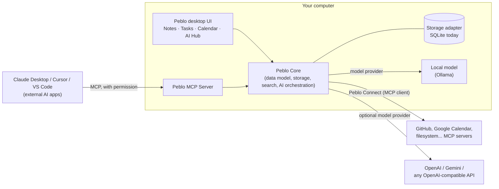
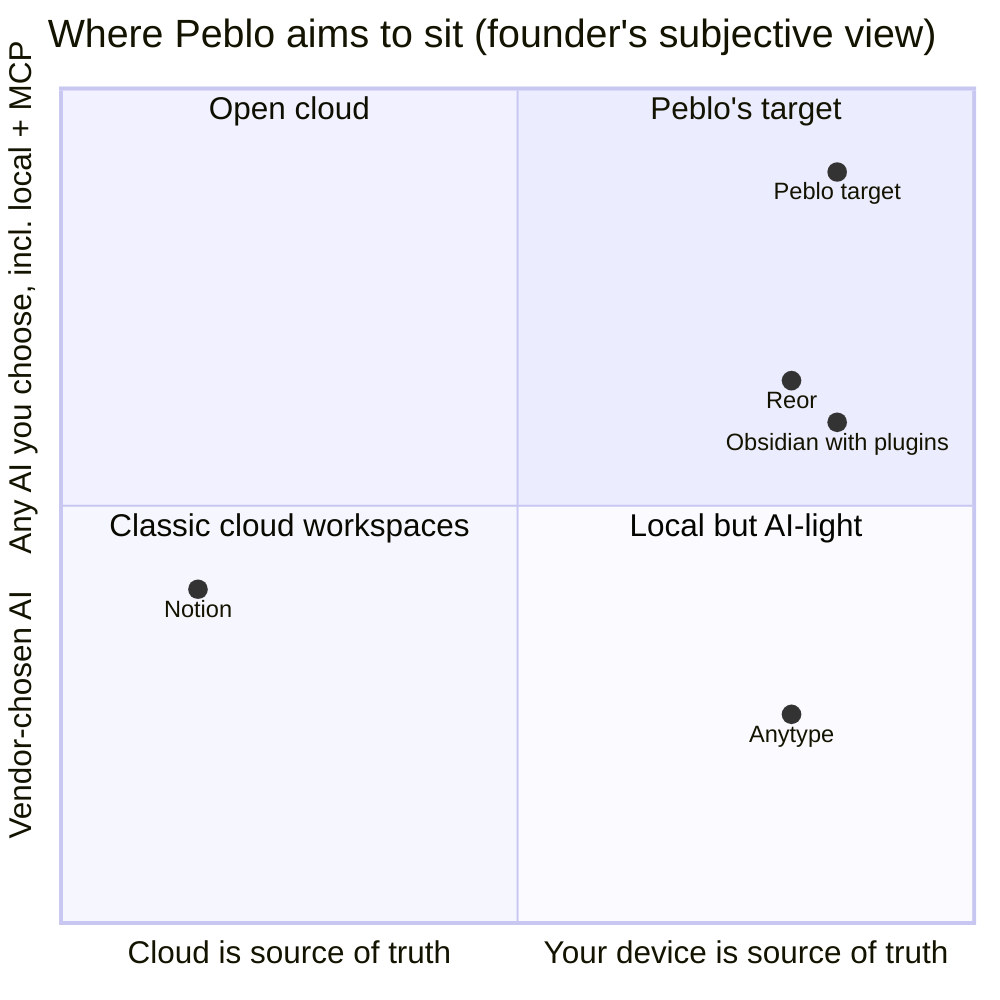
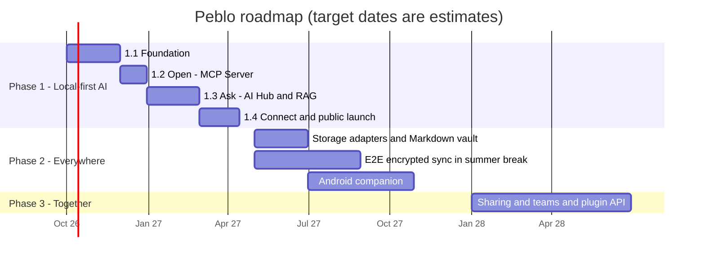

# Peblo: Vision and Strategy

> Owner: founder / head of product · Status: draft v1 · Last updated: 2026-09-26
> Sibling docs: [PRD](./01-prd.md) · [TRD](./02-trd.md) · [MCP](./03-mcp.md) · [AI Hub](./04-ai-hub.md) · [Design](./05-design.md) · [Go-to-market](./06-go-to-market.md)

## TL;DR

- **Vision:** your notes, tasks and calendar live on your own computer, and *any* AI you choose (a local model, a cloud model, or another AI app) can work with them, with your permission.
- **Positioning thesis:** *Notion puts your work in its cloud and rents you its AI. Peblo keeps your work on your machine and makes it useful to every AI you use, local or cloud, through an open protocol (MCP).*
- **Beachhead:** AI-heavy developers and technical students who already run Ollama or use an MCP client (Claude Desktop, Cursor, VS Code). They accept a desktop-only app, feel the "every AI chat starts from zero" pain every day, and are reachable for free through GitHub, Reddit and MCP directories.
- **Primary path:** "Peblo = the private memory and task layer for your AI tools" (path B below), with privacy and local-first as the brand promise. Students (path C) stay a secondary channel; a hosted team tier (path D) stays an option for Phase 3.
- **Business model:** free, fully useful local app. Phase 1 revenue is a one-time **Founding Supporter** license, used to test whether people will pay. Recurring revenue starts in Phase 2 with **encrypted sync + Pro** (a subscription, because sync costs us money every month). Never charge for export, backups, local AI or the basic MCP server.
- **Two blocking decisions before any public launch:** (1) **the product name**. "Peblo" is the name of the ed-tech company whose hiring challenge started this project, and that company's confidential challenge PDF is committed in the repo. (2) **The license**: open-source core or closed.
- **Proposed phase changes** (argued in [section 9](#9-milestones-by-phase)): add a "Foundation" release at the start of Phase 1, ship the Peblo MCP Server *before* AI Hub RAG, and move the plugin API from Phase 2 to Phase 3.

---

## 1. Vision, mission, thesis

**Vision (10-year).** Everyone has one private, durable home for what they know and what they plan to do. It belongs to them rather than to a vendor, and every AI they use can build on it.

**Mission (next 3 years).** Build the best local-first workspace for notes, tasks and calendar, where AI is optional, swappable and grounded in *your* data, and where your data is open to the tools you choose through MCP.

**One-line positioning thesis: why Peblo wins where Notion can't.**

> Notion's business is cloud seats, so your data has to live on Notion's servers and its AI runs on the models Notion picks. Peblo's business is *your* machine: it runs offline, works with a local LLM, needs no account, and exposes your data to *any* AI app through MCP. Notion can't copy that without undermining how it makes money.

Be honest about where Notion already is, so we don't fight a strawman:
- Notion has an **official MCP server**, but it is a hosted connection to Notion's cloud ([Notion MCP docs](https://developers.notion.com/guides/mcp/overview), [Notion blog](https://www.notion.com/blog/notions-hosted-mcp-server-an-inside-look)).
- Notion offers **offline mode**, but only on paid plans, and full Notion AI (agents, enterprise search) only on Business ($20/member/month billed monthly) and Enterprise ([Notion pricing](https://www.notion.com/pricing), checked 2026-09).

Peblo's claim is therefore *not* "Notion has no AI or MCP". It is: **with Notion, the cloud is the source of truth, the models are Notion's, and access runs on Notion's terms. With Peblo, your disk is the source of truth, the models are yours, and access runs on your terms.** Local-first software can't be bolted onto a cloud-first product without a rewrite, and that is the structural gap we exploit.

### The shape of the product

Everything goes through **Peblo Core**. The UI, the MCP server, a future CLI and future mobile/web clients are all just clients of Core. That is how we avoid being locked to Electron, SQLite or Express (see [02-trd.md](./02-trd.md)).

---

## 2. The core bets

Each bet is something we believe and are building around. If one proves false, the strategy changes, so each has a way to check it.

| # | Bet | What it means in the product | How we'll know if it's wrong |
|---|-----|------------------------------|-------------------------------|
| 1 | **Local-first wins trust.** People increasingly want their notes off someone else's server, especially as AI training on user data becomes a public worry. | No account. Data in a local file. Works fully offline. Sync, when it comes, is end-to-end encrypted. | Users ask for "just log in with Google" more than they praise offline and privacy; retention is no better than cloud tools'. |
| 2 | **AI you control.** People want to choose the model: a local one for privacy and cost, a cloud one for power, switched per task. | AI Hub model picker; Ollama and any OpenAI-compatible endpoint; a clear "this leaves your device" indicator; the app works fully with AI off. | Under 20% of AI users ever change the default model *(threshold is an estimate)*; nobody uses local models. |
| 3 | **Open via MCP.** Your AI tools (Claude, Cursor, ChatGPT...) should all share one personal memory and to-do list instead of each keeping its own silo. | Peblo MCP Server (others use Peblo) + Peblo Connect (Peblo uses others), with permissions and an audit log. | Users connect once and never make an external call again; the AI clients' built-in memory proves "good enough". |
| 4 | **No lock-in is a feature, not a leak.** Easy leaving makes people willing to start. | Full export in open formats (Markdown, JSON, ICS); later, a plain Markdown folder as a storage option. | Export is used mainly on the way out; churn rises when we make leaving easier. |
| 5 | **Swappable storage outlives any stack.** The data model outlives SQLite, Electron and today's models. | Storage adapters behind Core: SQLite now; encrypted sync, Markdown vault, Postgres later. | We end up with only one adapter after two years, which would mean the abstraction was overhead. |

---

## 3. Who it's for first: the beachhead

A beachhead is the *first* small group we try to win completely, before expanding. It should feel the problem sharply, be reachable cheaply, and tell others. We compared four candidates.

| Criterion (1 = poor, 5 = great) | Indian students / grad students | **AI-heavy developers & technical students** | Privacy-sensitive professionals (lawyers, doctors, therapists, consultants) | Indie founders |
|---|---|---|---|---|
| Feels the pain Peblo solves *today* | 3: deadlines and syllabus overload, but privacy is not their top worry | **5**: re-explaining context to every AI tool daily; already run Ollama or MCP clients | 5: can't paste client data into cloud AI | 4: scattered notes/tasks across tools |
| Fits a *desktop-only* app (mobile is Phase 2) | 2: phone-first | **5**: live on laptops | 3: also need mobile | 3 |
| Hardware can run local AI | 2: many 8 GB laptops *(estimate)* | **4**: often 16 GB+ *(estimate)* | 3 | 4 |
| Reachable by a solo founder for free | 5: founder's own campus | **4**: GitHub, r/LocalLLaMA, HN, MCP directories, dev Twitter/X | 1: slow trust-based sales | 3: Indie Hackers, X |
| Willingness to pay | 1–2 | **3**: pay for tools, but love free/open source | 5 | 3 |
| Forgives rough edges (unsigned builds, setup steps) | 2 | **5** | 1: need polish, compliance answers | 3 |
| Founder can dogfood and understand deeply | 5 | **5** (founder is a developer) | 1 | 3 |
| **Total** | 20–21 | **31** | 19 | 23 |

*(Scores are the founder's judgment, not measured data.)*

**Decision: the beachhead is AI-heavy developers and technical students** (CS/IT undergrads, M.Tech/MS students, and working developers) who already use at least one of Ollama, Claude Desktop, Cursor or VS Code with AI.

Why this group rather than "Indian students" in general:
- Peblo's most differentiated features (local LLM, MCP server, Peblo Connect) mean the most to them, and they need no convincing about what MCP is.
- Desktop-only is fine for them. Winning general students needs a mobile app first, which is Phase 2 work.
- Technical students *are* students. The founder's campus is still the first testing ground, just aimed at the CS/tech crowd first. Smart Intake's "syllabus PDF → semester plan" demo still works on them.
- Developers talk publicly (GitHub stars, Reddit, X), so early users bring the next ones.

Expansion order after the beachhead: all students (after mobile, Phase 2), then privacy-sensitive professionals (after encryption, sync and signed builds have proved reliable, late Phase 2), then small teams (Phase 3).

---

## 4. Strategic paths

These are four genuinely different companies Peblo could become. They share a codebase today but diverge fast in what gets built, who gets talked to, and how money is made.

### Path A: Privacy-first local AI workspace for individuals ("the private Notion")

| Pros | Cons |
|---|---|
| Broadest story; matches the founder's "go beyond Notion" vision | Broad means expensive to reach; no obvious first community |
| Current build is already most of the way there | Head-on with Notion, Obsidian, Anytype on editing polish, where they are years ahead |
| Privacy is a growing concern (e.g. India's DPDP Rules notified Nov 2025, [PIB](https://static.pib.gov.in/WriteReadData/specificdocs/documents/2025/nov/doc20251117695301.pdf)) | People *say* they value privacy far more often than they pay for it *(hypothesis)* |
| | Local-model quality limits the AI experience on average laptops |

- **What must be true:** a meaningful number of people will switch note apps mainly for privacy plus local AI, and Peblo's editor becomes "good enough" against Notion's.
- **Business model:** freemium; paid encrypted sync and Pro features.
- **Time to first revenue:** 9–15 months (needs sync to have something worth subscribing to) *(estimate)*.
- **Fit for a solo student founder:** medium. Large surface area to polish.

### Path B: Developer "second brain" wired into MCP and AI coding tools ("memory for your AI tools")

| Pros | Cons |
|---|---|
| Sharp, new pain: every AI tool keeps its own memory silo, and none of them hold your tasks and calendar | Smaller market than A or C |
| Strong tailwind: MCP is now an open standard under the Linux Foundation, with ~10,000 active servers and ~97M monthly SDK downloads, supported by ChatGPT, Claude, Cursor, Gemini, Copilot and VS Code ([MCP blog, Dec 2025](https://blog.modelcontextprotocol.io/posts/2025-12-09-mcp-joins-agentic-ai-foundation/)) | Developers are picky and many love plain Markdown files + git (Obsidian culture) |
| Free, cheap distribution through MCP registries, GitHub, r/LocalLLaMA, Hacker News | Free "memory" MCP servers already exist (e.g. the reference [memory server](https://github.com/modelcontextprotocol/servers)), and AI clients ship their own built-in memory |
| Founder is the user: daily dogfooding | Developers often expect open source, which complicates monetization |
| Desktop-only and some setup friction are acceptable | Risk of being seen as "a dev tool" and never reaching a broader audience |

- **What must be true:** developers want *one* personal context store shared across AI tools more than per-tool memory; and notes + tasks + calendar + permissions + local RAG in one app beats a plain-file MCP server.
- **Business model:** open-source (or source-available) core; paid Founding Supporter license now; paid encrypted sync + Pro later.
- **Time to first revenue:** 4–8 months for supporter licenses; 12+ months for recurring *(estimate)*.
- **Fit for a solo student founder:** **high**. Smallest scope to be best-in-class, and the founder is the customer.

### Path C: Student productivity OS (India-first)

| Pros | Cons |
|---|---|
| Huge population: ~4.33 crore enrolled in Indian higher education (AISHE 2021-22, [PIB](https://www.pib.gov.in/PressReleasePage.aspx?PRID=1999713)) | Phone-first users; Peblo has no mobile app until Phase 2 |
| Founder has direct campus access and credibility | Low willingness to pay; free alternatives (Notion free tier and student plans, Google Keep/Calendar) |
| Smart Intake (syllabus/timetable PDF → tasks) is a killer, visual demo | Many student laptops can't run local LLMs well, so someone pays for cloud AI |
| Word of mouth spreads fast in hostels and batches | Seasonal (exam cycles) and churn at graduation |
| | Privacy/ownership is not a top student purchase driver *(hypothesis)* |

- **What must be true:** students adopt a desktop-first tool, *or* mobile ships fast; students pay a small INR amount or colleges pay.
- **Business model:** freemium with a low INR plan (e.g. ₹99–199/month, *estimate*); campus ambassadors; later B2B2C through colleges (slow sales cycles).
- **Time to first revenue:** 12–18 months *(estimate)*.
- **Fit for a solo student founder:** medium. Easy access, but mobile, support volume and AI costs pile up.

### Path D: Open-core with a hosted team tier

| Pros | Cons |
|---|---|
| Highest revenue ceiling (per-seat B2B pricing) | Requires sync, collaboration, auth, permissions, hosting, security reviews, all before the first dollar |
| Privacy-sensitive SMBs value self-hosting | Fights Notion on its home ground (teams) |
| Open core builds trust and contributors | Contradicts today's "single user, no account" design |
| | Hardest path for one person in college |

- **What must be true:** individuals love Peblo first and pull it into their teams; we can operate a secure hosted service.
- **Business model:** free open-source core; paid hosted/self-hosted team edition.
- **Time to first revenue:** 18–30 months *(estimate)*.
- **Fit for a solo student founder:** low now; reasonable once there is a small team.

### Side-by-side

| | A: Private workspace | **B: AI tools' memory** | C: Student OS | D: Open-core teams |
|---|---|---|---|---|
| Sharpness of wedge | Low | **High** | Medium | Low |
| Uses what's already built | High | **High** (MCP/Hub are next anyway) | Medium (needs mobile) | Low |
| Cost to reach first 1,000 users | High | **Low** | Low | High |
| Revenue ceiling | Medium | Medium | Low–medium | High |
| Time to first revenue | 9–15 mo | **4–8 mo** | 12–18 mo | 18–30 mo |
| Solo-founder fit | Medium | **High** | Medium | Low |

### Recommendation

**Primary: Path B, "the private memory and task layer for your AI tools", wrapped in Path A's promise (local-first, you own it, AI you control).** In practice:
- Phase 1 product priority is the Peblo MCP Server, AI Hub with grounded answers, and Peblo Connect, on top of a reliable core (backups, reminders, recurrence, signed builds).
- Messaging leads with "one private memory for Claude, Cursor and your local LLM, with your notes, tasks and calendar in it". Privacy is the reason to trust it, not the headline.

**Keep optional (cheap to keep alive, don't invest heavily):**
- **Path C as a channel, not a strategy.** Run the first beta on the founder's campus (CS/IT students first) and ship one student template ("syllabus → semester plan"). Revisit making students primary once the mobile companion ships in Phase 2.
- **Path D as a Phase 3 option.** Only pursue it if sync is solid *and* at least ~20 unprompted "can my team use this?" requests arrive *(threshold is a judgment call)*.

**Kill/pivot signal for Path B:** 8 weeks after the Phase 1 public launch, if fewer than 15% of weekly active users have an MCP client connected *and* fewer than 30% use the AI Hub weekly, the "AI memory" wedge isn't landing. Shift emphasis to Path A (broad private workspace) and re-test messaging *(thresholds are estimates to be refined with real data)*.

---

## 5. Business model options

Principle: **charge for what costs us money to run (servers, sync) or for clear extra power. Never charge for owning your data** (export, backups, local AI, basic MCP access).

| Option | How it works | Pros | Cons | Verdict |
|---|---|---|---|---|
| **Free core + paid subscription (Sync/Pro)** | App free forever; ~$4–5/month global, ~₹129–199/month India *(estimate, compare Obsidian Sync at $4/month billed yearly, [Obsidian pricing](https://obsidian.md/pricing))* for E2E-encrypted sync, mobile, advanced agents | Predictable revenue; pays for the servers sync needs; familiar model | Needs sync to exist (Phase 2); subscriptions are a hard sell to Indian students | **Yes, from Phase 2** |
| **One-time Founding Supporter license** | e.g. $29 / ₹999 one-time *(estimate)*: supporter badge, early builds, roadmap votes, discount on future Sync | Revenue and a willingness-to-pay test *now*, with zero infra; rewards early believers | Small amounts; must not promise features we can't deliver | **Yes, Phase 1** |
| **One-time license per major version** (Sublime/Things style) | Pay once for v2, pay again for v3 | Users like "buy once"; fits local software | Lumpy revenue; doesn't cover ongoing sync costs | Maybe, for desktop Pro features only |
| **Open-core** | Core open source (e.g. AGPL-3.0); sync service, team features, hosted edition are commercial | Trust for privacy claims; community contributions; GitHub distribution | Forks; need a clear line between open and paid; license choice is hard to reverse | **Likely; decide before public launch** |
| **Hosted AI credits** | Peblo resells cloud model access so users don't need their own keys | Removes key setup, which matters for students | Thin margins, abuse risk, payment/tax complexity, conflicts with "AI you control" | Not now; revisit for students in Phase 2 |
| **Team / hosted tier** | Per-seat pricing for shared workspaces | Biggest revenue ceiling | Needs Phase 3 features | Phase 3 option |
| **Sponsorships / GitHub Sponsors** | Donations | Easy to set up | Rarely meaningful income | Add in Phase 1, expect little |
| **Services** (custom local-AI setups for privacy-sensitive firms) | Paid consulting | Cash early | Distracts a solo founder; doesn't scale | Avoid unless cash is urgently needed |

**Recommendation:** Phase 1: free app + Founding Supporter license + GitHub Sponsors. Phase 2: Peblo Sync + Pro subscription (INR and USD pricing, INR via a local processor, USD via a merchant-of-record service; check which ones accept an India-based individual or sole proprietor). Phase 3: team tier if the signal is there.

Honest math *(estimate)*: 1,000 weekly active users × 5% paying × $4/month ≈ $200/month. That validates demand; it doesn't pay a salary. Real income needs ~10–20k engaged users or a team tier. That is why the beachhead has to be one that spreads cheaply.

---

## 6. Moats and why now

### Why now

1. **MCP became the standard.** In December 2025 Anthropic donated MCP to the new Agentic AI Foundation under the Linux Foundation, co-founded with OpenAI and Block and backed by Google, Microsoft and AWS ([Linux Foundation](https://www.linuxfoundation.org/press/linux-foundation-announces-the-formation-of-the-agentic-ai-foundation), [OpenAI](https://openai.com/index/agentic-ai-foundation/)). An app that speaks MCP can plug into nearly every major AI client without per-vendor integrations.
2. **Local models got good enough for personal tasks.** Small open models (3–8B parameters) run on a 16 GB laptop through [Ollama](https://ollama.com) and handle summarizing, extracting tasks and answering over retrieved notes acceptably *(founder's assessment; quality varies by model and task)*. Embedding models like `nomic-embed-text` make local semantic search cheap.
3. **Privacy and ownership concerns are rising.** People are more aware that cloud tools may train on or analyze their content, and regulation is tightening (India's DPDP Rules, Nov 2025). Local-first tools like Obsidian and [Reor](https://github.com/reorproject/reor) show there's demand *(qualitative signal, not market sizing)*.
4. **AI tools have no shared memory.** Each assistant (Claude, ChatGPT, Cursor) keeps its own memory, if any, and none of them holds your tasks and calendar. The gap between "AI can do things" and "AI knows my context" is where Peblo sits.

### Moats (honest version)

A solo-founder product has **no real moat on day one**. These are the moats we can build, in order of how soon they become real:

| Moat | How it forms | Strength |
|---|---|---|
| **Trust and brand for "local + open"** | Open code, no account, visible audit logs, never selling data. Hard for cloud incumbents to claim credibly. | Medium, builds early |
| **Integration depth with MCP clients** | Being the default "personal memory" server people copy into their Claude/Cursor config, listed in registries, with the best permission model and tool design | Medium; first-mover advantage decays if we're slow |
| **Local-first sync engineering** | E2E-encrypted, conflict-free sync is hard to build and very hard to retrofit into cloud-first products | Strong, but only after Phase 2 ships |
| **User's accumulated context** | Years of linked notes, tasks, AI chat history and automations. Stickiness comes from usefulness, not lock-in (export stays free). | Grows over time |
| **Community** (templates, MCP recipes, later plugins) | Users share setups ("my Cursor + Peblo workflow") | Slow, compounding |

What is *not* a moat: the AI features themselves. Summaries, chat and task extraction are commodities that every competitor ships.

---

## 7. Competitive frame (light; details in [06-go-to-market.md](./06-go-to-market.md))

- **Notion:** cloud-first, strong teams and AI, has a hosted MCP server and paid offline mode (sources above). We don't beat it on collaboration or databases, and we shouldn't try before Phase 3.
- **Obsidian:** local Markdown files, free app, paid Sync ($4/month yearly) and a $50/user/year commercial license that is encouraged but optional ([Obsidian pricing](https://obsidian.md/pricing)). AI and MCP come via community plugins of varying quality. It is our closest competitor for the beachhead. We win on built-in tasks + calendar + AI Hub + permissioned MCP working out of the box; we lose on plugin ecosystem and plain files (until the Markdown vault adapter lands).
- **Reor, Anytype, AFFiNE and other local-first apps:** validate the category; most focus on notes only.

---

## 8. Strategy-level gaps (today vs. what this strategy needs)

| Area | Today | Needed for the strategy | Phase |
|---|---|---|---|
| **Name and brand** | "Peblo" is the name of the ed-tech startup whose take-home challenge started this project; its PDF, marked "Confidential — for candidate evaluation", is committed at the repo root | New product name; PDF removed from the repo *and its git history*; confirm no IP claims on the code | **Before public Phase 1 launch** |
| License | No LICENSE file | Decide open-source vs source-available vs closed | Phase 1 |
| MCP server | None | Peblo MCP Server with scopes and audit log (the wedge) | Phase 1 |
| Grounded AI | Chat panel creates/edits notes and sees only the 25 most recent note *titles*; embeddings are saved only when one AI path creates a note, one vector per whole note | AI Hub with RAG over all notes/tasks, chunked, with citations | Phase 1 |
| Local API security | Express API on 127.0.0.1 accepts any request (auth middleware sets a fixed local user) | Per-launch secret token so other local programs can't read/write data (critical once MCP exists) | Phase 1 |
| Trust signals | Unsigned builds (SmartScreen warnings), no auto-update | Signed/notarized builds, auto-update | Phase 1 |
| Measurement | No telemetry or crash reporting | Opt-in, content-free usage stats + crash reports, so we can compute the metrics in [01-prd.md](./01-prd.md) | Phase 1 |
| Data safety | Backups = "copy the file yourself"; export covers notes only | Automatic local backups; full export (tasks, calendar, AI chats, settings) | Phase 1 |
| Revenue plumbing | None | Supporter license checkout; later a subscription and license keys | Phase 1 / 2 |
| Everywhere | Desktop only; single SQLite file | Storage adapters, E2E sync, mobile companion | Phase 2 |

The full feature-level gap table is in [01-prd.md](./01-prd.md#12-current-state-vs-required-gap-table).

---

## 9. Milestones by phase

### Proposed changes to the shared phase plan (argued explicitly)

1. **Add a "Foundation" release at the start of Phase 1** (local API token, automatic backups, OS-level reminders, proper recurrence, full-text search, signed builds, auto-update, opt-in telemetry). *Why:* the beachhead will connect external AIs that can **write** to Peblo. A data-loss bug or an unauthenticated local API would destroy the trust the whole strategy depends on.
2. **Ship the Peblo MCP Server before AI Hub RAG** within Phase 1. *Why:* the MCP server is smaller to build (tools over existing Core functions), it is the sharpest differentiator for the beachhead, and it gives free distribution through MCP registries two to three months earlier. The MCP `search` tool starts on full-text search and upgrades to hybrid search when RAG lands.
3. **Move the plugin API from Phase 2 to Phase 3.** *Why:* a plugin ecosystem needs stable APIs, docs, review and support that one person can't sustain alongside sync and mobile. Until then, MCP + a CLI *are* the extension story.
4. **In Phase 2, build the Markdown-folder storage adapter before the Postgres adapter.** *Why:* developers ask for plain files first. It doubles as "no lock-in" proof and lets people sync with tools they already trust (git, Syncthing) while paid sync matures.

### Phase plan with measurable goals

Dates assume ~15 hours/week during term and ~35 hours/week during breaks *(estimates; exam dates will shift them)*.

| Phase | Exit goals (all measurable) | Business goals |
|---|---|---|
| **Phase 1: Local-first AI** (Oct 2026 – ~Apr 2027) | New name live · signed builds on Windows + macOS · 1,000 downloads · **100 weekly active users (WAU)** · week-4 retention ≥ 25% · ≥ 30% of WAU use AI Hub weekly · ≥ 20% of WAU have an MCP client connected · zero confirmed data-loss incidents · 30 user interviews done | 25 Founding Supporter licenses sold (the willingness-to-pay test) · license decided |
| **Phase 2: Everywhere** (~May 2027 – Dec 2027) | 1,000 WAU · week-4 retention ≥ 30% · E2E sync in beta with zero data-loss incidents over 60 days · mobile companion used weekly by ≥ 40% of sync users · Markdown vault adapter shipped | 150 paying Sync/Pro subscribers *(estimate)* · clear signal on India vs global pricing |
| **Phase 3: Together** (2028+) | Sharing and small-team spaces used by ≥ 50 teams · plugin API with ≥ 10 community plugins | Team tier revenue covers infrastructure plus one hire, or explicit decision to stay individual-focused |

*(Targets are estimates chosen to be ambitious but reachable for one person; revise after the first 8 weeks of real data.)*

---

## 10. Founder operating plan (one person, in college, with an internship)

The biggest risk to Peblo is not a competitor; it's running out of focused hours. This plan is built around a realistic week *(hours are estimates; adjust to your timetable)*.

**Weekly rhythm during term (~15 hours on Peblo):**

| When | What | Output |
|---|---|---|
| Mon–Fri evenings, 1–1.5 h | Build: one issue at a time from the "Now" list | Merged changes |
| Daily commute (~2 h, no screen) | Audio only: product/founder podcasts, or replaying recorded user calls. Park before capturing ideas. Never type while riding. | Ideas captured after arrival (Quick Capture) |
| Saturday, 4 h deep block | The hardest item of the week (RAG, MCP permissions, sync) | One meaningful slice shipped |
| Sunday, 2 h | 2 user conversations (20 min each) · 1 build-in-public post · **30-minute weekly review** | Notes in Peblo; next week's 3 goals |

**Weekly review checklist (30 min, every Sunday):**
1. Metrics: downloads, WAU, week-1/week-4 retention, MCP connections, AI Hub weekly users, crash-free sessions.
2. Read every new piece of feedback; tag it (bug / request / praise / confusion).
3. Pick **3 goals** for next week: at most **one** big feature, plus bugs and debt.
4. Is anything blocking the current phase's exit goals? If yes, it becomes goal #1.

**Monthly:** one release with a public changelog; one retro (what slowed me down?); update this doc's milestone table.

**Rules that protect focus:**
- **Work-in-progress limit of one big feature.** Finish or cut before starting another.
- **Exam weeks = maintenance mode.** Bug fixes and support replies only. No launches, no migrations.
- **Big risky builds go in breaks.** Sync is scheduled for the summer break for this reason.
- **20% of build time goes to debt** (tests, splitting `WorkspacePage.jsx`, moving hard-coded prompts out of `aiService.ts`).
- **Dogfood daily.** Run college work and internship tasks in Peblo. Every annoyance becomes an issue.
- **Support promise:** reply within 48 hours; keep a public known-issues list to cut repeat questions.
- **Don't build for imagined users.** Anything not requested by at least 3 real users or required by the phase goals waits.

**When to add people:** after Phase 1 hits its goals. Look first for a co-founder or contributor strong in the area the founder is weakest in (likely distribution/GTM, or mobile for Phase 2). Open source makes contributors possible earlier; label "good first issue"s from Phase 1.

---

## 11. Risks

| Risk | Likelihood | Impact | Mitigation |
|---|---|---|---|
| **Name/IP conflict:** "Peblo" belongs to another company and its confidential document sits in the repo | High (it's a fact today) | High: forced rename after launch, reputational damage | Rename before any public launch; remove the PDF and purge it from git history; keep "Peblo" as an internal codename only |
| **Incumbents add the same features** (Notion already has MCP + offline; Obsidian plugins add AI/MCP; AI clients add built-in memory) | High | Medium–High | Compete on what's structural (local source of truth, any model, permissioned cross-tool memory with tasks + calendar), not on single AI features; move fast in Phase 1 |
| **Electron weight** (hundreds of MB of RAM *(estimate)*, plus a local LLM on the same laptop) | Medium | Medium: bad on 8 GB machines, many of them in India | Performance budgets in the PRD; "light mode" with cloud or tiny models; Core is UI-agnostic so a Tauri/native shell stays possible (see [02-trd.md](./02-trd.md)) |
| **Support burden** (Ollama setup, OS quirks, MCP client configs) | High | Medium: eats build hours | One-click MCP config, connection health checks, in-app diagnostics export, public troubleshooting docs, community forum |
| **Security: external AI writes or leaks data** via MCP (prompt injection, over-broad permissions) | Medium | High | Read-only by default, per-client scopes, "private" tag never exposed, audit log, versions before every AI edit, no delete tool in v1 (see [03-mcp.md](./03-mcp.md)) |
| **Data loss** (single SQLite file, migrations, future sync conflicts) | Medium | Very high | Pre-migration backups, automatic daily backups, restore UI, no destructive AI/MCP operations without undo |
| **Local model quality** disappoints on common hardware | Medium | Medium | Honest model recommendations by RAM size; hybrid (local embeddings + optional cloud chat); citations so users can verify |
| **Monetization fails** (users love free, won't pay) | Medium | High | Test early with supporter licenses; charge for sync (real cost); keep costs near zero until then |
| **Founder burnout / time** | High | High | Operating rules above; phases sized to part-time hours; exam-week freezes |
| **Beachhead too narrow** | Medium | Medium | Kill/pivot criteria in section 4; campus channel keeps a broader test running |

## 12. Open questions

1. **What's the new name?** It needs to be short, pronounceable in English and Indian languages, with a free .com/.app domain and a GitHub org. Owner: founder, with [06-go-to-market.md](./06-go-to-market.md). Needed before 1.2 ships publicly.
2. **Which license?** AGPL-3.0 open core, source-available (e.g. FSL/BSL-style), or closed? It affects trust, contributions and fork risk. Decide in Phase 1.
3. **Is Markdown files or the database the long-term source of truth?** Developers want files; features such as tasks, links and AI metadata want a database. The adapter model allows both, but the default matters. See [02-trd.md](./02-trd.md).
4. **Who pays for AI for users without a good laptop or API key?** Hosted credits, a free cloud tier with limits, or "bring your own key" only?
5. **What telemetry is acceptable** to a privacy-first audience? Proposal: opt-in, counts only, no content, with the full event list in the docs.
6. **INR vs USD pricing**, and which payment providers accept an India-based student founder.
7. **Does the beachhead actually want tasks/calendar in their AI memory**, or only notes? Test in the first 30 interviews.

## 13. Next steps

| When | Step |
|---|---|
| This week | Remove the challenge PDF from the repo and its history; start a name shortlist; add a LICENSE decision note |
| Phase 1.1 (Oct–Nov 2026) | Foundation release per [01-prd.md](./01-prd.md#9-release-plan); set up opt-in telemetry so Phase 1 metrics are measurable from day one |
| Phase 1.1 | Recruit 10 beta users (5 from campus CS/IT, 5 developers online); first 10 interviews using the JTBD in the PRD |
| Phase 1.2 (Dec 2026) | Ship Peblo MCP Server; submit to MCP registries; open Founding Supporter checkout |
| Phase 1.3–1.4 (Jan–Apr 2027) | AI Hub + RAG, Peblo Connect, public launch (plan in [06-go-to-market.md](./06-go-to-market.md)) |
| End of Phase 1 | Review kill/pivot criteria; decide Phase 2 scope and pricing |

### Sources

- Notion pricing and plan features: https://www.notion.com/pricing (accessed 2026-09-26)
- Notion MCP: https://developers.notion.com/guides/mcp/overview · https://www.notion.com/blog/notions-hosted-mcp-server-an-inside-look
- Obsidian pricing: https://obsidian.md/pricing (accessed 2026-09-26)
- MCP joins the Agentic AI Foundation (stats: ~10k servers, 97M monthly SDK downloads): https://blog.modelcontextprotocol.io/posts/2025-12-09-mcp-joins-agentic-ai-foundation/
- Linux Foundation AAIF announcement: https://www.linuxfoundation.org/press/linux-foundation-announces-the-formation-of-the-agentic-ai-foundation
- OpenAI on AAIF: https://openai.com/index/agentic-ai-foundation/
- MCP reference servers (incl. memory): https://github.com/modelcontextprotocol/servers
- AISHE 2021-22 (4.33 crore enrolment): https://www.pib.gov.in/PressReleasePage.aspx?PRID=1999713
- DPDP Rules 2025 (PIB): https://static.pib.gov.in/WriteReadData/specificdocs/documents/2025/nov/doc20251117695301.pdf
- Reor (local AI notes): https://github.com/reorproject/reor
- Ollama: https://ollama.com
