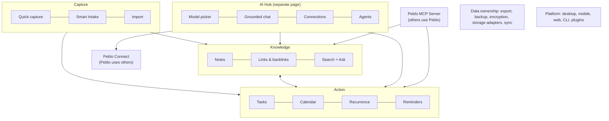

# Peblo: Product Requirements Document (PRD)

> Owner: founder / head of product · Status: draft v1 · Last updated: 2026-09-26
> Covers Phase 1 in detail and Phases 2–3 at requirement level.
> Read with: [Vision & strategy](./00-vision-and-strategy.md) · [TRD](./02-trd.md) · [MCP](./03-mcp.md) · [AI Hub](./04-ai-hub.md) · [Design](./05-design.md) · [Go-to-market](./06-go-to-market.md)

## TL;DR

- **Who first:** AI-heavy developers and technical students on desktop (the beachhead in [00-vision-and-strategy.md](./00-vision-and-strategy.md#3-who-its-for-first-the-beachhead)).
- **Core problem:** your knowledge and plans are scattered across apps, and every AI tool you use starts from zero because it can't safely see them.
- **Phase 1 goal:** make Peblo the private, local memory and task list that *any* AI can use with permission: **Peblo MCP Server**, **AI Hub** (grounded chat with citations, any model including local Ollama), **Peblo Connect**, on top of a trustworthy foundation (backups, real recurrence, OS reminders, fast search, signed builds).
- **Requirements** are listed per module with priority (**P0** = must ship in that phase, **P1** = should, **P2** = could), phase and acceptance criteria. Each has an ID (e.g. `MCP-05`) so issues and other docs can refer to it.
- **Biggest gaps today:** no grounded "ask your notes" (embeddings are saved for almost no notes), no MCP server, no per-launch auth on the local API, recurrence stored as 5–30 pre-made copies, reminders only as an in-app modal while the UI is loaded, Smart Intake saves without a review step, export covers notes only.
- **Release order (proposed):** 1.1 Foundation → 1.2 Open (MCP Server) → 1.3 Ask (AI Hub + RAG) → 1.4 Connect + public launch.

---

## 1. Problem statements and jobs-to-be-done

### Problems

| # | Problem | Evidence / why we believe it |
|---|---------|------------------------------|
| P1 | **AI tools don't know my context.** Every chat in Claude, ChatGPT or Cursor starts from zero; I paste the same background again and again. | Founder's daily experience; common complaint in AI-tool communities *(to validate in interviews)* |
| P2 | **I can't safely give AI my private notes.** Pasting client, research or personal notes into a cloud chatbot feels risky, and many tools have no local option. | Rising privacy concern; demand for local-LLM apps *(qualitative)* |
| P3 | **Notes, tasks and calendar live in different apps,** so decisions in notes never become tasks and tasks lose their context. | Existing users link todos to notes; Smart Intake exists because of this |
| P4 | **Capturing is slow,** so ideas get lost between classes, meetings and coding sessions. | Quick capture hotkey was built for this; measure capture frequency |
| P5 | **Tools lock me in.** Leaving Notion or Evernote is painful; I don't want to pick a new prison. | Import from Notion/Obsidian exists because switching pain is real |

### Jobs-to-be-done (JTBD)

Written as "When [situation], I want to [motivation], so I can [outcome]."

| ID | Job |
|----|-----|
| J1 | When I **start an AI session** (coding, writing, studying), I want the AI to already know my relevant notes, decisions and open tasks, so I can skip re-explaining and get better answers. |
| J2 | When I **have a question about something I wrote before**, I want to ask in plain language and get an answer with links to the exact notes, so I can trust it and jump to the source. |
| J3 | When **a thought or task hits me mid-work**, I want to capture it in under 5 seconds without switching context, so I can keep flowing and not lose it. |
| J4 | When I **receive a messy input** (syllabus PDF, meeting transcript, brain-dump), I want it turned into organized notes and dated tasks that I can review, so I can act on it the same day. |
| J5 | When **a deadline or routine is coming up**, I want a reliable reminder even if Peblo's window is closed, so I can stop worrying about forgetting. |
| J6 | When **I use sensitive material**, I want to choose a local model and see exactly what leaves my device, so I can use AI without breaking trust or rules. |
| J7 | When **I let another AI app use my data**, I want to control what it can see and change, and review what it did, so I can connect without fear. |
| J8 | When **I decide to switch tools or back up**, I want everything out in open formats in one click, so I can own my data forever. |

---

## 2. Personas and scenarios

### Persona 1 (primary): Ravi, the AI-native developer

- 24, backend developer at a Hyderabad startup; side projects on weekends. Windows laptop with 16 GB RAM at work, MacBook at home.
- Uses Cursor daily, Claude Desktop for thinking, Ollama with a 7B model for "private stuff". Keeps notes in a mix of Obsidian, Apple Notes and TODO comments.
- **Pains:** re-explains the architecture to Cursor every day; decisions made in meetings get lost; tasks live in five places.
- **Success looks like:** "Cursor and Claude can both read my project notes and add to my task list, and I never paste context again."
- **Will pay for:** sync between two laptops; a polished, trustworthy MCP setup.

**Scenario, a Tuesday:** In Cursor, Ravi asks, "What did we decide about the retry policy for the payments worker?" Cursor calls Peblo's `search_notes` tool (read scope granted to Cursor), finds the note "Payments worker – design review (Sep 12)", and answers with the decision and a link. Ravi then says "add a task to write the retry tests, due Friday". Cursor calls `create_task`, Peblo shows a small toast ("Cursor created a task"), and the audit log records it. That evening, in Peblo's AI Hub with the local model selected, Ravi asks "what's still open on the payments project?" and gets a list of tasks and notes with citations.

### Persona 2 (secondary, campus channel): Meghana, the engineering student

- 21, final-year B.Tech (CSE) at a college in Warangal; preparing for placements and a research internship. 8 GB Windows laptop, Android phone.
- Uses Google Keep, WhatsApp "message yourself" and a paper planner; tried Notion but found setup heavy. Uses a free cloud chatbot for studying.
- **Pains:** a syllabus PDF per subject, lab deadlines, placement test dates and DSA practice all scattered; reminders missed.
- **Success looks like:** "I drop in each syllabus and get a semester plan I can tick off, and I can ask my notes questions before exams."
- **Will pay for:** very little. ₹99–199/month is a stretch *(estimate)*. Mobile access matters a lot (Phase 2).

**Scenario, start of semester:** Meghana drags five syllabus PDFs into Smart Intake. Peblo shows a **review screen** with 5 notes (one per subject, units as headings) and 23 proposed tasks (assignments, internal exams) with dates. She unticks 3 wrong tasks, fixes one date and confirms. She adds a recurring task "DSA practice, every Mon/Wed/Fri 7 pm" with a reminder. Her laptop can't run a large model well, so AI Hub suggests a small local model for search and her own Gemini key for chat, and it clearly labels which one sends data to the cloud.

### Persona 3 (future, Phase 2+): Priya, the privacy-sensitive professional

- 34, independent counselling psychologist in Bengaluru (could equally be a lawyer or consultant). MacBook Air, iPhone.
- Session notes are confidential; can't paste them into cloud AI. Currently uses a locked Word folder and a paper diary.
- **Pains:** writing session summaries takes an hour a day; fear of data breaches; needs notes on phone and laptop.
- **Success looks like:** "A local model drafts my summaries, everything is encrypted, nothing leaves my devices unencrypted, and I can prove it."
- **Will pay for:** encryption, sync, reliability, and support, readily *(estimate: highest willingness to pay of the three)*.

**Scenario (Phase 2):** After a session Priya writes rough notes. She runs "Summarize" with the local model; the AI Hub shows a green "On-device" badge. Her notes sync end-to-end encrypted to her iPhone. When an external AI app requests access via MCP, her workspace policy "never expose notes tagged #client" is enforced automatically.

---

## 3. Product principles

Principles settle arguments. When two requirements conflict, the higher principle wins.

1. **The user owns the data.** Everything can be exported in open formats at any time, for free. No feature may make leaving harder. *In practice:* every new data type ships with its export format.
2. **Local-first.** The app is fully useful offline, with no account. The local copy is the source of truth; servers (when they exist) are only for sync and are end-to-end encrypted. *In practice:* no feature requires our server in Phase 1.
3. **Never lose data.** Every write is safe; every AI or external edit is reversible. *In practice:* AI/MCP edits always create a version first; there is no hard delete without trash.
4. **AI is optional and swappable.** Every non-AI feature works with AI off. Any supported model can power any AI feature, and the user always sees which model is used and whether data leaves the device.
5. **Explicit consent for access.** External apps (via MCP) and external tools (via Peblo Connect) get the minimum access, shown in plain language, revocable in one click, and logged.
6. **Keyboard-first, fast.** Every frequent action has a shortcut and is reachable from `Ctrl/Cmd+K`. Speed targets are requirements, not wishes (section 6).
7. **Grounded over clever.** AI answers about your data must cite sources. "I couldn't find that in your notes" beats a confident guess.
8. **Not locked to today's stack.** Features are built against Peblo Core's API, never directly against SQLite, Express routes or Electron (see [02-trd.md](./02-trd.md)).

---

## 4. Scope overview

---

## 5. Feature requirements by module

**Legend.** Priority: **P0** must ship in that phase · **P1** should · **P2** could. Phase: 1 / 2 / 3. Status today: **Exists**, **Partial** or **Missing** (checked against the code in Sep 2026).

### 5.1 Capture

| ID | Requirement | Pri | Phase | Status | Acceptance criteria |
|----|-------------|-----|-------|--------|---------------------|
| CAP-01 | **Global quick capture** (`Ctrl/Cmd+Shift+Space`) for a note or a task, with natural-language parsing (`tomorrow`, `friday`, `!high`, `#tag`) | P0 | 1 | Exists | Window visible ≤ 300 ms after the hotkey on a reference machine (section 6); saving works offline; parsed date/priority/tags shown before saving; `Esc` closes without saving; works with the main window closed (tray). |
| CAP-02 | Quick capture adds **time** (`5pm`, `at 17:30`), **recurrence** (`every mon`) and **reminder** (`remind 30m before`) parsing | P1 | 1 | Missing | 20 test phrases in a parser test suite pass; unparsed text stays in the task title rather than being dropped. |
| CAP-03 | **Inbox**: captures land in an Inbox view until triaged (moved, tagged, scheduled or done) | P1 | 1 | Missing | Inbox count badge in nav; triage keyboard shortcuts (`t` tag, `s` schedule, `e` done); zero-inbox empty state. |
| CAP-04 | **Smart Intake with a review step**: paste text or drop a PDF → proposed notes + tasks shown for review; nothing is saved until the user confirms | P0 | 1 | Partial (saves immediately, no review) | Review screen lists proposed notes and tasks with checkboxes and editable dates; "Confirm" writes all selected items in one transaction; "Cancel" writes nothing; each created item is tagged with its source (`intake:<filename>`); works with any configured model provider. |
| CAP-05 | Smart Intake handles **multiple files** at once and very long PDFs (chunked) | P1 | 1 | Missing | 5 PDFs of 30 pages each process without timeout; progress shown per file; one failure doesn't block the others. |
| CAP-06 | **Import** from Notion (Markdown & CSV zip), Obsidian vault zip, loose `.md` | P0 | 1 | Exists | Existing behavior kept; import report shows counts and skipped items. |
| CAP-07 | Import **images/attachments** and **Obsidian `[[wikilinks]]`** as Peblo links | P1 | 1 | Missing (images skipped) | Images from a Notion/Obsidian export appear in notes; `[[Note name]]` resolves to a Peblo link when the target exists. |
| CAP-08 | Import tasks from **Todoist/TickTick CSV** and events from **`.ics`** | P2 | 2 | Missing | Round-trip test with a sample export of each. |
| CAP-09 | **Capture via MCP**: external AI apps create notes/tasks (see MCP-02) landing in Inbox with source label | P0 | 1 | Missing | Item shows "Created by Cursor" etc.; appears in audit log. |
| CAP-10 | **Voice capture** with local transcription (e.g. a Whisper-class model) | P2 | 2 | Partial (voice commands exist; transcription path not local) | Works offline with a local model; audio never leaves the device unless a cloud provider is chosen. |
| CAP-11 | **Web clipper / share target** (browser extension, mobile share sheet) | P2 | 2 | Missing | Clip a page's selection + URL to Inbox in ≤ 2 clicks. |

### 5.2 Knowledge

| ID | Requirement | Pri | Phase | Status | Acceptance criteria |
|----|-------------|-----|-------|--------|---------------------|
| KN-01 | **Block editor notes** with tags, categories, archive, trash, version history, export (MD/PDF/Word/HTML) | P0 | 1 | Exists | Kept; no regression in the smoke test. |
| KN-02 | **Links between notes** with `[[` autocomplete and a **backlinks** panel | P1 | 1 | Missing | Typing `[[` suggests notes by title within 100 ms; renaming a note updates links; backlinks panel lists linking notes with a snippet. |
| KN-03 | **Full-text search** with ranking, highlighting and filters (tag, date, type) across notes *and* tasks | P0 | 1 | Partial (SQL `contains` on notes only) | Results in ≤ 150 ms for 10,000 notes; exact-phrase and prefix search; results ranked by relevance, not only recency; available in `Ctrl/Cmd+K`. |
| KN-04 | **Semantic + hybrid search**: every note (and task) chunked and embedded in the background; results combine keyword and meaning | P0 | 1 | Partial (embeddings saved for almost no notes; one vector per whole note; no search uses them) | All notes indexed within 10 min for 1,000 notes on a local embedding model; index updates ≤ 30 s after an edit; searching "decision about retries" finds a note that says "we chose exponential backoff"; indexing pauses on battery saver and resumes. |
| KN-05 | **Ask your notes** (RAG): questions answered from your data with **citations**; lives in AI Hub (HUB-03) and is exposed to MCP clients as a tool | P0 | 1 | Missing | See HUB-03. |
| KN-06 | **Attachments** (images, PDFs) stored locally and exportable | P1 | 1 | Missing | Paste/drag an image into a note; it's included in export; PDF text is searchable. |
| KN-07 | **Related notes** suggestions in the note sidebar | P2 | 2 | Missing | Shows top 5 semantically related notes; can be turned off. |
| KN-08 | **Daily note** (one per day, auto-created, linked from the calendar) | P2 | 1 | Missing | `Ctrl/Cmd+D` opens today's note; calendar day view links to it. |
| KN-09 | **Templates** (meeting, lecture, project, weekly review) | P2 | 2 | Missing | User-editable; used by Smart Intake's templates too. |

### 5.3 Action (tasks, calendar, recurrence, reminders)

| ID | Requirement | Pri | Phase | Status | Acceptance criteria |
|----|-------------|-----|-------|--------|---------------------|
| ACT-01 | **Tasks** with priority, deadline, time, tags, link to a note | P0 | 1 | Exists | Kept. Tags move from a JSON column to a real relation (dependency on [02-trd.md](./02-trd.md)) so they can be filtered and exposed over MCP consistently with note tags. |
| ACT-02 | **Recurrence done properly**: one recurring *series* defined by a rule (iCalendar RRULE style: every N days/weeks, specific weekdays, monthly on day X or "2nd Tuesday", until/count), with the next occurrence generated when the current one is done | P0 | 1 | Partial (stored as 30/12/12/5 pre-created copies; only daily/weekly/monthly/yearly) | Creating "every Mon/Wed/Fri" makes one series, not copies; completing an occurrence shows the next; editing offers "this one" or "this and future"; deleting offers the same; calendar shows occurrences indefinitely without extra rows; existing copy-based recurrences are migrated into series without losing completion history. |
| ACT-03 | **Reminders and OS notifications**: per-task reminder times (e.g. at due time, 30 min before, custom), delivered as native notifications by the background process even when the window is closed; snooze and "mark done" from the notification | P0 | 1 | Partial (in-app "AI voice call" modal at 7:30 am and ~2 h before deadlines; renderer-only, not configurable per task) | Reminder fires within ±1 min of its time with the window closed and the app in the tray; missed reminders (laptop asleep) appear once on wake, grouped; snooze 10 min / 1 h / tomorrow works; the voice-call briefing becomes an optional reminder style, off by default. |
| ACT-04 | **Calendar** month/day views with tasks | P0 | 1 | Exists | Kept. |
| ACT-05 | **Week view with time blocking** (drag a task onto a time slot) | P1 | 1 | Missing | Drag-to-schedule sets start/end time; overlapping blocks are shown side by side. |
| ACT-06 | **External calendars**: subscribe to `.ics` URLs (read-only) in Phase 1; two-way Google/Outlook via Peblo Connect or native sync later | P1 / P2 | 1 / 2 | Missing | ICS events show in the calendar in a different style, refreshed every 30 min, available offline from cache; never modified by Peblo. |
| ACT-07 | **Today / Upcoming** views with overdue handling | P0 | 1 | Partial (dashboard + todo page) | "Today" shows overdue, due today and scheduled today; one-key reschedule of all overdue to today/tomorrow. |
| ACT-08 | **Projects and subtasks** | P2 | 2 | Missing | A task can have child tasks; a project groups tasks and notes; progress shown. |
| ACT-09 | **Daily briefing / weekly review** | P1 | 1 | Exists | Kept; becomes a built-in AI Hub automation (HUB-09) so users can edit its prompt and choose its model. |

### 5.4 AI Hub (separate page)

Details and UX live in [04-ai-hub.md](./04-ai-hub.md) and [05-design.md](./05-design.md). The existing floating AI chat panel stays as a quick, in-context helper; the AI Hub is the full-page home for AI.

| ID | Requirement | Pri | Phase | Status | Acceptance criteria |
|----|-------------|-----|-------|--------|---------------------|
| HUB-01 | **Dedicated AI Hub page** in the main navigation (`/ai`), reachable by shortcut | P0 | 1 | Missing | Nav tab + `Ctrl/Cmd+J` (proposed); keeps conversation state when switching pages. |
| HUB-02 | **Model picker**: choose provider + model per conversation (Ollama local, OpenAI, Gemini, later any OpenAI-compatible endpoint); each model shows a badge **On-device** or **Cloud: <provider>** | P0 | 1 | Partial (provider order in Settings; no per-chat choice) | Switching model mid-conversation works; lists installed Ollama models automatically; a cloud model shows a one-time notice of what will be sent; default model settable per feature (chat, summaries, embeddings). |
| HUB-03 | **Grounded chat with citations** over notes, tasks and calendar | P0 | 1 | Missing (chat panel sees only 25 recent note titles) | Answers include numbered citations linking to the exact note (scrolls to the passage) or task; if nothing relevant is found, the answer says so instead of guessing; on a 50-question test set built from the founder's own notes, ≥ 80% of answers cite at least one correct source *(target estimate)*. |
| HUB-04 | **Scope control**: ask across everything, a tag, a set of notes, tasks only, or a date range; a "private" tag is excluded by default | P0 | 1 | Missing | Scope chip above the input; retrieved sources visible in a "context used" drawer before/after answering. |
| HUB-05 | **Conversation history** stored locally, searchable, deletable, exportable | P0 | 1 | Missing | Conversations survive restarts; included in full export (DATA-01); "delete all AI history" works. |
| HUB-06 | **Actions from chat**: create/edit notes and tasks from an answer, always with a preview and confirm | P0 | 1 | Partial (chat panel creates/edits notes directly) | Every write shows a diff/preview first; edits create a version (DATA rule); undo available for 10 s after confirming. |
| HUB-07 | **Connections manager**: one screen for model providers, MCP clients using Peblo (MCP-05) and MCP servers Peblo uses (Peblo Connect), each with status, test button and remove | P0 | 1 | Missing | Each connection shows healthy/unreachable status and last used time; API keys stored in the OS keychain, not in the database. |
| HUB-08 | **Any OpenAI-compatible endpoint** (LM Studio, llama.cpp server, Groq, OpenRouter, etc.) as a provider | P1 | 1 | Missing | Add by base URL + optional key; model list fetched; used by all AI features. |
| HUB-09 | **Agents / automations**: saved prompts that run on a schedule or trigger (e.g. "every Friday 6 pm summarize notes tagged #meeting into a weekly review", "when a note is tagged #lecture, extract tasks"), with results as a draft for review | P1 (1 built-in: daily briefing) / P0 in Phase 2 | 1 / 2 | Missing | Automation list with on/off, last run, output; runs only while the app runs; never writes without review unless the user allows auto-apply for that automation; can use Peblo Connect tools with the same approval rules. |
| HUB-10 | **Editable prompt library**: built-in prompts (summarize, extract actions, rewrite...) visible and editable, with reset to default | P1 | 1 | Missing (prompts hard-coded in `aiService.ts`) | User can edit and restore each prompt; prompts versioned with the app. |
| HUB-11 | **Usage transparency**: per-message model, token count and estimated cost (cloud), latency | P2 | 1 | Missing | Shown on hover/expand; monthly total per provider. |
| HUB-12 | **AI-off mode**: one switch disables all AI; no AI UI appears; no network calls to providers | P0 | 1 | Partial (AI fails gracefully without keys) | With AI off, no request goes to any provider (verified by network log); all non-AI features work. |
| HUB-13 | **Hardware-aware model guidance**: on first run, recommend models based on RAM/GPU | P1 | 1 | Missing | Detects RAM; suggests e.g. a small model for 8 GB and a larger one for 16 GB+; one-click `ollama pull` if Ollama is installed. |

### 5.5 Peblo MCP Server (others use Peblo)

Protocol details, tool schemas and the security model are in [03-mcp.md](./03-mcp.md). This section defines *what users must be able to do*.

| ID | Requirement | Pri | Phase | Status | Acceptance criteria |
|----|-------------|-----|-------|--------|---------------------|
| MCP-01 | **Local MCP server** (stdio, launched via a bundled `peblo-mcp` command) that talks to Peblo Core | P0 | 1 | Missing | Works with Claude Desktop, Cursor and VS Code on Win/mac/Linux; works when the Peblo window is closed (app in tray); if Peblo isn't running, returns a clear error or starts it. |
| MCP-02 | **Tools (v1):** `search_notes`, `get_note`, `create_note`, `append_to_note`, `list_tasks`, `create_task`, `complete_task`, `get_agenda(date range)`, `ask_peblo` (RAG answer with citations, after 1.3) | P0 | 1 | Missing | Each tool has a JSON schema and a clear description; results include Peblo links (`peblo://note/<id>`); list results paginated; no tool returns more than a configurable size (default ~8k tokens). |
| MCP-03 | **One-click setup**: "Connect to Claude Desktop / Cursor / VS Code" writes or shows the config snippet | P0 | 1 | Missing | From AI Hub → Connections, setup takes < 2 min for a first-time user in usability tests; a "Test" button confirms the client can call `search_notes`. |
| MCP-04 | **Permissions per client**: read-only by default; write (create/append/complete) must be granted; scopes by data type (notes, tasks, calendar) and by tag; a **private tag** is never exposed | P0 | 1 | Missing | New clients appear as "pending" until approved in Peblo; revoking takes effect on the next call; notes tagged `#private` (configurable) never appear in any result, including search snippets. |
| MCP-05 | **Audit log**: every external call recorded (client, tool, arguments summary, items touched, time); visible and exportable | P0 | 1 | Missing | Log viewable in AI Hub → Connections → client; kept 90 days by default; export as JSON. |
| MCP-06 | **Safe writes**: no delete tool in v1; `append_to_note` and edits create a version first; external creations are labelled | P0 | 1 | Missing | Any MCP change can be undone from note history; created items show a "via <client>" label. |
| MCP-07 | **Resources and prompts**: notes exposed as MCP resources; prompts like "project context" and "daily review" | P1 | 1 | Missing | Clients that support resources can attach a note; prompts appear in clients that support them. |
| MCP-08 | **Rate and size limits** to stop runaway agents | P1 | 1 | Missing | Default ≤ 60 calls/min and ≤ 50 writes/hour per client, configurable; limit hits are logged and surfaced. |
| MCP-09 | **Remote transport** (HTTP with auth) for use from other devices or cloud agents | P2 | 2 | Missing | Off by default; requires explicit enable + token; works only over TLS or localhost. |

### 5.6 Peblo Connect (Peblo uses other MCP servers)

| ID | Requirement | Pri | Phase | Status | Acceptance criteria |
|----|-------------|-----|-------|--------|---------------------|
| CON-01 | **Add an MCP server** by command (stdio) or URL (HTTP) and use its tools in AI Hub chat | P0 | 1 | Missing | After adding, the server's tools are listed; a chat can call them; the server can be disabled without deleting it. |
| CON-02 | **Per-tool approval**: "Ask every time" (default), "Always allow", "Never" | P0 | 1 | Missing | Tool calls pause with an approval card showing tool name and arguments; decisions are remembered per tool if chosen. |
| CON-03 | **Visible tool calls** in the chat transcript (inputs, outputs, errors) | P0 | 1 | Missing | Each call is expandable in the transcript and in the audit log. |
| CON-04 | **Untrusted-content guardrails**: content returned by external tools is treated as data, never as instructions; Peblo writes triggered after reading external content always require confirmation | P0 | 1 | Missing | A red-team test set of prompt-injection pages/issues cannot make Peblo create, edit or send anything without a visible confirmation. |
| CON-05 | **Curated presets**: filesystem (read-only folder), GitHub, Google Calendar, web fetch | P1 | 1 | Missing | Each preset installs with guided steps; secrets stored in the OS keychain. |
| CON-06 | **Connection health** and errors in plain language | P1 | 1 | Missing | "GitHub server not responding. Check your token." rather than a stack trace. |
| CON-07 | Automations (HUB-09) can use Connect tools under the same approval rules | P1 | 2 | Missing | An automation with an "Ask" tool pauses and notifies instead of running it silently. |

### 5.7 Data ownership

| ID | Requirement | Pri | Phase | Status | Acceptance criteria |
|----|-------------|-----|-------|--------|---------------------|
| DATA-01 | **Full export** in open formats: notes (Markdown + front-matter), tasks (JSON + CSV), calendar/recurrence (ICS), AI conversations (Markdown/JSON), settings (JSON, without secrets), attachments | P0 | 1 | Partial (notes only, Markdown zip) | Export of a 5,000-note workspace completes in < 60 s; a re-import of the export into a fresh Peblo recreates all notes, tasks, tags and links (round-trip test in CI). |
| DATA-02 | **Automatic local backups**: daily snapshot of the database kept for 14 days + weekly for 8 weeks (configurable), plus a snapshot before every schema migration; restore from Settings | P0 | 1 | Missing ("copy the file yourself"; per-note versions exist) | Backups happen without blocking the UI; restore to a chosen snapshot works in a test; backup location changeable (e.g. to an external drive). |
| DATA-03 | **API keys and connection secrets in the OS keychain** (Windows Credential Manager, macOS Keychain, libsecret) | P0 | 1 | Missing (stored in the SQLite file) | No secret is readable from `peblo.db`; existing keys migrate automatically on upgrade. |
| DATA-04 | **Local API protected by a per-launch secret**, so other programs on the computer can't read or write Peblo data without permission | P0 | 1 | Missing (any local process can call the API) | Requests without the token get 401; the MCP server uses its own scoped credentials, not the UI's token. |
| DATA-05 | **Encryption at rest** (optional passphrase-protected database) | P1 | 2 | Missing | With encryption on, `peblo.db` is unreadable without the passphrase; unlock on launch; clear warning that a lost passphrase means lost data. |
| DATA-06 | **Storage adapters**: SQLite (default), **Markdown folder vault** (notes as `.md` files you can open in any editor or put in git), later Postgres (self-hosted/cloud) | P0 (vault) / P2 (Postgres) | 2 | Missing | Switching a workspace to a vault folder writes all notes as files; edits made outside Peblo appear within 5 s; tasks/metadata stored in a documented sidecar format. |
| DATA-07 | **End-to-end encrypted multi-device sync** (paid) | P0 | 2 | Missing | Two devices edit the same note offline and both edits survive after reconnect (conflict-free merge); the server stores only ciphertext; 60-day beta with zero data-loss incidents before GA. |
| DATA-08 | **Delete everything**: wipe local data, backups and caches in one flow | P1 | 1 | Missing | After confirmation, the data folder contains nothing user-created; documented uninstall steps per OS. |

### 5.8 Platform

| ID | Requirement | Pri | Phase | Status | Acceptance criteria |
|----|-------------|-----|-------|--------|---------------------|
| PLAT-01 | **Desktop app** for Windows, macOS (Intel + Apple Silicon), Linux (AppImage, deb) | P0 | 1 | Exists | Kept. |
| PLAT-02 | **Signed and notarized builds** (Windows code signing, macOS notarization) | P0 | 1 | Missing | No SmartScreen "unknown publisher" or macOS Gatekeeper block on a clean machine. |
| PLAT-03 | **Auto-update** with release notes and staged rollout | P0 | 1 | Missing | Update downloads in background, applies on restart; can pause updates; rollback path documented. |
| PLAT-04 | **Opt-in, content-free telemetry and crash reports** | P0 | 1 | Missing | Asked once at onboarding, off by default; the event list is public; no note/task text or titles are ever sent; can be turned off anytime. |
| PLAT-05 | **CLI** (`peblo add`, `peblo search`, `peblo today`) on top of Core | P1 | 1 | Missing | Works when the app is running; shares the MCP server's permission model. |
| PLAT-06 | **Keyboard-first**: every primary action reachable from `Ctrl/Cmd+K`; shortcut cheat sheet | P1 | 1 | Partial (command palette exists) | Each nav target, create action and AI action is in the palette; shortcuts are customizable. |
| PLAT-07 | **Mobile companion** (Android first, given the India user base, then iOS): capture, today's tasks, reminders, read/search notes, with sync | P0 | 2 | Missing | Capture-to-synced in < 5 s on a good connection; works offline and syncs later. |
| PLAT-08 | **Web client** (read/write through sync or self-hosted Core) | P2 | 3 | Missing | Same Core API; no plaintext on our servers. |
| PLAT-09 | **Plugin/extension API** (moved from Phase 2 to Phase 3, see [vision §9](./00-vision-and-strategy.md#9-milestones-by-phase)) | P2 | 3 | Missing | Plugins run sandboxed with declared permissions; ≥ 3 first-party plugins built on it before opening it up. |
| PLAT-10 | **Onboarding**: first-run flow (import, choose AI: local/cloud/off, set capture hotkey, optional MCP connect) in < 3 min | P0 | 1 | Missing | 70% of new users finish onboarding *(target estimate)*; every step skippable. |

---

## 6. Non-functional requirements

### Privacy
- **N-PRIV-1** No network requests except: user-configured model providers, user-added Connect servers, ICS subscriptions, update checks, and opt-in telemetry. A **"Network activity"** screen lists every domain contacted in the last 7 days.
- **N-PRIV-2** Before the first request to a cloud model, show exactly what kind of data is sent (e.g. "the question plus up to 8 note excerpts").
- **N-PRIV-3** Telemetry never contains user content (text, titles, tags, file names). Only event names, counts, durations, app version, OS.
- **N-PRIV-4** The private-tag exclusion (MCP-04, HUB-04) applies to *every* AI and external path, including embeddings sent to cloud embedding providers.

### Performance targets
Reference machine: 8 GB RAM, 4-core laptop CPU, SSD, Windows 11 *(representative of the student segment; targets are estimates to validate with profiling)*.

| Metric | Target |
|---|---|
| Cold start to usable notes list | ≤ 3 s |
| Quick capture window visible after hotkey | ≤ 300 ms |
| Keystroke-to-render in editor, 5,000-word note | ≤ 50 ms |
| Full-text search, 10,000 notes | ≤ 150 ms |
| Hybrid/semantic search, 10,000 notes | ≤ 500 ms |
| AI Hub first token: cloud model | ≤ 3 s |
| AI Hub first token: local 3B model (16 GB machine) | ≤ 8 s |
| Idle memory (app only, excluding the LLM) | ≤ 400 MB |
| Background indexing CPU | ≤ 25% of one core; paused on battery saver |
| MCP tool call (`search_notes`) round trip | ≤ 300 ms (excluding client time) |

### Offline
- **N-OFF-1** Every non-AI feature works with no internet, forever, without degraded UI.
- **N-OFF-2** With a local model configured, every AI feature works offline.
- **N-OFF-3** Cloud-AI features fail with a clear message and a "switch to local model" option, never a spinner that doesn't end.

### Accessibility
- **N-A11Y-1** WCAG 2.1 AA colour contrast in light and dark themes.
- **N-A11Y-2** Every feature usable by keyboard alone; visible focus states.
- **N-A11Y-3** Screen-reader labels on all icon buttons; AI streaming output announced politely (not character by character).
- **N-A11Y-4** Respect OS "reduce motion"; text scalable to 200% without breaking layout.

### Reliability and data-loss rules (non-negotiable)
- **N-REL-1** Every multi-item write (Smart Intake, import, AI actions) is a single transaction: all or nothing.
- **N-REL-2** No destructive operation without undo or a restorable copy: trash for 30 days, versions before AI/MCP edits, snapshots before migrations.
- **N-REL-3** The editor never loses more than 2 s of typing on a crash or power loss (autosave + write-ahead).
- **N-REL-4** Schema migrations are tested against copies of real anonymised databases (volunteer-provided) before release; failed migrations roll back to the pre-migration snapshot automatically.
- **N-REL-5** Crash-free sessions ≥ 99.5% (measured via opt-in crash reports).
- **N-REL-6** Sync (Phase 2) ships only after a 60-day beta with zero confirmed data-loss incidents.
- **N-REL-7** Automated tests grow beyond the single API smoke test: Core unit tests, MCP contract tests, import/export round-trip tests, and a small set of end-to-end UI tests for capture, editing and Smart Intake (see [02-trd.md](./02-trd.md)).

### Security
- **N-SEC-1** Local API requires a per-launch token (DATA-04); the API binds only to 127.0.0.1.
- **N-SEC-2** Secrets live in the OS keychain (DATA-03).
- **N-SEC-3** MCP and Connect follow least privilege, explicit approval and full audit (MCP-04/05, CON-02/04).
- **N-SEC-4** Dependencies scanned in CI; Electron security checklist applied (context isolation, no remote code in the renderer).

---

## 7. Success metrics per phase

Local-first means we can only measure users who opt in to telemetry. All metrics below are computed on opted-in users, backed by interviews and in-app surveys *(expected opt-in rate unknown; treat numbers as samples)*.

### Definitions
- **Weekly active user (WAU):** opened Peblo and created or edited at least one item that week.
- **Activated user:** within 7 days of install, did all three: (1) created ≥ 5 items (notes or tasks, any method), (2) used Quick Capture at least once, (3) had one "aha" moment: a grounded AI answer with a citation clicked, **or** an MCP client made a successful call.
- **Retention:** week-1 and week-4 retention of each install cohort (still a WAU in week N).
- **Capture frequency:** captures (quick capture + intake + MCP creates) per WAU per week.
- **AI usage:** share of WAU using any AI feature weekly; share using AI Hub; share using a local model; citation click-through rate.
- **MCP usage:** share of WAU with an active MCP client (≥ 1 call that week); external calls per active client.

| Metric | Phase 1 target | Phase 2 target | Phase 3 target |
|---|---|---|---|
| Downloads (cumulative) | 1,000 | 10,000 | 50,000 |
| WAU | 100 | 1,000 | 5,000 |
| Activation rate (of installs) | ≥ 35% | ≥ 45% | ≥ 50% |
| Week-1 retention | ≥ 40% | ≥ 45% | ≥ 50% |
| Week-4 retention | ≥ 25% | ≥ 30% | ≥ 35% |
| Captures per WAU per week | ≥ 8 | ≥ 12 (with mobile) | ≥ 15 |
| WAU using AI Hub weekly | ≥ 30% | ≥ 40% | ≥ 45% |
| WAU using a local model | ≥ 25% | ≥ 25% | n/a (track) |
| Citation click-through on grounded answers | ≥ 20% | ≥ 25% | ≥ 25% |
| WAU with an active MCP client | ≥ 20% | ≥ 25% | ≥ 30% |
| Crash-free sessions | ≥ 99.5% | ≥ 99.7% | ≥ 99.8% |
| Confirmed data-loss incidents | 0 | 0 | 0 |
| Paying users | 25 supporters | 150 subscribers | Team tier live |

*(All targets are estimates for a part-time solo founder; revisit after 8 weeks of data.)*

Leading indicator to watch weekly in Phase 1: **% of new users who reach an "aha" (cited answer clicked or MCP call) in their first session.** If this is low, fix onboarding before building more features.

---

## 8. Key product decisions: options and recommendations

### D1. How should recurrence work?

| Option | Pros | Cons |
|---|---|---|
| Keep pre-created copies (today) | Already built; simple queries | Arbitrary horizon (30 daily copies, then nothing); editing "all future" is messy; clutters data and exports; no weekday or "2nd Tuesday" rules |
| **Series + rule (RRULE-style), generate next occurrence on completion; expand virtually for the calendar** | Standard (interoperates with ICS/Google); unlimited horizon; clean edits | Migration needed; more complex calendar queries |
| Full occurrence table materialized in a rolling window | Fast queries | Still needs a background job and window management |

**Recommendation:** series + rule. It's how every serious calendar works and it makes ICS export and future Google sync straightforward. Migrate existing copies by grouping them into series.

### D2. Default permission for new MCP clients

| Option | Pros | Cons |
|---|---|---|
| Full read/write on connect | Zero friction, great demo | One prompt-injected agent can vandalize the workspace; breaks principle 5 |
| **Read-only by default, write on explicit grant, private tag always excluded** | Safe, still useful immediately | One extra step for write use cases |
| Ask on every call | Maximum control | Unusable for agents; approval fatigue |

**Recommendation:** read-only by default, with write granted per client and per data type. See [03-mcp.md](./03-mcp.md).

### D3. Where does "ask your notes" live?

| Option | Pros | Cons |
|---|---|---|
| Inside the existing floating chat panel | No new page | Panel is built for note creation; cramped for citations, scope and history |
| **AI Hub page for full chat; panel stays for quick in-context actions; both share the same Core AI service** | Room for model picker, scope, citations, connections; matches the vision | Two surfaces to keep consistent |

**Recommendation:** AI Hub as the home, panel as a shortcut that can "Open in AI Hub".

### D4. Build order inside Phase 1

| Option | Pros | Cons |
|---|---|---|
| AI Hub + RAG first, then MCP | Visible feature for everyone | Larger build; delays the sharpest differentiator for the beachhead |
| **Foundation → MCP Server → AI Hub + RAG → Connect** | MCP is smaller, ships distribution 2–3 months earlier; RAG then upgrades MCP search too | AI Hub arrives later for non-developer users |

**Recommendation:** Foundation → MCP → AI Hub → Connect (also argued in [00-vision-and-strategy.md](./00-vision-and-strategy.md#9-milestones-by-phase)).

---

## 9. Release plan

Timing assumes ~15 h/week in term and more in breaks *(estimates)*.

| Release | Target | Contents (IDs) | Exit criteria |
|---|---|---|---|
| **1.1 Foundation** | Nov 2026 | DATA-02 backups, DATA-03 keychain, DATA-04 local API token, ACT-02 recurrence series, ACT-03 OS reminders, KN-03 full-text search, CAP-04 Smart Intake review step, PLAT-02 signing, PLAT-03 auto-update, PLAT-04 opt-in telemetry, N-REL-7 test expansion | All P0s above pass acceptance; 10 beta users on the build for 2 weeks with no data loss |
| **1.2 Open** | Dec 2026 | MCP-01…06, CAP-09, PLAT-05 CLI (P1), HUB-07 connections screen (MCP part), PLAT-10 onboarding v1 | Claude Desktop + Cursor + VS Code setups verified on 3 OSes; listed in at least one MCP registry |
| **1.3 Ask** | Feb 2027 | HUB-01…06, HUB-12, HUB-13, KN-04 hybrid search, KN-05, MCP `ask_peblo`, DATA-01 full export, KN-02 links/backlinks (P1) | Grounded-answer test set ≥ 80% correct citations; performance targets met on the reference machine |
| **1.4 Connect + launch** | Mar–Apr 2027 | CON-01…04 (+ CON-05/06 P1), HUB-08, HUB-09 (daily briefing as first automation), HUB-10, rename complete, Founding Supporter checkout | Public launch per [06-go-to-market.md](./06-go-to-market.md); Phase 1 metric tracking live |
| **2.x Everywhere** | May–Dec 2027 | DATA-06 Markdown vault adapter, DATA-07 E2E sync (beta in summer break), DATA-05 encryption, PLAT-07 Android companion, HUB-09 automations P0, ACT-06 two-way calendar, CAP-10/11 | Phase 2 metrics in section 7 |
| **3.x Together** | 2028+ | Sharing, small-team spaces, PLAT-08 web, PLAT-09 plugin API, optional hosted tier | Phase 3 metrics |

---

## 10. Explicitly out of scope

Not in Phase 1 (and some not ever), so we can say "no" quickly:

- **Real-time collaboration, sharing, public links, teams, comments.** (Phase 3. The original web version had public sharing; the desktop app intentionally dropped it.)
- **Accounts and login** of any kind in Phase 1. Sync in Phase 2 will use keys/devices, not a mandatory account wall for local use.
- **Mobile apps and web client** in Phase 1.
- **Notion-style relational databases** (tables with views, formulas, relations). Possibly never; tables inside notes are enough for now.
- **Whiteboards/canvas, email client, chat/messaging.**
- **Hosting or reselling AI models** (no Peblo-run LLM, no AI credits) in Phase 1.
- **Two-way Google/Outlook calendar sync** in Phase 1 (read-only ICS only; Google via Peblo Connect as a user-added tool).
- **Plugin API and marketplace** before Phase 3.
- **Enterprise features** (SSO, admin console, compliance certifications).
- **Gamification beyond existing streaks/heatmap.**
- **Themes marketplace / heavy visual customization** (e.g. glassmorphism presets proposed in `peblo_improvement_proposal.md`). Not aligned with the beachhead's needs.

---

## 11. Dependencies on design and tech

| Need | Owner doc | What the PRD needs from it |
|---|---|---|
| Peblo Core API boundary (UI, MCP, CLI all call Core, not Express routes or Prisma directly) | [02-trd.md](./02-trd.md) | Must land in 1.1–1.2; MCP-01 depends on it |
| Recurrence data model + migration from copies | [02-trd.md](./02-trd.md) | ACT-02 |
| Background process for reminders, indexing and automations independent of the renderer | [02-trd.md](./02-trd.md) | ACT-03, KN-04, HUB-09 |
| Vector index choice (e.g. sqlite-vec vs. in-memory), chunking, hybrid ranking, re-index strategy | [02-trd.md](./02-trd.md), [04-ai-hub.md](./04-ai-hub.md) | KN-04, HUB-03 |
| Model provider interface (chat, embeddings, streaming, tool calling) replacing the hard-coded cascade | [04-ai-hub.md](./04-ai-hub.md) | HUB-02, HUB-08, HUB-10 |
| MCP tool schemas, transports, permission and audit model, prompt-injection defences | [03-mcp.md](./03-mcp.md) | MCP-01…09, CON-01…07 |
| AI Hub layout, citation UI, approval cards, connections screen, onboarding, Smart Intake review screen, Inbox | [05-design.md](./05-design.md) | HUB-*, CAP-03/04, PLAT-10 |
| Storage adapter interface + Markdown vault sidecar format; sync/CRDT choice | [02-trd.md](./02-trd.md) | DATA-06, DATA-07 |
| Code signing certificates (cost), notarization account | [02-trd.md](./02-trd.md) / founder | PLAT-02 (budget needed) |
| Name, brand, launch channels, pricing page | [06-go-to-market.md](./06-go-to-market.md) | 1.4 launch |

---

## 12. Current state vs. required gap table

| Area | Current state (verified in code, Sep 2026) | Required | Req. IDs | Phase |
|---|---|---|---|---|
| Quick capture | Global hotkey window; parses dates, `!priority`, `#tags` | Add time/recurrence/reminder parsing; Inbox | CAP-02, CAP-03 | 1 |
| Smart Intake | Text/PDF → note + tasks, **saved immediately** | Review-before-save; multi-file; transactional | CAP-04, CAP-05 | 1 |
| Import | Notion MD/CSV zip, Obsidian zip, `.md`; images skipped | Attachments, wikilinks; later Todoist/ICS | CAP-07, CAP-08 | 1 / 2 |
| Search | SQL `contains` on title/content, notes only | Ranked full-text across notes + tasks; hybrid semantic | KN-03, KN-04 | 1 |
| Embeddings | `NoteEmbedding` table, one vector per note as a JSON string; written only from one AI note-creation path; unused by any feature | Chunked, background-indexed for all content; used by search, RAG and MCP | KN-04 | 1 |
| Ask your notes | Not built. Chat panel plans note creation from the 25 most recent note *titles* | AI Hub grounded chat with citations and scope | HUB-03, HUB-04 | 1 |
| Links | None | `[[links]]` + backlinks | KN-02 | 1 |
| Recurrence | 30/12/12/5 pre-created copies; daily/weekly/monthly/yearly only | Series + rule, edit this/future | ACT-02 | 1 |
| Reminders | In-app voice-call modal (7:30 am briefing, ~2 h before deadline), runs in the renderer, not configurable per task | Native OS notifications from background, per-task, snooze | ACT-03 | 1 |
| Calendar | Month/day views | Week view + time blocking; ICS subscribe | ACT-05, ACT-06 | 1 |
| Todo tags | JSON array in a column | Relation shared with note tags | ACT-01 | 1 |
| AI providers | Cascade OpenAI → Gemini → Ollama; order set in Settings; keys in SQLite | Per-conversation model picker; any OpenAI-compatible endpoint; keys in keychain | HUB-02, HUB-08, DATA-03 | 1 |
| AI prompts | Hard-coded in ~900-line `aiService.ts` | Editable prompt library | HUB-10 | 1 |
| AI page | Floating chat panel only | Dedicated AI Hub page | HUB-01 | 1 |
| Automations | Daily briefing / weekly report (fixed) | User-defined scheduled/triggered agents with review | HUB-09 | 1 / 2 |
| MCP server | None | Local server, tools, permissions, audit | MCP-01…08 | 1 |
| MCP client (Connect) | None | Add servers, approvals, guardrails | CON-01…06 | 1 |
| Local API security | Express on 127.0.0.1, **no auth**: any local process can read/write | Per-launch token; scoped MCP credentials | DATA-04 | 1 |
| Backups | Per-note versions; whole-DB backup is manual | Automatic snapshots + restore; pre-migration snapshot | DATA-02 | 1 |
| Export | All notes as Markdown zip | Everything, in open formats, round-trip tested | DATA-01 | 1 |
| Encryption | None | Optional at-rest encryption; E2E sync | DATA-05, DATA-07 | 2 |
| Storage | SQLite via Prisma only | Adapters: Markdown vault, later Postgres | DATA-06 | 2 |
| Builds | Unsigned; manual download; no auto-update | Signed/notarized; auto-update | PLAT-02, PLAT-03 | 1 |
| Telemetry | None | Opt-in, content-free usage + crash reports | PLAT-04 | 1 |
| Tests | One API smoke test (31 checks); no UI tests | Core unit, MCP contract, round-trip, E2E tests | N-REL-7 | 1 |
| Onboarding | None (app opens to dashboard) | First-run flow incl. AI choice and MCP connect | PLAT-10 | 1 |
| Mobile / web | None | Android companion (Phase 2), web (Phase 3) | PLAT-07, PLAT-08 | 2 / 3 |
| Plugins | None | Plugin API | PLAT-09 | 3 |
| Name / legal | "Peblo" is another company's name; its confidential challenge PDF is in the repo; no LICENSE | New name; PDF removed from history; license chosen | n/a | Before 1.4 |

---

## 13. Risks and open questions

### Risks

| Risk | Mitigation in this PRD |
|---|---|
| Scope too big for one part-time person | Strict P0 list per release; P1/P2 slip without guilt; out-of-scope list |
| Local RAG quality poor on small models | Hybrid search, citations, "not found" behaviour, hardware-aware model guidance, cloud option |
| MCP write access abused (prompt injection via other tools) | Read-only default, no delete tool, versions, audit log, CON-04 guardrails |
| Recurrence migration corrupts task history | Pre-migration snapshot, migration tested on real anonymised DBs, rollback |
| Background indexing drains battery / slows old laptops | CPU budget, pause on battery saver, index on idle |
| Opt-in telemetry gives too little data to steer | Pair with interviews (≥ 30 in Phase 1) and in-app one-question surveys |
| Two AI surfaces (panel + Hub) diverge | Both call the same Core AI service; panel links "Open in AI Hub" |

### Open questions

1. **Tasks inside a Markdown vault:** as `- [ ]` checkboxes in files (Obsidian-compatible) or in a sidecar database? This affects DATA-06 and developer adoption.
2. **Which embedding model by default** when the user has no Ollama: bundle a tiny on-device model in the app (larger download) or require a provider?
3. **Should MCP clients be able to call `ask_peblo`** (which runs Peblo's chosen model, possibly a cloud one) or only get raw search results? It has cost and privacy implications.
4. **Reminder delivery when Peblo is fully quit:** do we register OS-level scheduled notifications, or accept "reminders need Peblo in the tray"?
5. **Do users want the voice-call briefing** at all, or should it be retired? Check usage once telemetry exists.
6. **How to price Pro vs. Sync** in INR vs. USD (see [00-vision-and-strategy.md](./00-vision-and-strategy.md#5-business-model-options)).
7. **Rename timing:** rename in 1.2 (before registry listings, so we don't build SEO on the wrong name) or at 1.4 launch? Recommendation: before 1.2 goes public.

---

## 14. Next steps

| Phase / release | Step |
|---|---|
| Now | Turn every P0 in 1.1 into a GitHub issue using its ID; write the grounded-answer test set (50 questions from the founder's own notes) |
| 1.1 | Build the Foundation release; recruit 10 beta users; start interviews against the JTBD in section 1 |
| 1.2 | Ship Peblo MCP Server with read-only default; verify on 3 clients × 3 OSes; submit to registries |
| 1.3 | AI Hub + hybrid search + citations; measure citation accuracy and first-token latency |
| 1.4 | Peblo Connect, launch, Founding Supporter checkout; start weekly metric reviews against section 7 |
| End of Phase 1 | Review metrics and kill/pivot criteria; re-prioritize Phase 2 (vault adapter, sync, Android) |
