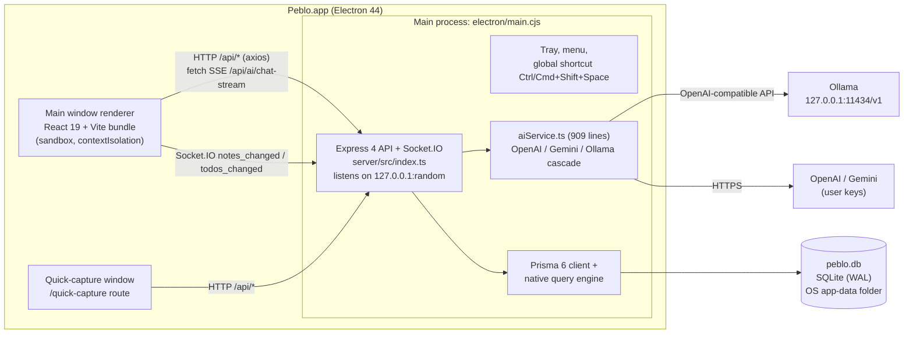
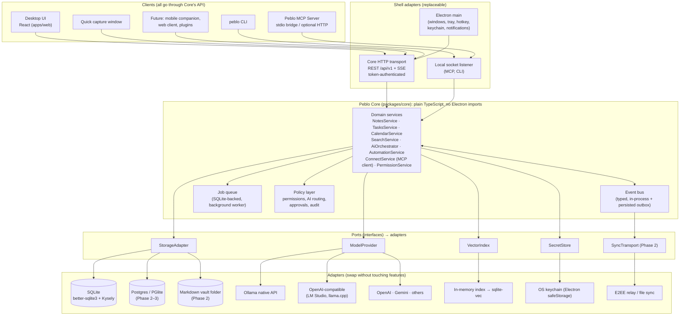
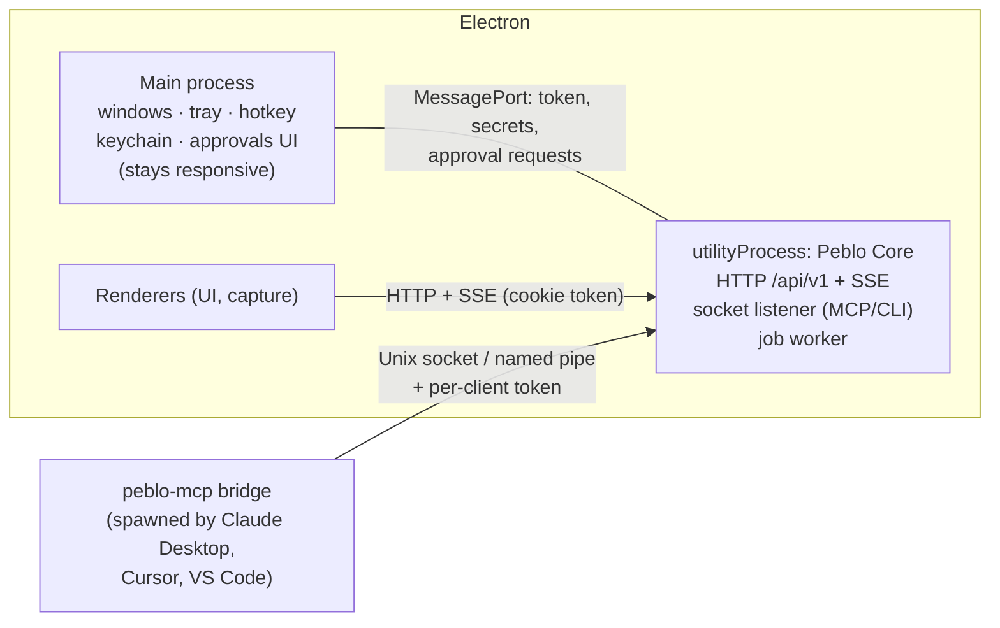
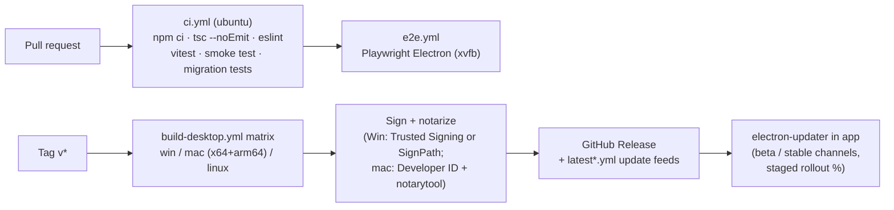
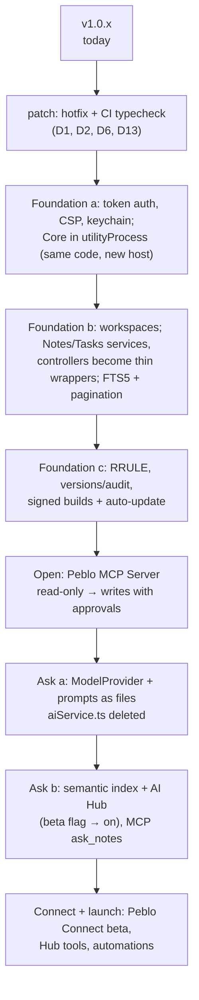

# Peblo: Technical Requirements Document (TRD)

> Owner: lead developer / architect · Status: draft v1 · Last updated: 2026-09-26
> Related: [00 Vision & strategy](./00-vision-and-strategy.md) · [01 PRD](./01-prd.md) · [03 MCP spec](./03-mcp.md) · [04 AI Hub spec](./04-ai-hub.md) · [05 Design](./05-design.md) · [06 Go-to-market](./06-go-to-market.md)

## TL;DR

- **Today** Peblo is one Electron process tree. The Express API, Prisma and all the AI code run **inside the Electron main process**. The React UI talks to that API over plain HTTP on `127.0.0.1` with **no authentication**. It works, it ships, and it's local-first, which is the right base.
- **Target:** a runtime-agnostic **Peblo Core**, a plain TypeScript library with domain services and no Electron imports. Everything else is an adapter plugged into it: a **Storage adapter** (SQLite today, sync or Postgres later), a **Model provider** interface (Ollama, OpenAI-compatible, cloud), an **event bus**, and a durable **job queue**. The desktop UI, quick capture, the **Peblo MCP Server**, a CLI and future mobile/web clients are all just clients of Core.
- **Fix first (about 2 dev-weeks):** a real bug disables *all* AI for anyone who saved an OpenAI key (`aiService.ts:41`). Other issues to fix: an unauthenticated local API, API keys stored in plain text in three places, a silent local→cloud fallback that leaks "private" data, and no typecheck in CI.
- **Key decisions:**
  - Stay on **Electron** and move Core into a `utilityProcess`.
  - Put all data access behind the Storage adapter. New code uses **better-sqlite3 + Kysely**; Prisma is retired gradually.
  - For vector search, ship **in-memory brute force over SQLite BLOBs** first, then move to **sqlite-vec** once it's proven on all three OSes, and **pgvector** only for hosted.
  - For sync (Phase 2), use a **Yjs (notes) + HLC last-writer-wins (records)** hybrid over an **end-to-end-encrypted relay**.
  - AI is **local-first; cloud only with explicit consent**.
  - Move to an **npm-workspaces monorepo**, adding `packages/*` next to today's folders so the app stays shippable.
- The Phase 1 engineering scope is **about 27 focused dev-weeks (±30%)**. For a part-time solo developer that means roughly **7–9 calendar months** (estimate; see [§10](#10-phased-engineering-roadmap-solo-dev-estimates)).

---

## Contents

1. [Current architecture](#1-current-architecture)
2. [Honest assessment: strengths, debt, risks](#2-honest-assessment)
3. [Target architecture: Peblo Core](#3-target-architecture-peblo-core)
4. [Core interfaces (TypeScript sketches)](#4-core-interfaces-typescript-sketches)
5. [Data model evolution and migration strategy](#5-data-model-evolution)
6. [Architecture decision records](#6-architecture-decision-records-adrs)
7. [Security and privacy](#7-security-and-privacy)
8. [Performance budgets and observability](#8-performance-budgets-and-observability)
9. [Testing strategy and CI/CD](#9-testing-strategy-and-cicd)
10. [Phased engineering roadmap](#10-phased-engineering-roadmap-solo-dev-estimates)
11. [Gaps table: today vs target](#11-gaps-table-today-vs-target)
12. [Refactor plan that keeps the app shippable](#12-refactor-plan-that-keeps-the-app-shippable)
13. [Risks and open questions](#13-risks-and-open-questions)
14. [Sources](#14-sources)

---

## 1. Current architecture

What the code in this repo actually does today (branch `app`):



Key facts, with file references:

| Area | How it works today | Where |
|---|---|---|
| Process model | `startBackend()` `import()`s `dist/server/index.js` **into the Electron main process** and calls `startServer({ port: 0 })`. The UI is served by the same Express app, so the window loads `http://127.0.0.1:<port>/`. | `electron/main.cjs` |
| Auth | `authenticate` middleware sets `req.user = { id: 'local-user' }` for every request. CORS allows any `http://localhost:*` / `127.0.0.1:*` origin. There is no token and no Host check. | `server/src/middleware/auth.ts`, `server/src/index.ts` |
| Storage | Prisma 6 + SQLite. The schema lives in `schema.prisma`. The runtime migrations are numbered SQL files applied by a custom runner using `PRAGMA user_version`. The runner splits files on `;` + newline. | `server/src/db.ts`, `server/prisma/sql/001_init.sql` |
| Notes | BlockNote editor → `blocksToMarkdownLossy` → Markdown string in `notes.content`. Search is `LIKE '%q%'` on title/content. `GET /api/notes` returns **every note with full content** and no pagination. | `client/src/components/BlockEditor.jsx`, `notesController.ts` |
| Versions | `note_backups` rows are written **only** when AI chat edits a note. Normal edits and reverts create no backup. | `aiChatController.ts:107,229`, `notesController.ts` `revertBackup` |
| Tasks | Recurrence is created as **N copies** (30 daily / 12 weekly / 12 monthly / 5 yearly). `tags` are JSON inside the row. The `timezone` the client sends is ignored. | `todosController.ts` |
| AI | Each feature is hand-written twice (OpenAI-style and Gemini). Prompts are inline strings, and structured output means "JSON in the prompt". Chat is single-turn and not saved; the stream sends raw JSON fragments. | `server/src/services/aiService.ts` |
| Embeddings | `note_embeddings` holds one JSON-text vector per note. It's written only for voice-created notes, and the model/dimensions aren't recorded. Nothing reads it. | `notesController.ts` `saveEmbeddingForNote` |
| Realtime | Socket.IO rooms are keyed by `userId`, and there's no handshake auth. | `server/src/index.ts`, `client/src/context/AuthContext.jsx` |
| Build/CI | esbuild transpiles TS **without typechecking**. GitHub Actions builds unsigned installers only on tag / manual dispatch; there are no PR checks. | `scripts/build-server.mjs`, `.github/workflows/build-desktop.yml` |
| Tests | `scripts/smoke-test.mjs`: about 30 API checks against a temp DB, including a fake Ollama server. No unit, UI or E2E tests. | `scripts/smoke-test.mjs` |

---

## 2. Honest assessment

### 2.1 Strengths (keep these)

- **Local-first by default.** A single SQLite file, no account, and it works offline. This is the hardest thing to retrofit, and Peblo already has it.
- **Simple, robust packaging.** One app process, a random loopback port, a single-instance lock, and a pre-warmed capture window that makes the hotkey feel instant.
- **Sensible Electron hardening.** The renderer has `sandbox: true`, `contextIsolation: true` and `nodeIntegration: false`. A strict `setWindowOpenHandler`/`will-navigate` policy is in place, and a permission handler allows only mic, clipboard and notifications.
- **Schema versioning that doesn't need Prisma migrate at runtime** (`PRAGMA user_version`). It's simple and inspectable.
- **Zod is already a dependency** (v4), which is what the MCP TypeScript SDK v2 uses for tool schemas. Contracts can be shared.
- **A useful smoke test** that exercises import/export and a fake Ollama. It's a good seed for contract tests.
- **Import/export exists** (Notion, Obsidian, Markdown zip). "No lock-in" is a real selling point.

### 2.2 Bugs and debt found in the code (ordered by impact)

| # | Finding | Evidence | Impact | Fix effort |
|---|---|---|---|---|
| D1 | **All AI breaks when an OpenAI key is saved.** `getOpenAIProvider` returns `model: p.model`, but `p` is not defined in that scope. That's a `ReferenceError` thrown while the provider map is being built, *before* the cascade loop runs. Callers catch it and return mock/fallback output, so even a working Gemini/Ollama setup is never used. TypeScript would flag this, but the build never typechecks. | `server/src/services/aiService.ts:41`; `scripts/build-server.mjs` uses esbuild only | Critical | 1 hour + add `tsc --noEmit` to CI |
| D2 | **Silent local→cloud fallback.** If the user picks "Local AI (Ollama)" and Ollama is down, `providerOrder` falls through to OpenAI and then Gemini, so the note text leaves the machine. That breaks the promise shown in Settings ("private, works offline"). | `aiService.ts` `providerOrder`, `runWithCascade` | High (trust) | 0.5 day |
| D3 | **Unauthenticated local API.** Any local process, or a web page that finds the port (port scanning / DNS rebinding, since there's no Host/Origin check), can read and write every note. Socket.IO `join` trusts whatever userId the client sends. | `middleware/auth.ts`, `index.ts` CORS | High | 2–3 days ([§7.1](#71-local-api-authentication)) |
| D4 | **API keys stored in plain text in three places:** `user_api_keys`, the `users.settings` JSON (the UI sends keys *inside* `settings`, and `updateProfile` merges them in), and renderer `localStorage['peblo-settings']`. `GET /api/profile` returns them to the renderer. The smoke test confirms `settings.geminiKey` round-trips. | `profileController.ts`, `AuthContext.jsx`, `SettingsModal.jsx:74` | High | 2 days (keychain, [§7.2](#72-secrets)) |
| D5 | **The API runs in the Electron main process.** Synchronous work such as `AdmZip` on imports of up to 500 MB, `pdf-parse`, and big `JSON.stringify` of all notes blocks the main thread. That freezes window management, the tray and the global shortcut. | `electron/main.cjs` `startBackend` | Medium–High | 1 week (utilityProcess) |
| D6 | **Error responses leak stack traces** (`{ error, stack }`) in production. | `middleware/errorHandler.ts` | Low–Med | 1 hour |
| D7 | **The migration runner will break on triggers.** It splits SQL on `;\n`, but FTS5 sync triggers (`BEGIN … ; … END;`) contain inner semicolons. It also takes no backup before migrating. | `server/src/db.ts` `migrate()` | Medium (blocks search work) | 1 day |
| D8 | **Lossy note storage.** `blocksToMarkdownLossy` drops block IDs and some formatting. Without stable block IDs you can't have block-level citations, backlinks or CRDT merge. | `BlockEditor.jsx:34` | Medium (blocks RAG citations, sync) | See [§5.4](#54-block-level-vs-markdown-storage) |
| D9 | **Recurrence as copies.** A daily series silently ends after 30 days, you can't edit a whole series, and completing one occurrence doesn't create the next. | `todosController.ts` `createTodo` | Medium (calendar trust) | 1–2 weeks (RRULE) |
| D10 | **Version history is partial.** User edits are never snapshotted, and `revertBackup` overwrites without saving the current state first. | `notesController.ts` | Medium | 2–3 days |
| D11 | **No pagination or index-backed search.** `GET /api/notes` ships all notes with full content. At about 5,000 notes × 5 KB that's around 25 MB of JSON per sidebar refresh (estimate). | `notesController.ts` `getNotes` | Medium at scale | 1 week (list DTO + FTS5) |
| D12 | **Monolithic AI service.** Prompts are duplicated per provider; JSON-in-prompt is used instead of native tool calling; chat is single-turn with no persistence; model names are hard-coded (`gpt-4o-mini`, `gemini-2.5-flash`). The Gemini SDK in use (`@google/generative-ai`) is **deprecated** in favour of `@google/genai`. | `aiService.ts`, `package.json` | Medium | Part of Model provider work |
| D13 | **Settings split-brain.** `AuthContext` merges `{ ...dbSettings, ...localStorage }`, so stale localStorage beats the database. | `AuthContext.jsx` | Low | 0.5 day |
| D14 | **No CSP.** Once the AI Hub renders model output and MCP tool results as Markdown, a CSP (especially `img-src`) is the main defence against exfiltration through remote images. | `client/index.html`, Express | Medium (future) | 0.5 day |
| D15 | **Unsigned builds, no auto-update, no crash reporting.** Users see SmartScreen/Gatekeeper warnings, and bugs are invisible. | `.github/workflows/build-desktop.yml` | High for growth | 1–2 weeks + certificate lead time |
| D16 | **Single-user assumptions baked into the schema.** `tags.name` is globally unique (no owner/workspace), and `LOCAL_USER_ID` is hard-coded. That's fine for Phase 1 but blocks Phase 3 workspaces. | `schema.prisma` `Tag` | Low now | Phase 2 |
| D17 | Big UI components (`WorkspacePage.jsx` 1,075 lines, `CalendarPage.jsx` 854, `AiChatPanel.jsx` 804) and inline styles in `SettingsModal.jsx`. | `client/src` | Low–Med | Ongoing; see [05 Design](./05-design.md) |

### 2.3 Architectural risks if nothing changes

1. **Lock-in to Express routes as the "API".** Business logic lives in controllers (`notesController.ts`, `aiChatController.ts`). An MCP server, CLI or sync engine would have to duplicate it or call HTTP.
2. **Prisma as a hard dependency.** Prisma can't model FTS5/vector virtual tables or triggers. It ships a native engine that needs the `PRISMA_QUERY_ENGINE_LIBRARY` + `asarUnpack` workarounds in `main.cjs`. And Prisma 7 changes the runtime model to driver adapters, which is a forced migration anyway.
3. **Privacy promise vs behaviour** (D2, D4). One incident, such as "Peblo sent my private notes to OpenAI", would undo the core positioning in [00 Vision](./00-vision-and-strategy.md).

---

## 3. Target architecture: Peblo Core

**Goal:** swap the database, sync, models and even the UI shell **without rewriting features**. The rule that makes this possible: *features are written once, against Core's interfaces (ports); anything technology-specific is an adapter.*



### 3.1 Layers and responsibilities

| Layer | Responsibility | Must NOT |
|---|---|---|
| **Clients** | Presentation and input. The desktop UI, quick capture, MCP server, CLI and future mobile/web apps. | Talk to the database or models directly. |
| **Shell adapters** | Host-specific glue. Electron handles windows/tray/hotkey/notifications and passes the auth token and secrets to Core. The HTTP transport maps routes to service calls. The socket listener handles MCP/CLI. | Contain business rules. |
| **Core API: domain services** | All business rules, including validation (Zod schemas shared with clients), ownership, versioning and permission checks. | Import `electron`, `express` or any vendor SDK directly. |
| **Policy layer** | One place that decides "may this actor do this?". Actors are `user`, `ai:<conversation>`, `mcp:<client>` and `automation:<id>`. The same layer handles AI routing (local vs cloud), approvals and audit logging. | Be bypassed. Every write goes through it. |
| **Event bus** | Typed events (`note.updated`, `task.completed`, `approval.requested`…). They feed UI refresh (replacing ad-hoc `io.emit`), MCP `subscriptions/listen` change notifications, the search indexer, and later the sync outbox. | Carry secrets. |
| **Job queue** | Durable background work: chunking and embedding notes, automations, imports, snapshots and cleanup. It runs in the Core process with low priority and pauses on battery. | Block request handling. |
| **Ports and adapters** | `StorageAdapter`, `ModelProvider`, `VectorIndex`, `SecretStore`, `SyncTransport`, `Clock`, `FileStore`. | Leak adapter types (Prisma models, OpenAI SDK types) into Core. |

### 3.2 Process layout (desktop)



**Why move Core into a `utilityProcess`:**
- A slow import or an embedding batch can no longer freeze the tray and the hotkey (D5).
- A crash in Core can be detected and the process restarted.
- It proves Core has no Electron dependency. The same entry point can later run headless (`peblo serve`), as a Tauri sidecar, or in a Docker image for self-hosting.

[Electron `utilityProcess`](https://www.electronjs.org/docs/latest/api/utility-process) is Node-enabled and communicates with main over `MessagePort`.

### 3.3 Core API surface (versioned)

- **HTTP:** `/api/v1/*` REST for CRUD, plus `text/event-stream` for AI runs and a global `/api/v1/events` stream. That stream replaces Socket.IO; keep Socket.IO until the UI has migrated. The current `/api/*` routes stay as a compatibility alias until the UI moves over.
- **Contracts:** Zod schemas in `packages/shared` are used by the server (validation), the UI (types), the MCP server (tool `inputSchema`s) and contract tests. An OpenAPI document is generated from them for documentation.
- **In-process:** the MCP server and CLI call services directly inside the Core process. They don't make HTTP round-trips; the socket carries MCP JSON-RPC, not REST.

### 3.4 Proposed repository layout (end of Phase 1)

```
peblo/
  package.json              # npm workspaces: ["packages/*", "client", "server"]
  electron/                 # (Phase 2: apps/desktop/) main.cjs, preload, mcp-bridge.cjs
  client/                   # (Phase 2: apps/web/) React UI, unchanged location in Phase 1
  server/                   # (Phase 2: apps/core-host/) composes Core + HTTP transport; old controllers shrink
  packages/
    shared/                 # Zod schemas, DTO types, ID helpers (UUIDv7), error codes
    core/                   # domain services, policy, event bus, job queue, ports (interfaces)
    storage-sqlite/         # StorageAdapter impl: better-sqlite3 + Kysely, migrations/, FTS5, vectors
    models/                 # ModelProvider impls: ollama, openai-compatible, openai, gemini (@google/genai)
    prompts/                # default prompt templates (*.md with front matter)
    mcp-server/             # Peblo MCP Server (tools/resources/prompts), socket + optional HTTP listener
    connect/                # Peblo Connect: MCP client manager (spawn, HTTP, OAuth)
    cli/                    # `peblo` CLI (Phase 1 stretch / Phase 2)
  docs/
```

Why npm workspaces and not pnpm/Nx/Turborepo: the repo already uses npm and `package-lock.json`, and electron-builder is happy with npm's hoisted `node_modules`. It's one less tool for a solo developer. Turborepo can be added later for caching if builds get slow. See [ADR-6](#adr-6-monorepo-and-package-layout).

---

## 4. Core interfaces (TypeScript sketches)

These are **sketches** to align on shape, not final code. They live in `packages/core/src/ports/`.

### 4.1 Shared primitives

```ts
// packages/shared/src/ids.ts
export type Brand<T, B extends string> = T & { readonly __brand: B };
export type NoteId = Brand<string, 'NoteId'>;      // UUIDv7 for new rows; legacy v4 kept
export type TaskId = Brand<string, 'TaskId'>;
export type BlockId = Brand<string, 'BlockId'>;
export type ChunkId = Brand<string, 'ChunkId'>;

export interface Page<T> { items: T[]; nextCursor: string | null; }
export interface ListQuery { cursor?: string; limit?: number; /* default 50, max 500 */ }

/** Who is acting. Every write is attributed; the policy layer decides. */
export type Actor =
  | { kind: 'user' }
  | { kind: 'ai'; conversationId: string; model: string }
  | { kind: 'mcp'; clientId: string; clientName: string }
  | { kind: 'automation'; automationId: string }
  | { kind: 'import'; source: 'notion' | 'obsidian' | 'markdown' }
  | { kind: 'sync'; deviceId: string };
```

### 4.2 Storage adapter

```ts
// packages/core/src/ports/storage.ts
export interface StorageCapabilities {
  fullTextSearch: boolean;     // SQLite FTS5 / Postgres tsvector
  vectorSearch: boolean;       // sqlite-vec / pgvector; false → Core uses in-memory VectorIndex
  transactions: boolean;
  changeFeed: boolean;         // needed by sync + MCP subscriptions
  attachments: boolean;
}

export interface StorageAdapter {
  readonly kind: 'sqlite' | 'postgres' | 'pglite' | 'vault' | 'memory';
  readonly capabilities: StorageCapabilities;

  notes: NoteRepository;
  blocks: BlockRepository;           // block JSON / derived text per note (Phase 1.5+)
  tasks: TaskRepository;
  series: TaskSeriesRepository;      // RRULE recurrence
  tags: TagRepository;
  links: LinkRepository;             // backlinks graph
  files: FileRepository;             // attachment metadata (bytes in FileStore)
  versions: VersionRepository;       // note history / audit snapshots
  conversations: ConversationRepository;
  chunks: ChunkRepository;           // RAG chunks + FTS
  audit: AuditRepository;
  kv: KeyValueRepository;            // settings (non-secret)
  changes: ChangeLog;                // append-only outbox of entity changes (sync, subscriptions)
  jobs: JobStore;                    // durable job queue storage

  transaction<T>(fn: (tx: StorageAdapter) => Promise<T>): Promise<T>;
  migrate(opts?: { backup?: boolean }): Promise<MigrationReport>;
  backup(toPath: string): Promise<void>;   // SQLite: VACUUM INTO
  close(): Promise<void>;
}

export interface NoteRepository {
  get(id: NoteId, opts?: { withContent?: boolean }): Promise<Note | null>;
  list(q: NoteListQuery): Promise<Page<NoteSummary>>;  // summaries: no full content
  create(input: NewNote, actor: Actor): Promise<Note>;
  update(id: NoteId, patch: NotePatch, expectedVersion: number, actor: Actor): Promise<Note>; // optimistic concurrency
  softDelete(id: NoteId, actor: Actor): Promise<void>;
  restore(id: NoteId, actor: Actor): Promise<void>;
  purge(id: NoteId): Promise<void>;                     // hard delete from trash
  searchText(q: string, opts: TextSearchOptions): Promise<TextHit[]>; // FTS5 BM25 or fallback
}

export interface NoteListQuery extends ListQuery {
  folder?: 'active' | 'archived' | 'trash';
  tag?: string; category?: string;
  updatedAfter?: string;                    // ISO instant
  sort?: 'updated' | 'created' | 'title';
}

export interface ChangeLog {
  append(change: EntityChange): Promise<number>;       // returns monotonic seq
  since(seq: number, limit: number): Promise<EntityChange[]>;
}
export interface EntityChange {
  seq?: number; entity: 'note' | 'task' | 'tag' | 'link' | 'file' | 'series';
  id: string; op: 'upsert' | 'delete'; hlc: string; actor: Actor; at: string;
}
```

The `vault` adapter (Phase 2: "bring your own Markdown folder") will return `capabilities.fullTextSearch = false`. Core then uses its own FTS in a sidecar SQLite cache. That's the point of capabilities: **Core degrades gracefully instead of every feature checking `if (sqlite)`**.

### 4.3 Model provider

```ts
// packages/core/src/ports/models.ts
export type Capability = 'chat' | 'stream' | 'tools' | 'vision' | 'embed' | 'json_schema' | 'thinking';

export interface ModelInfo {
  id: string;                 // "ollama:llama3.2:3b", "openai:gpt-4.1-mini"
  providerId: string;
  name: string;
  capabilities: Capability[]; // Ollama: from /api/show "capabilities"
  contextLength?: number;     // Ollama: model_info["<arch>.context_length"]
  parameterSize?: string;     // "3.2B"
  quantization?: string;      // "Q4_K_M"
  sizeBytes?: number;         // on-disk size, used for hardware hints
  isLocal: boolean;
}

export type ChatMessage =
  | { role: 'system' | 'user'; content: string; images?: string[] }
  | { role: 'assistant'; content: string; toolCalls?: ToolCall[] }
  | { role: 'tool'; toolCallId: string; name: string; content: string };

export interface ToolSpec { name: string; description: string; inputSchema: JSONSchema; }
export interface ToolCall { id: string; name: string; arguments: Record<string, unknown>; }

export interface ChatRequest {
  model: string;
  messages: ChatMessage[];
  tools?: ToolSpec[];
  toolChoice?: 'auto' | 'none' | { name: string };
  responseFormat?: { type: 'text' } | { type: 'json_schema'; schema: JSONSchema };
  temperature?: number;
  maxOutputTokens?: number;
  contextWindow?: number;     // Ollama options.num_ctx; ignored by cloud providers
  keepAlive?: string;         // Ollama keep_alive, e.g. "5m"
  think?: boolean | 'low' | 'medium' | 'high';
}

export type ChatStreamEvent =
  | { type: 'text-delta'; text: string }
  | { type: 'reasoning-delta'; text: string }
  | { type: 'tool-call'; call: ToolCall }
  | { type: 'usage'; inputTokens: number; outputTokens: number }
  | { type: 'done'; finishReason: 'stop' | 'length' | 'tool_calls' | 'cancelled' }
  | { type: 'error'; error: ProviderError };

export interface ModelProvider {
  readonly id: string;                                  // "ollama-local", "openai", "lmstudio"
  readonly kind: 'ollama' | 'openai-compatible' | 'openai' | 'gemini' | 'anthropic';
  readonly isLocal: boolean;
  listModels(signal?: AbortSignal): Promise<ModelInfo[]>;
  health(signal?: AbortSignal): Promise<{ ok: boolean; version?: string; error?: string }>;
  chat(req: ChatRequest, signal?: AbortSignal): Promise<{ message: ChatMessage; usage?: Usage }>;
  stream(req: ChatRequest, signal?: AbortSignal): AsyncIterable<ChatStreamEvent>;
  embed?(req: { model: string; input: string[]; dimensions?: number }, signal?: AbortSignal):
    Promise<{ vectors: Float32Array[]; model: string; dims: number }>;
}

/** Chooses provider+model per task under the user's privacy policy. Never silently leaves "local-only". */
export interface ModelRouter {
  resolve(task: 'chat' | 'rag' | 'summarize' | 'extract' | 'embed' | 'automation',
          prefs: { privacy: 'local-only' | 'prefer-local' | 'best-available'; modelId?: string }):
    Promise<{ provider: ModelProvider; model: ModelInfo } | { unavailable: string }>;
}
```

The Ollama adapter uses Ollama's **native** API (`/api/chat`, `/api/embed`, `/api/tags`, `/api/show`, `/api/ps`), not `/v1`. The native API lets Peblo set `options.num_ctx` and `keep_alive` per request, and read model capabilities and context length. Ollama's OpenAI-compatible layer can't set the context size (it points you to a Modelfile instead), and Ollama's default context is only 4k tokens on machines with less than 24 GiB of VRAM. That default is too small for RAG. ([Ollama context length](https://docs.ollama.com/context-length.md), [OpenAI compatibility](https://docs.ollama.com/api/openai-compatibility.md).) The `openai-compatible` adapter covers LM Studio, the llama.cpp server, vLLM and similar. Details are in [04 AI Hub §3](./04-ai-hub.md#3-model-picker-and-provider-management).

### 4.4 Event bus and job queue

```ts
// packages/core/src/ports/events.ts
export type CoreEvent =
  | { type: 'note.created' | 'note.updated' | 'note.deleted'; id: NoteId; actor: Actor }
  | { type: 'task.created' | 'task.updated' | 'task.completed' | 'task.deleted'; id: TaskId; actor: Actor }
  | { type: 'index.progress'; done: number; total: number }
  | { type: 'approval.requested'; approvalId: string; actor: Actor; summary: string }
  | { type: 'ai.run.updated'; runId: string; status: RunStatus }
  | { type: 'connect.status'; connectionId: string; status: 'up' | 'down' | 'error' };

export interface EventBus {
  publish(e: CoreEvent): void;                        // sync fan-out, in-process
  subscribe<T extends CoreEvent['type']>(type: T | '*', fn: (e: Extract<CoreEvent, { type: T }>) => void): () => void;
}

// packages/core/src/ports/jobs.ts
export interface JobQueue {
  enqueue(type: JobType, payload: unknown, opts?: { runAfter?: Date; priority?: number; dedupeKey?: string }): Promise<string>;
  /** Worker loop: claims one job at a time per type; retries with backoff; respects pause(). */
  start(handlers: Record<JobType, (payload: any, ctx: JobContext) => Promise<void>>): void;
  pause(reason: 'battery' | 'user' | 'busy'): void;
  resume(): void;
}
export type JobType = 'index.note' | 'embed.chunks' | 'automation.run' | 'snapshot.note' | 'import.archive' | 'purge.trash';
```

**Why a SQLite `jobs` table instead of BullMQ and friends:** those need Redis. A table with `status`, `run_after`, `attempts` and `dedupe_key` is durable across restarts, which matters because indexing 5,000 notes can take minutes on a laptop. It's also trivially inspectable. Postgres-hosted Core (Phase 3) can switch to `pg-boss` behind the same interface.

---

## 5. Data model evolution

### 5.1 Principles

1. **IDs:** use **UUIDv7** ([RFC 9562](https://www.rfc-editor.org/rfc/rfc9562)) for all new rows. They're time-ordered, which is better for B-tree locality and gives a "roughly sorted by creation" order. They're globally unique without coordination, which is required for multi-device sync. They're also still valid UUID strings, so **existing v4 IDs stay as they are and no ID migration is needed**. ULID has the same properties but a different text format; UUIDv7 wins because it's a standard and fits the existing `TEXT` UUID columns.
2. **Timestamps:** store instants as UTC ISO-8601 or epoch ms, consistently through one helper. **Dates without times are stored separately** (`due_date TEXT 'YYYY-MM-DD'`) from instants (`due_at`), and each carries an IANA `tz`. Today `deadline` (DateTime) plus `startTime`/`endTime` (`'HH:mm'` strings) mix both, and the client's `timezone` is ignored.
3. **Soft delete everywhere:** every syncable entity gets `deleted_at` as a tombstone. Today only notes have one; todos and tags are hard-deleted, and sync can't propagate hard deletes.
4. **Row version:** every row gets `version INTEGER` (optimistic concurrency, so two windows or an MCP client can't overwrite each other) and, in Phase 2, `hlc TEXT` (a hybrid logical clock used for merges).
5. **Everything attributable:** writes record an `Actor` ([§4.1](#41-shared-primitives)) in `audit_events` and in `note_versions.actor`.

### 5.2 Target entities (SQLite dialect, abbreviated)

```sql
-- notes: content canonical as block JSON (Phase 1.5); markdown is derived for export/search
ALTER TABLE notes ADD COLUMN content_json TEXT;          -- BlockNote document JSON (stable block ids)
ALTER TABLE notes ADD COLUMN content_hash TEXT;          -- sha256 of canonical content → skip re-index
ALTER TABLE notes ADD COLUMN version INTEGER NOT NULL DEFAULT 1;

CREATE TABLE links (                                      -- backlinks graph
  src_note_id TEXT NOT NULL, src_block_id TEXT,
  dst_note_id TEXT NOT NULL, dst_block_id TEXT,
  kind TEXT NOT NULL CHECK (kind IN ('wikilink','mention','embed','task_ref')),
  created_at TEXT NOT NULL,
  PRIMARY KEY (src_note_id, src_block_id, dst_note_id, kind)
);
CREATE INDEX links_dst ON links(dst_note_id);

CREATE TABLE task_series (                                -- RRULE recurrence (RFC 5545)
  id TEXT PRIMARY KEY, rrule TEXT NOT NULL,               -- e.g. 'FREQ=WEEKLY;BYDAY=MO,WE'
  dtstart TEXT NOT NULL, tz TEXT NOT NULL,
  exdates TEXT NOT NULL DEFAULT '[]',                     -- skipped occurrences
  template_json TEXT NOT NULL,                            -- text/priority/tags/note link for new occurrences
  created_at TEXT NOT NULL, deleted_at TEXT
);
ALTER TABLE todos ADD COLUMN series_id TEXT REFERENCES task_series(id);
ALTER TABLE todos ADD COLUMN occurrence_date TEXT;        -- which occurrence this row materialises
ALTER TABLE todos ADD COLUMN deleted_at TEXT;
CREATE TABLE task_tags (task_id TEXT, tag_id TEXT, PRIMARY KEY (task_id, tag_id)); -- replaces JSON tags

CREATE TABLE files (                                      -- attachments, content-addressed
  id TEXT PRIMARY KEY, sha256 TEXT NOT NULL UNIQUE, mime TEXT NOT NULL,
  size INTEGER NOT NULL, original_name TEXT, created_at TEXT NOT NULL, deleted_at TEXT
);                                                        -- bytes at <userData>/files/ab/cd/<sha256>
CREATE TABLE note_files (note_id TEXT, file_id TEXT, block_id TEXT, PRIMARY KEY (note_id, file_id, block_id));

CREATE TABLE note_versions (                              -- replaces note_backups (migrated in)
  id TEXT PRIMARY KEY, note_id TEXT NOT NULL, version INTEGER NOT NULL,
  title TEXT, content_json TEXT, content_md TEXT NOT NULL,
  actor TEXT NOT NULL,                                    -- JSON Actor
  reason TEXT NOT NULL CHECK (reason IN ('autosave','before_ai_edit','before_mcp_edit','before_revert','import','manual')),
  created_at TEXT NOT NULL
);
CREATE INDEX note_versions_note ON note_versions(note_id, created_at DESC);

CREATE TABLE audit_events (
  id TEXT PRIMARY KEY, at TEXT NOT NULL, actor TEXT NOT NULL,
  action TEXT NOT NULL,                                   -- 'note.create', 'mcp.tool_call', 'connect.spawn', ...
  entity_type TEXT, entity_id TEXT, details_json TEXT, outcome TEXT NOT NULL -- 'ok'|'denied'|'error'
);

-- search (details in 04-ai-hub.md §5)
CREATE TABLE chunks (id TEXT PRIMARY KEY, note_id TEXT NOT NULL, ord INTEGER NOT NULL,
  heading_path TEXT, block_ids TEXT NOT NULL, text TEXT NOT NULL, token_count INTEGER NOT NULL,
  content_hash TEXT NOT NULL, updated_at TEXT NOT NULL);
CREATE VIRTUAL TABLE chunks_fts USING fts5(text, heading_path, content='chunks', content_rowid='rowid',
  tokenize='unicode61 remove_diacritics 2');
CREATE TABLE embedding_models (id TEXT PRIMARY KEY, provider TEXT, model TEXT, dims INTEGER,
  doc_prefix TEXT, query_prefix TEXT, created_at TEXT);
CREATE TABLE chunk_vectors (chunk_id TEXT NOT NULL, model_id TEXT NOT NULL, vector BLOB NOT NULL, -- Float32 LE
  PRIMARY KEY (chunk_id, model_id));

CREATE TABLE changes (seq INTEGER PRIMARY KEY AUTOINCREMENT, entity TEXT, entity_id TEXT,
  op TEXT, hlc TEXT, actor TEXT, at TEXT);                -- outbox for sync + subscriptions
CREATE TABLE jobs (id TEXT PRIMARY KEY, type TEXT, payload TEXT, status TEXT, priority INTEGER,
  attempts INTEGER DEFAULT 0, run_after TEXT, dedupe_key TEXT UNIQUE, last_error TEXT, updated_at TEXT);
CREATE TABLE secrets_index (id TEXT PRIMARY KEY, label TEXT, ciphertext BLOB, updated_at TEXT);
```

The AI Hub tables (`conversations`, `messages`, `tool_calls`, `message_sources`, `model_providers`, `automations`) are specified in [04 AI Hub §8](./04-ai-hub.md#8-data-model). The MCP tables (`mcp_clients`, `mcp_grants`, `mcp_connections`) are in [03 MCP](./03-mcp.md).

### 5.3 Decisions inside the data model

| Topic | Options | Recommendation | Why |
|---|---|---|---|
| Recurrence | (a) keep N copies; (b) RRULE series + **materialise the next occurrence on completion** + expand virtually for calendar views; (c) RRULE + materialise a rolling 90-day window | **(b)** using [`rrule`](https://github.com/jkbrzt/rrule) | Series never "run out", edits apply to the whole series, and it round-trips to iCal/Google Calendar ([RFC 5545](https://www.rfc-editor.org/rfc/rfc5545)). The calendar only needs virtual expansion for the visible range. |
| Task tags | JSON column vs join table | **`task_tags` join table**, sharing `tags` with notes | Needed for filters, the tag graph, MCP `list_tasks(tag)` and sync granularity. |
| Embeddings | one vector per note vs per chunk | **Per chunk**, and each vector records its `model_id` | Citations need passages. Switching embedding models must never mix vector spaces (today's table can't tell). |
| Versions | snapshots vs diffs | **Snapshots**, throttled (autosave at most every 10 min while editing, plus always before AI/MCP/revert) with pruning (keep all from 7 days, then daily for 90 days, then weekly) | Simple and robust. Text compresses well. Diffs are an optimisation for later. |
| Attachments | in DB vs on disk | **On disk, content-addressed** by sha256, with metadata in `files` | Keeps the DB small and dedupes. Sync and backup handle the folder separately. Unblocks image import (currently skipped). |

### 5.4 Block-level vs Markdown storage

| Option | Pros | Cons |
|---|---|---|
| **A. Markdown canonical** (today) | Portable, human-readable, vault-friendly, easy export. | Lossy round-trip with BlockNote. No stable block IDs, so no block citations, block backlinks or fine-grained merge. |
| **B. BlockNote JSON canonical, Markdown derived** | Lossless for the editor. Stable block IDs for RAG citations (`note#block`) and backlinks. Still exports Markdown. | Tied to BlockNote's schema (mitigate with a thin mapping layer and a versioned `schema` field). |
| **C. CRDT document canonical (Yjs)** with JSON/Markdown snapshots derived | Merge-friendly multi-device and collab editing; BlockNote supports Yjs collaboration natively. | Binary blobs, harder to inspect or query, more complexity. Only worth it once sync ships. |

**Recommendation:** **B in Phase 1** (write `content_json` alongside `content`, and make `content` a derived Markdown mirror so all existing code keeps working), then **C in Phase 2** when sync lands (store `ydoc BLOB`; JSON and Markdown become snapshots). The mirror means export, the AI prompts and import don't change.

### 5.5 Migration strategy

1. **Fix the runner first (D7).** Once Core owns a raw `better-sqlite3` connection, run each migration file with `db.exec()` inside a transaction. That handles triggers and multi-statement files correctly. Keep `PRAGMA user_version` as the version marker; it's simple and already in users' databases.
2. **Back up before migrating:** `VACUUM INTO '<userData>/backups/peblo-v{from}-{timestamp}.db'`. Keep the last 3, and add a "Restore previous version" button in Settings → Your data.
3. **Expand → backfill → switch → contract.** Add new columns and tables (`content_json`, `task_tags`, `chunks`…). Backfill in the **job queue**, not at startup: parse Markdown to blocks, move JSON tags into `task_tags`, collapse recurring copies into series. Switch reads behind a flag, then drop old columns **one release later**. Every release can open the previous release's data.
4. **Collapse recurring copies:** group `todos` by `(text, recurrence, noteId)` with deadlines on the expected cadence. Create one `task_series`, keep completed copies as history, and delete future uncompleted copies. This is a heuristic, so a report is shown in the release notes.
5. **Migration tests in CI:** keep fixture databases from each released version (`server/test/fixtures/peblo-v1.0.0.db`, …) and upgrade them in CI, asserting row counts and invariants.
6. **Prisma coexistence:** while Prisma still serves old routes, both connections use WAL and `busy_timeout = 5000`. The `schema.prisma` file is kept in sync for tables Prisma still reads; new tables aren't declared there.

---

## 6. Architecture decision records (ADRs)

Each ADR follows the same format: context, options, decision, consequences. Status: *Proposed*, pending founder sign-off.

### ADR-1: Desktop shell: Electron vs Tauri

**Context.** Peblo ships on Electron 44 with a Node backend (Express + Prisma). The complaints about Electron are size (installers of roughly 100 MB or more) and RAM. The vision says the UI shell must be swappable.

| Option | Pros | Cons |
|---|---|---|
| **Stay on Electron** | Zero rewrite. Node in-process (Core, MCP SDK, better-sqlite3 all "just work"). Mature auto-update, signing and E2E tooling (electron-builder, Playwright `_electron`). Chromium gives identical rendering everywhere. | Bigger install and RAM. Chromium security updates are the app's responsibility. |
| **Tauri 2** | Much smaller installers, system webview, Rust core, good security model ([Tauri 2](https://v2.tauri.app/)). | The backend is Node, so it would have to ship as a **sidecar binary** ([sidecar docs](https://v2.tauri.app/develop/sidecar/)), which gives back much of the size win, or be rewritten in Rust. WebKitGTK/WebView2/WKWebView differences hit the BlockNote editor. It means a new language and toolchain for a solo developer. |
| **Native per platform** | Best feel | Not realistic for one person. |

**Decision.** **Stay on Electron** for Phases 1–2, but make the swap cheap:
- Core runs in a `utilityProcess`, with no `electron` imports in `packages/*`.
- The UI talks only HTTP/SSE to Core, never `ipcRenderer`, for app data.
- Shell-only features (tray, hotkey, keychain, notifications) sit behind a small `ShellBridge` interface.

Revisit Tauri only if install size or RAM becomes a top-3 complaint in user feedback. **Consequence:** the same Core can power a CLI, a headless server and a mobile companion's backend without touching Electron.

### ADR-2: Database access layer: Prisma vs Drizzle / Kysely / raw vs embedded alternatives

**Context.** Search needs FTS5 virtual tables and triggers, and possibly sqlite-vec. Sync needs an outbox and `version`/`hlc` columns. Hosted Phase 3 may use Postgres. Prisma 7 makes the Rust-free client the default and requires driver adapters ([Prisma 7 changelog](https://www.prisma.io/changelog/2025-11-19), [upgrade guide](https://www.prisma.io/docs/guides/upgrade-prisma-orm/v7)), so a migration effort is coming either way.

| Option | Pros | Cons |
|---|---|---|
| **Prisma (6→7)** | Already in use. Great DX for CRUD. | Can't model FTS5/virtual tables/triggers. Forced v7 upgrade. Codegen step plus packaging workarounds (`asarUnpack`, engine path hack in `main.cjs`). Two schema sources (`schema.prisma` + SQL files). |
| **Drizzle** | TS schema, SQLite/PG/libSQL/PGlite drivers, light runtime. | Its migration generator struggles with virtual tables; you still hand-write SQL for search. |
| **Kysely** ([kysely.dev](https://kysely.dev)) | A typed SQL *query builder*, not an ORM. Dialects for SQLite (better-sqlite3), Postgres and PGlite. Raw SQL is first-class, which is ideal for FTS5 and vectors. No codegen engine. | You write migrations in SQL (already the case) and type definitions by hand or with `kysely-codegen`. |
| **Raw better-sqlite3** | Fastest (synchronous), can `loadExtension`, full control. | No type safety and SQLite-only. Makes the Postgres adapter a rewrite. |
| **Embedded alternatives:** libSQL (embedded replicas), PGlite (Postgres in WASM), DuckDB | libSQL adds built-in replication. PGlite gives Postgres semantics locally. | libSQL ties sync to Turso's model. PGlite is heavier and its extension story is younger. DuckDB is analytics, not OLTP. Worth watching, not adopting. |

**Decision.** Use **better-sqlite3 + Kysely inside `packages/storage-sqlite`**, behind the `StorageAdapter` port.
- New tables (search, AI Hub, MCP, jobs) use it from day one.
- Existing entities move over one repository at a time.
- Prisma is **frozen at v6** (no v7 upgrade work) and deleted once the last controller is migrated (target: end of Phase 1 / early Phase 2).

**Consequences:**
- The Prisma native-engine packaging hack goes away.
- `better-sqlite3` is a native module and must be rebuilt for Electron's Node ABI (`electron-builder install-app-deps`). CI covers that.
- A future Postgres adapter reuses most Kysely queries.

### ADR-3: Vector search

**Context.** Personal scale: 2,000 notes × about 5 chunks = around 10,000 chunks. At 768 dimensions × 4 bytes that's about 30 MB of vectors (estimate). We need hybrid search (keyword + vector) that works offline on an 8 GB laptop.

| Option | Pros | Cons |
|---|---|---|
| **In-memory brute force** (vectors stored as Float32 BLOBs in SQLite, loaded into one `Float32Array`) | No native extension. Exact results. 10k × 768 dot products is a few ms in JS (estimate). Trivial to test. | RAM grows linearly. Above roughly 200k chunks it needs smarter structures. |
| **sqlite-vec** ([docs](https://alexgarcia.xyz/sqlite-vec/js.html)) | Vectors live in the same DB file and transaction. SQL KNN (`vec0`). Tiny. | Native extension loading must work on Win/mac/Linux × x64/arm64 inside Electron. Other Node/Electron projects report loading failures (e.g. Windows + better-sqlite3, macOS `node:sqlite` built without extension loading: [openclaw#65704](https://github.com/openclaw/openclaw/issues/65704), [#66977](https://github.com/openclaw/openclaw/issues/66977)). Still pre-1.0 ([releases](https://github.com/asg017/sqlite-vec/releases)). |
| **LanceDB** ([repo](https://github.com/lancedb/lancedb)) | Embedded, ANN indexes, scales far beyond personal use. | A second storage engine and file set to back up and sync, a large native dependency, and it's overkill at this scale. |
| **pgvector** | Standard for hosted Postgres. | Needs Postgres, so only relevant for the hosted/team offering (Phase 3). |

**Decision.**
- **Phase 1:** a `VectorIndex` port with the **in-memory implementation** over `chunk_vectors` BLOBs.
- **Phase 2:** add a **sqlite-vec** implementation behind the same port once a CI job proves it loads on all 6 OS/arch targets. Keep in-memory as the fallback when the extension fails.
- **Phase 3 hosted:** **pgvector**.

Search quality is identical because brute force is exact.

### ADR-4: Sync approach (Phase 2)

**Context.** The vision promises local-first, multi-device, encrypted, and later collaboration. Notes are rich text; tasks and calendar items are small records.

| Option | Pros | Cons |
|---|---|---|
| **CRDT: Yjs** ([yjs](https://github.com/yjs/yjs)) for documents | Battle-tested for rich-text merge; BlockNote/ProseMirror bindings exist; the path to real-time collaboration. | Only covers documents. Records need their own scheme. Tombstone growth needs occasional compaction. |
| **CRDT: Automerge** ([automerge.org](https://automerge.org)) for everything | One model for docs and records, with good history. | Heavier. Rich-text-in-editor integration is less mature than Yjs + BlockNote. |
| **Server-authoritative** (Postgres + change feed; ElectricSQL/PowerSync style) | Simple mental model, easy teams and permissions. | Server sees plaintext (conflicts with E2EE), needs always-on infrastructure, offline edits need conflict rules anyway. |
| **File-based** (Markdown vault in iCloud/Dropbox/Syncthing) | Zero infrastructure, users own the files, Obsidian-compatible. | Conflicts become duplicate files. Tasks, calendar, AI history and metadata don't map cleanly to files. Hard to make reliable across providers. |

**Decision.** A **hybrid**:
- **Yjs** for note bodies.
- **Per-field last-writer-wins with a hybrid logical clock (HLC)** for structured records (tasks, tags, series, settings).
- Everything travels as **end-to-end-encrypted change batches** through a dumb relay (the server stores ciphertext blobs; keys stay on devices).
- The **Markdown vault mirror** is a separate, one-way-then-two-way *feature* (the "vault" storage adapter), not the sync backbone.

**Phase 1 prerequisites** (cheap now, expensive later): UUIDv7, `deleted_at` everywhere, `version` columns, the `changes` outbox, and the event bus. Details belong in a Phase 2 sync RFC.

### ADR-5: Where AI runs

**Context.** Positioning is "private, local AI". Users range from an 8 GB laptop with no GPU to machines with 24 GB+ GPUs. The current cascade silently falls back to cloud (D2).

| Option | Pros | Cons |
|---|---|---|
| Cloud-first | Best quality, zero setup | Breaks the privacy promise and costs the user money. |
| Local-only | Strongest privacy | Weak on low-end hardware, and some users want cloud quality. |
| **Local-first with explicit cloud fallback** | Honest defaults, and it works for everyone. | Needs clear UI and per-feature routing. |

**Decision.** Local-first, with **three privacy modes** stored per workspace and optionally per conversation or automation:
- **Local only.** Never contacts cloud providers; features degrade instead.
- **Prefer local.** Cloud is used **only after a one-time consent per provider** and with a visible badge on every cloud-generated message.
- **Best available.**

**Embeddings are always local by default.** Indexing a whole vault in the cloud is a bulk export of private data. Cloud embeddings are opt-in with a warning. Routing is implemented by `ModelRouter` ([§4.3](#43-model-provider)).

### ADR-6: Monorepo and package layout

**Context.** Peblo needs to share Core, schemas and prompts across the desktop app, the MCP server, the CLI and later mobile/web, without a disruptive reorganisation.

| Option | Pros | Cons |
|---|---|---|
| **npm workspaces**, adding `packages/*` next to `client/`, `server/`, `electron/` | No new tooling. Incremental. electron-builder-friendly. | No build caching. |
| pnpm + Turborepo | Fast, strict dependency isolation, caching. | Migration friction. pnpm's symlinked `node_modules` needs electron-builder configuration. |
| Nx | Powerful generators and graph | Heavy for one person. |
| Polyrepo | Independent releases | Version skew between Core and clients, especially painful with shared Zod contracts. |

**Decision.** **npm workspaces now.** Rename `client/`→`apps/web`, `electron/`→`apps/desktop`, `server/`→`apps/core-host` in Phase 2 once CI is solid. Add Turborepo only if CI exceeds about 10 minutes. The layout is in [§3.4](#34-proposed-repository-layout-end-of-phase-1).

### ADR-7: Core ↔ UI transport

| Option | Pros | Cons |
|---|---|---|
| **HTTP REST + SSE over loopback, token-authenticated** | Already in place. The same API serves a future web or mobile client. curl-debuggable. | Needs auth hardening ([§7.1](#71-local-api-authentication)). |
| Electron IPC (`contextBridge`) | No network surface | Ties the UI to Electron (against the vision) and duplicates the API for other clients. |
| tRPC | End-to-end types | Another abstraction. Zod contracts already give types. |

**Decision.** **HTTP + SSE with a per-launch auth token.** Version it under `/api/v1`. Replace Socket.IO with an SSE `/api/v1/events` stream once the UI has migrated, which removes a dependency and simplifies auth.

---

## 7. Security and privacy

### 7.1 Local API authentication

**Problem:** today any process on the machine, or a malicious web page that finds the random port via scanning or DNS rebinding, can call `127.0.0.1:<port>/api/*` (D3).

**Design:**
1. **Token.** Electron main generates `crypto.randomBytes(32)` at every launch and passes it to Core over the `utilityProcess` `MessagePort`, never through env or argv, where other processes can read it.
2. **UI delivery.** Before `loadURL`, main sets a cookie on the Core origin: `session.defaultSession.cookies.set({ url: 'http://127.0.0.1:<port>', name: 'peblo_session', value: token, httpOnly: true, sameSite: 'strict' })`. The UI is served from the same origin, so axios, `fetch` for SSE, and Socket.IO send it automatically. No renderer JavaScript ever sees the token.
3. **Server checks, on every request:**
   - `Host` header ∈ {`127.0.0.1:<port>`, `localhost:<port>`}. This blocks DNS rebinding.
   - `Origin`, if present, equals the Core origin. The permissive CORS regex is removed.
   - The cookie or an `Authorization: Bearer` header must match (constant-time compare).
   - Socket.IO/SSE handshakes check the same cookie. This replaces `authenticate`'s unconditional `local-user`.
4. **Other local clients** (CLI, MCP bridge) don't use this token. They connect to the **local socket** (Unix domain socket `~/.../Peblo/run/core.sock` with `0600` permissions, or a Windows named pipe `\\.\pipe\peblo-core-<user-sid>`) with their own revocable per-client tokens. See [03 MCP §1.4](./03-mcp.md#14-permission-model).
5. **Headers:** add a CSP (`default-src 'self'; img-src 'self' data: blob:; connect-src 'self' http://127.0.0.1:*; object-src 'none'; frame-ancestors 'none'`), `X-Content-Type-Options: nosniff`, and no stack traces in responses (D6).

### 7.2 Secrets

- Store API keys, MCP connection tokens and OAuth refresh tokens encrypted with **Electron [`safeStorage`](https://www.electronjs.org/docs/latest/api/safe-storage)**, which uses Keychain on macOS, DPAPI on Windows, and libsecret/kwallet on Linux. The ciphertext goes in `secrets_index`. Core asks main to decrypt over the `MessagePort` when it needs a secret. `keytar` is unmaintained, so don't use it.
- **Linux caveat:** when no secret service is available, safeStorage can fall back to a weak `basic_text` backend. Detect this with `safeStorage.getSelectedStorageBackend()` and show a warning.
- **Never return secrets to renderers.** The API returns `{ configured: true, last4: 'x9Qa' }`. Remove keys from `users.settings` and `localStorage` with a one-time migration (D4).
- Never log secrets. Add a log redaction filter for `sk-…`, `AIza…`, `Bearer …` and `pbl_mcp_…`.

### 7.3 Encryption at rest

| Option | Pros | Cons |
|---|---|---|
| Rely on OS full-disk encryption (BitLocker / FileVault / LUKS) | Zero code; protects against a stolen laptop. | Doesn't help against other users or processes on the same account. |
| **SQLCipher-compatible DB** via [`better-sqlite3-multiple-ciphers`](https://github.com/m4heshd/better-sqlite3-multiple-ciphers), with the key in the keychain or derived from a passphrase | A "Lock Peblo" feature; backups are encrypted. | Slight performance cost. Losing the passphrase means losing the data. Makes the sqlite-vec path harder (the extension must be compatible). |
| Field-level encryption | Granular | Breaks FTS and search. |

**Decision:** Phase 1 documents the OS disk-encryption guidance and uses the keychain for secrets. **Phase 2** adds optional SQLCipher ("Protect with passphrase"), and **sync payloads are always E2EE** (XChaCha20-Poly1305 via libsodium).

### 7.4 MCP permission model (summary)

- Read-only by default.
- Per-client tokens with scopes (`notes:read`, `tasks:read`, `calendar:read`, `notes:write`, `tasks:write`, `ai:ask`).
- Writes need approval in Peblo's own UI (not only the MCP client's).
- No delete tools in Phase 1.
- Every call is written to `audit_events`, with an Activity log UI.
- Every AI/MCP edit creates a `note_versions` snapshot, so it's one-click reversible.

For Peblo Connect: every spawned command is shown in full and needs consent, secrets are kept out of the model context, and "taint tracking" forces approval for write tools after the conversation has taken in untrusted content. Full detail is in [03 MCP](./03-mcp.md).

### 7.5 Electron hardening checklist (delta from today)

- [ ] Add CSP (see [§7.1](#71-local-api-authentication)). Keep `sandbox`, `contextIsolation` and the `setWindowOpenHandler` policy.
- [ ] Set [Electron fuses](https://www.electronjs.org/docs/latest/tutorial/fuses): disable `EnableNodeOptionsEnvironmentVariable` and `EnableNodeCliInspectArguments`, and enable `EnableEmbeddedAsarIntegrityValidation` / `OnlyLoadAppFromAsar`. `RunAsNode` stays **enabled** in Phase 1 because the MCP bridge uses it ([03 MCP §1.2](./03-mcp.md#12-transports)). Revisit when the bridge becomes a standalone binary.
- [ ] Validate every `shell.openExternal` URL (only `https:`/`mailto:`). This matters for OAuth URLs from MCP servers.
- [ ] Keep Electron within the 3 supported major versions (automated with Dependabot/Renovate).

---

## 8. Performance budgets and observability

### 8.1 Budgets (targets on a reference low-end laptop: 4-core CPU, 8 GB RAM, SSD, no discrete GPU)

These are **estimates and targets**, to be measured in CI and in a manual release checklist.

| Metric | Budget | How we'll meet it |
|---|---|---|
| Cold start → interactive dashboard | ≤ 2.5 s | Core in utilityProcess starts in parallel with the window, lazy routes (already there), no full-notes fetch on start. |
| Quick-capture hotkey → focused input | ≤ 150 ms | Pre-warmed hidden window (already there). |
| Open a 10k-word note | ≤ 150 ms | `get` by id, JSON content, no N+1. |
| Sidebar list (5k notes) | ≤ 100 ms, ≤ 500 KB payload | Summaries + cursor pagination instead of full content (D11). |
| Keyword search (10k notes) | ≤ 50 ms p95 | FTS5 BM25. |
| Hybrid search (10k chunks), excl. query embedding | ≤ 150 ms p95 | In-memory cosine + FTS5 + RRF. |
| Query embedding (local, e.g. nomic-embed-text on CPU) | ≤ 300 ms (estimate) | Keep the embed model warm while the Hub is open (`keep_alive`). |
| Background indexing | ≤ 1 CPU core, paused on battery by default | Job queue plus Electron `powerMonitor.isOnBatteryPower()`. |
| Idle RAM (app only, excluding Ollama) | ≤ 350 MB | No note contents cached in the renderer beyond the visible ones. |
| AI chat first token (local 3B model, warm) | ≤ 2 s (estimate) | Warm the model when the Hub opens; bounded prompt size ([04 §6](./04-ai-hub.md#6-context-window-budgeting)). |

### 8.2 Observability

- **Local structured logs:** pino JSON logs in `<userData>/logs/`, rotated (5 × 5 MB), with the redaction filter from [§7.2](#72-secrets). A "Help → Export diagnostics" button zips logs, versions, OS info and DB stats (no note content) for bug reports.
- **Opt-in crash reporting:** Sentry for Electron ([docs](https://docs.sentry.io/platforms/javascript/guides/electron/)) or self-hosted GlitchTip. It's **off by default**, and first-run onboarding asks in plain words. A `beforeSend` scrubber removes breadcrumbs containing note or task text and AI prompts.
- **Opt-in product analytics** is a Go-to-market decision; see [06 Go-to-market](./06-go-to-market.md). Technical requirement: a single `track()` wrapper that is a no-op unless the user opted in, and never sends content.
- **Health panel** (Settings → Diagnostics): shows Core uptime, job queue depth, index coverage (chunks embedded / total), provider health, MCP clients connected, and DB size.

---

## 9. Testing strategy and CI/CD

### 9.1 Test pyramid

| Layer | Tooling | What | Target (end of Phase 1) |
|---|---|---|---|
| Type safety | `tsc --noEmit` on `server/` and `packages/*`; `// @ts-check` + JSDoc on the most important client files | Catches D1-class bugs | Required on every PR |
| Unit (Core) | Vitest; `StorageAdapter` against in-memory SQLite (`:memory:`); fake `ModelProvider`; fake `Clock` | Services, policy/permissions, RRULE expansion, chunker, RRF fusion, context budgeter, prompt rendering | 70% line coverage of `packages/core` |
| Contract (API) | Vitest + supertest against `createApp()`; Zod schemas from `packages/shared` validate responses | Every `/api/v1` route: status codes, shapes, auth (401 without token, 403 on bad Host/Origin) | All routes |
| MCP conformance | `@modelcontextprotocol/client` in tests driving the server over an in-memory socket pair; [MCP Inspector](https://github.com/modelcontextprotocol/inspector) manually | `server/discover`, tools/resources/prompts listing, scope enforcement, approval timeouts | All tools |
| Migration | Fixture DBs from each release upgraded to HEAD | Data preserved, invariants hold | Every release fixture |
| E2E | Playwright `_electron.launch()` ([docs](https://playwright.dev/docs/api/class-electron)) with `PEBLO_DATA_DIR` temp dir (already supported in `main.cjs`) and a fake Ollama (reuse the smoke-test mock) | Quick capture creates a note; editor save/reload; search; AI Hub ask-your-notes shows citations; MCP approval dialog | 10–15 critical flows, run on Linux in CI (xvfb) and macOS/Windows nightly |
| RAG quality | `npm run eval:rag` with a golden set ([04 AI Hub §10](./04-ai-hub.md#10-evaluation)) | recall@k, citation precision | Tracked per release, with no regressions over 5 points |
| Existing smoke test | `scripts/smoke-test.mjs` | Kept as a fast end-to-end API sanity check | Runs on every PR |

### 9.2 CI/CD pipeline



- **Signing:**
  - **macOS** needs an Apple Developer Program membership (US$99/year, [apple.com](https://developer.apple.com/programs/)) and notarization via electron-builder's `notarize` with an App Store Connect API key. **Auto-update on macOS requires a signed app.**
  - **Windows:** Microsoft's cloud signing service (Azure Trusted Signing, roughly US$10/month; *estimate, check current pricing*) or [SignPath](https://signpath.org/) (free for qualifying open-source projects). Unsigned installers trigger SmartScreen warnings, which hurts the first-100-users goal in [06 Go-to-market](./06-go-to-market.md).
  - **Linux:** AppImage/deb unsigned is acceptable; optionally publish checksums signed with GPG.
- **Auto-update:** [`electron-updater`](https://www.electron.build/auto-update) with the GitHub Releases provider (already publishing there), `allowPrerelease` for a beta channel, and `stagingPercentage` for staged rollouts. Updates install on quit; the user is never interrupted mid-edit.
- **Release hygiene:** Conventional Commits → changelog, a DB backup before the first launch of a new version ([§5.5](#55-migration-strategy)), and Renovate for dependency updates (weekly batch).

---

## 10. Phased engineering roadmap (solo dev estimates)

Assumptions:
- **1 dev-week = about 20 focused hours.** The PRD assumes about 15 h/week during term ([01 PRD §9](./01-prd.md#9-release-plan)), which is about 0.75 dev-weeks per calendar week, with more during college breaks.
- All numbers are **estimates** with ±30% uncertainty.

### Phase 1: "Local-first AI" (engineering scope)

The steps are grouped by the PRD's release plan, which runs **Foundation → MCP → AI Hub → Connect** ([01 PRD D4](./01-prd.md#d4-build-order-inside-phase-1)). I agree with that order technically: MCP read tools only need Core services plus keyword search. `search_notes` reports `semantic_available: false` until the vector index lands in the "Ask" release, so MCP isn't blocked by the RAG work.

| Step | Deliverable | Est. dev-weeks | PRD release |
|---|---|---|---|
| **1.0 Hotfix and hygiene** | Fix D1 (`p.model`). Stop local→cloud silent fallback (D2). Strip stacks (D6). `ci.yml` with `tsc --noEmit` + smoke test on PRs. Settings split-brain (D13). | 1 | patch, ship now |
| **1.1 Local API hardening** | Token cookie, Host/Origin checks, CSP, Socket.IO auth (D3/D14). Secrets to keychain, removed from settings and localStorage (D4). | 1.5 | 1.1 Foundation |
| **1.2 Core in utilityProcess** | Move `startServer` into `utilityProcess`, MessagePort bridge for token/secrets, crash restart (D5). Also becomes the home for OS reminders (ACT-03), indexing and automations. | 1 (+0.5 reminders) | 1.1 Foundation |
| **1.3 Workspaces + Core skeleton** | npm workspaces. `packages/shared` (Zod), `packages/core` (ports, event bus, policy, job queue), `packages/storage-sqlite` (better-sqlite3 + Kysely, new migration runner with backups, D7). Notes and Tasks services wrap existing tables; controllers call services. | 3 | 1.1 Foundation |
| **1.4 Keyword search + pagination** | `chunks` + FTS5 (keyword side of the future hybrid), summary DTOs and cursor pagination for the note list (D11). | 1 | 1.1 Foundation |
| **1.5 RRULE recurrence** | `task_series`, next-occurrence on completion, virtual calendar expansion, collapse-copies migration (D9) (PRD ACT-02). | 2 | 1.1 Foundation |
| **1.6 Versions, audit, sync groundwork** | `note_versions` autosave + revert-safe (D10). `audit_events`. UUIDv7 for new rows, `deleted_at` on tasks/tags, `version` columns, `changes` outbox. | 2 | 1.1 Foundation |
| **1.7 Signing, auto-update, crash reporting** | Certificates, notarization, electron-updater, opt-in Sentry. | 1.5 (plus 1–3 weeks certificate lead time in parallel) | 1.1 Foundation |
| **1.8 Peblo MCP Server** | Socket listener + stdio bridge + MCPB. Read tools (1.5 wk), then write tools with approvals + Activity log (1.5 wk). See [03](./03-mcp.md). | 3 | 1.2 Open |
| **1.9 Model provider layer** | `packages/models` (Ollama native, OpenAI-compatible, OpenAI, Gemini via `@google/genai`). `ModelRouter` with privacy modes. Prompts as files. Existing AI features ported off `aiService.ts`. | 2.5 | 1.3 Ask |
| **1.10 Semantic index** | Embedding jobs, `chunk_vectors`, in-memory `VectorIndex`, hybrid RRF search API, `content_json` (block IDs) for new edits. | 2 | 1.3 Ask |
| **1.11 AI Hub MVP** | Conversations, streaming run engine, model picker + hardware hints, RAG with citations, attachments; MCP `ask_notes`. See [04](./04-ai-hub.md). | 3.5 | 1.3 Ask |
| **1.12 Peblo Connect (beta)** | MCP client manager, stdio spawn + HTTP + OAuth, approval UX, taint rule. See [03 §2](./03-mcp.md#part-2-peblo-connect-mcp-client). | 3 | 1.4 Connect + launch |
| **1.13 Hub tools + automations** | Built-in Peblo tools in Hub chat (shared with the MCP server), JSON fallback protocol, Daily plan + Weekly review. See [04 §7](./04-ai-hub.md#7-tools-agents-and-automations). | 1.5 | 1.4 Connect + launch |
| **1.14 E2E + RAG eval** (spread across releases) | Playwright suite, golden set, CI wiring. | 1.5 | all |
| **Total** | | **about 30.5 dev-weeks (±30%, so 21–40)** | |

**Timeline gap with the PRD (explicit):** at about 0.75 dev-weeks per calendar week, the estimates put the releases roughly here:
- Foundation (about 13.5 dev-weeks): **~Feb 2027**, not Nov 2026.
- Open (MCP): **~Mar 2027**.
- Ask: **~Jun 2027**.
- Connect + launch: **~Aug 2027**, versus the PRD's Mar–Apr 2027.

Levers to close the gap, in the order I'd pull them:
1. Use college breaks for full-time sprints.
2. Ship Foundation without the sync groundwork and without the collapse-copies migration (new series only, old copies left as they are), saving about 2 dev-weeks.
3. Move **Peblo Connect to 2.x**, saving 3 dev-weeks. It's the riskiest security surface, and the Hub + MCP Server already carry the launch story.
4. Defer the Prisma removal (already Phase 2).

The README gap analysis should reconcile this with [01 PRD §9](./01-prd.md#9-release-plan).

### Phase 2: "Everywhere" (rough sizing)

| Item | Est. dev-weeks |
|---|---|
| Finish the StorageAdapter migration, remove Prisma, rename to `apps/*` | 4–6 |
| Attachments (content-addressed files, image import) | 2 |
| Yjs document model + BlockNote collaboration binding (local only first) | 3–4 |
| E2EE sync: HLC records, relay service, device pairing, key management | 8–12 |
| sqlite-vec adapter (after the CI proof on 6 targets) | 1 |
| Optional SQLCipher "Protect with passphrase" | 1.5 |
| Mobile companion (capture, tasks, read notes, ask-your-notes via the desktop or synced data) | 8–12 |
| Plugin/extension API (sandboxed, permissioned; could reuse MCP as the plugin protocol) | 4–6 |
| `peblo` CLI + headless `peblo serve` | 1.5 |

### Phase 3: "Together"

Shared spaces (workspace/owner columns, fixing D16), Yjs real-time presence via the relay, and a hosted Core on Postgres + pgvector (the same `StorageAdapter` interface). The marketplace builds on the plugin API. Sizing is out of scope for this document; it depends on Phase 2 learnings and possibly a hire.

---

## 11. Gaps table: today vs target

| Area | Today | Target | Phase |
|---|---|---|---|
| Architecture | Logic in Express controllers, in the Electron main process | Peblo Core library in a utilityProcess, ports and adapters | 1 |
| Local API security | No auth; permissive localhost CORS | Per-launch token cookie, Host/Origin checks, CSP | 1 |
| Secrets | Plain text in DB (×2) and localStorage; returned to renderer | OS keychain via safeStorage; never sent to renderer | 1 |
| AI provider layer | Hand-written cascade, duplicate prompts, broken OpenAI path, silent cloud fallback | `ModelProvider` + `ModelRouter`, privacy modes, prompts as files | 1 |
| Search | `LIKE` on full content, no pagination | FTS5 + vector hybrid, cursor pagination | 1 |
| RAG / ask your notes | Not built; unused per-note embeddings | Chunked, per-model vectors, citations to note/block | 1 |
| Chat | Single-turn, not saved | Conversations, history, tool calls, sources | 1 |
| MCP | None | Peblo MCP Server (read + approved writes) and Peblo Connect | 1 |
| Note storage | Lossy Markdown | Block JSON canonical (Markdown mirror), then Yjs | 1.5 → 2 |
| Versions/audit | AI-edit backups only | Throttled snapshots, actor attribution, audit log | 1 |
| Recurrence | N copies | RRULE series | 1 (PRD ACT-02) |
| Tags on tasks | JSON column | Join table shared with notes | 1–2 |
| IDs / tombstones | UUIDv4, partial soft delete | UUIDv7, `deleted_at` everywhere, `version`, change outbox | late 1 |
| Attachments | Images skipped on import | Content-addressed file store | 2 |
| Sync | None | E2EE Yjs + HLC-LWW via relay | 2 |
| Encryption at rest | None | Optional SQLCipher | 2 |
| Mobile / web | None | Companion app via Core HTTP API / sync | 2 |
| Plugins | None | Permissioned extension API | 2 |
| Tests | ~30 smoke checks | Typecheck, unit, contract, MCP, migration, E2E, RAG eval | 1 |
| CI/CD | Unsigned, tag-only builds | PR checks, signed + notarized, auto-update, staged rollout | 1 |
| Observability | console.log | Rotating logs, diagnostics export, opt-in crash reports | 1 |

---

## 12. Refactor plan that keeps the app shippable

This is a **strangler-fig** approach: new Core code grows around the old controllers and replaces them route by route. Each step below is its own release (or can be), and none needs a data migration that can't be rolled back.



Rules for every step:
1. **Feature flags** (`kv` table plus a Settings → Labs panel) for anything user-visible: `aiHub`, `mcpServer`, `connect`, `newSearch`.
2. **Old routes stay** as aliases until nothing in `client/` calls them. `grep` for the path in `client/src/api/index.js` is the check.
3. **One repository at a time:** a Prisma call is replaced only when that service method has unit tests.
4. **Data-shape changes are additive** (expand → backfill → switch → contract across two releases), with automatic pre-migration backups.
5. **The smoke test must stay green** at every step. It's the "still shippable" gate.

---

## 13. Risks and open questions

### Top technical risks

| Risk | Likelihood | Impact | Mitigation |
|---|---|---|---|
| **Scope vs. capacity:** about 27 dev-weeks of Phase 1 for a part-time solo developer, and a long tail of platform bugs (Windows paths, Linux keyrings, native modules) | High | High | Strict ordering (security + Hub + MCP first, Connect can slip), feature flags, a fixed release train every 2–3 weeks. |
| **Prompt injection through MCP/Connect tool results** leading to unwanted writes or exfiltration | Medium | High | Approvals in Peblo's UI, taint rule, no delete tools, versions for every AI edit, CSP `img-src 'self'`. See [03 MCP](./03-mcp.md). |
| **Local model quality/performance on 8 GB laptops** makes RAG or tool use feel broken | High | Medium–High | Hardware-aware defaults, small-model tool budget, JSON-schema-constrained fallback, keyword-only degradation. See [04 AI Hub](./04-ai-hub.md). |
| Native module matrix (better-sqlite3, later sqlite-vec/SQLCipher) × Electron ABI × 6 OS/arch targets | Medium | Medium | `install-app-deps` in CI, a smoke test on each target in the build matrix, in-memory vector fallback. |
| Data migration bugs corrupting user notes (block JSON, recurrence collapse) | Low–Med | Very high | Pre-migration `VACUUM INTO` backups, fixture-DB migration tests, additive changes, restore button. |
| MCP spec churn (2026-07-28 removed sessions/`initialize`; clients in the wild still speak older versions) | Medium | Medium | Use the official SDK v2 (handles version negotiation), test against Claude Desktop, Cursor and VS Code before each release. |
| Code-signing cost/admin for a student in India (entity verification, cards in USD) | Medium | Medium | Start certificate applications early; SignPath if open-source; document fallback install steps. |

### Open questions (need founder input)

1. **Open source or not?** This affects SignPath eligibility, the plugin ecosystem and trust. See [00 Vision](./00-vision-and-strategy.md).
2. **Is Phase 2 sync free?** The relay has running costs. Pricing lives in [06 Go-to-market](./06-go-to-market.md).
3. **Minimum supported hardware** for the "AI works locally" promise: 8 GB RAM, or 16 GB? This drives default models and marketing claims.
4. **Should RRULE recurrence move into Phase 1?** Yes if calendar users complain about "disappearing" repeats.
5. **A domain for OAuth client metadata** (`https://peblo.app/...`) for Peblo Connect's Client ID Metadata Document. It needs to be registered early.

---

## 14. Sources

- Electron: [utilityProcess](https://www.electronjs.org/docs/latest/api/utility-process), [safeStorage](https://www.electronjs.org/docs/latest/api/safe-storage), [fuses](https://www.electronjs.org/docs/latest/tutorial/fuses), [security checklist](https://www.electronjs.org/docs/latest/tutorial/security)
- electron-builder: [auto-update](https://www.electron.build/auto-update), [code signing](https://www.electron.build/code-signing)
- Tauri 2: [overview](https://v2.tauri.app/), [sidecar](https://v2.tauri.app/develop/sidecar/)
- Prisma: [v7.0.0 changelog](https://www.prisma.io/changelog/2025-11-19), [upgrade to v7](https://www.prisma.io/docs/guides/upgrade-prisma-orm/v7)
- [Kysely](https://kysely.dev), [better-sqlite3](https://github.com/WiseLibs/better-sqlite3), [better-sqlite3-multiple-ciphers](https://github.com/m4heshd/better-sqlite3-multiple-ciphers), [PGlite](https://pglite.dev)
- sqlite-vec: [JS usage](https://alexgarcia.xyz/sqlite-vec/js.html), [releases](https://github.com/asg017/sqlite-vec/releases); loading issues seen in other projects: [openclaw#65704](https://github.com/openclaw/openclaw/issues/65704), [openclaw#66977](https://github.com/openclaw/openclaw/issues/66977)
- [LanceDB](https://github.com/lancedb/lancedb), [SQLite FTS5](https://www.sqlite.org/fts5.html)
- [Yjs](https://github.com/yjs/yjs), [Automerge](https://automerge.org), [BlockNote](https://www.blocknotejs.org)
- [RFC 9562 (UUIDv7)](https://www.rfc-editor.org/rfc/rfc9562), [RFC 5545 (iCalendar RRULE)](https://www.rfc-editor.org/rfc/rfc5545), [rrule.js](https://github.com/jkbrzt/rrule)
- Ollama: [context length](https://docs.ollama.com/context-length.md), [OpenAI compatibility](https://docs.ollama.com/api/openai-compatibility.md)
- Google: [`@google/generative-ai` deprecation notice](https://github.com/google-gemini/deprecated-generative-ai-js)
- [Playwright Electron](https://playwright.dev/docs/api/class-electron), [Sentry Electron](https://docs.sentry.io/platforms/javascript/guides/electron/), [Apple Developer Program](https://developer.apple.com/programs/), [SignPath](https://signpath.org/)
- MCP: see [03 MCP sources](./03-mcp.md#sources)
