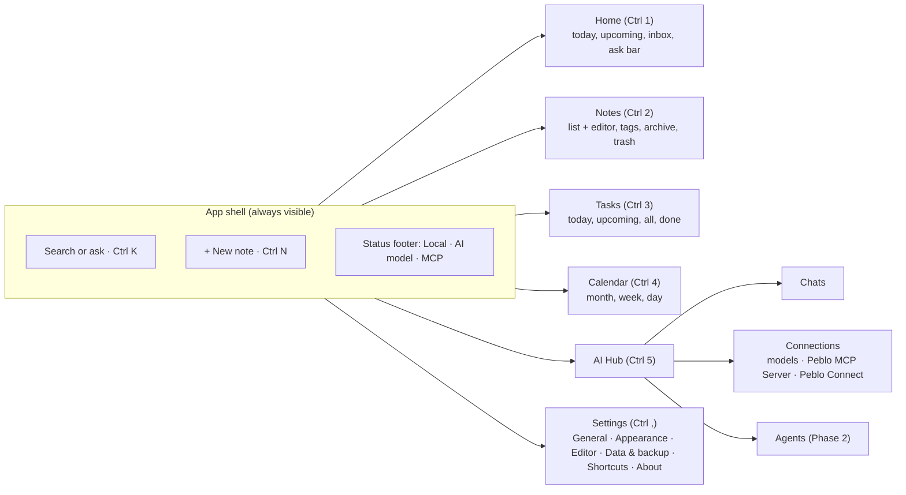
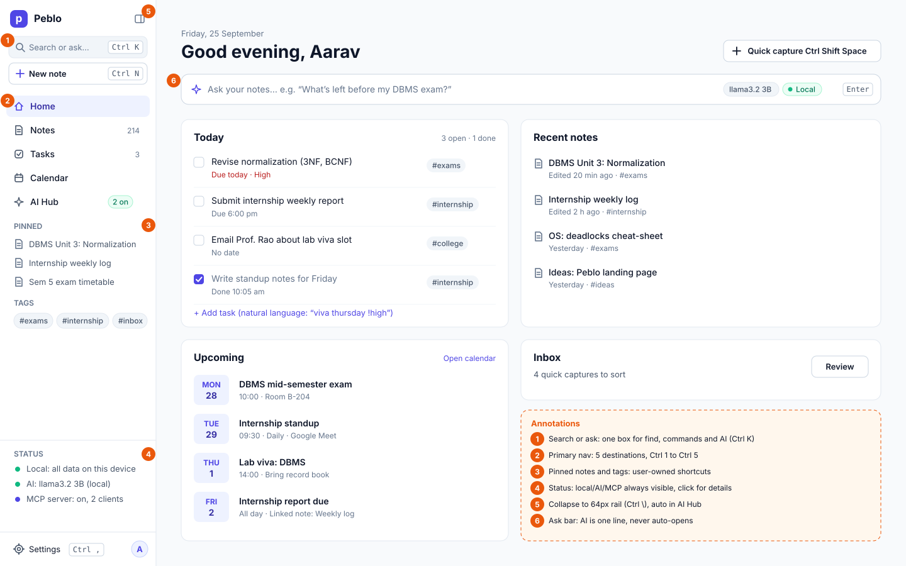
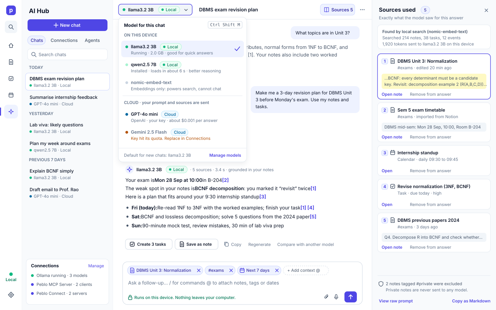
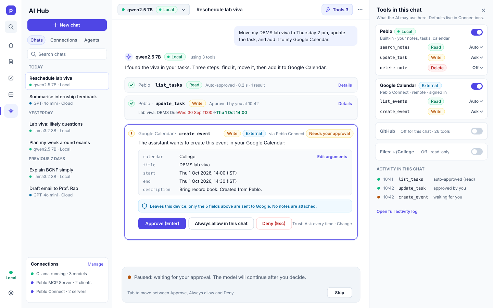
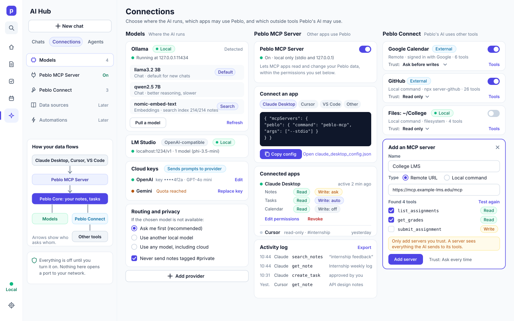
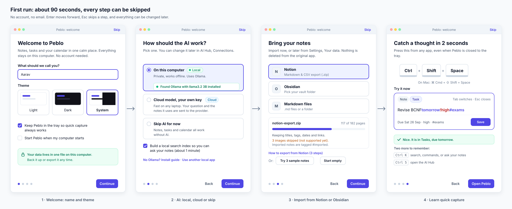
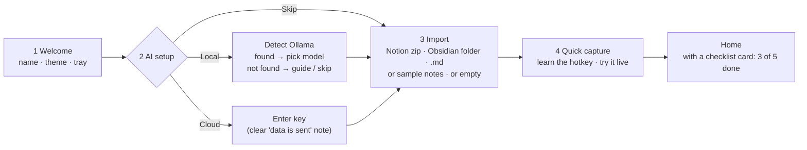

# 05 · Product design: Peblo's UX, AI Hub and design system

> Owner: design. Status: proposal for Phase 1 ("Local-first AI"). Last updated: 26 Sep 2026.
> Sibling docs: [00 Vision & strategy](./00-vision-and-strategy.md) · [01 PRD](./01-prd.md) · [02 TRD](./02-trd.md) · [03 MCP](./03-mcp.md) · [04 AI Hub](./04-ai-hub.md) · [06 Go-to-market](./06-go-to-market.md)

## TL;DR

- **Principles.** Peblo should feel *calm and fast*, be *keyboard-first*, keep the AI *visible but never pushy*, and earn trust through *transparency*: every AI answer shows which model ran, where it ran (local or cloud) and exactly which notes it saw. Local/private status is always on screen.
- **Audit.** The current UI has a good base: tokens with light and dark themes, a command palette, and an excellent quick-capture window. It has also drifted. There are three competing brand colours (indigo, purple and green). Border tokens are used as colours, so about 30 borders and dividers silently don't render. There are 234 inline `style={{}}` blocks, no `:focus-visible` styles, no reduced-motion support, mobile-web leftovers in a desktop-only app, and five separate AI surfaces.
- **Navigation.** Move from the floating top pill bar to a **collapsible left sidebar** (like Linear or Notion) with five destinations: **Home, Notes, Tasks, Calendar, AI Hub**, plus Settings. The sidebar has a permanent **trust status footer** (Local · AI model · MCP). It collapses to a 64 px icon rail, and does so automatically in the AI Hub.
- **AI Hub** is a full page: conversation list, chat with **inline citations**, a **Sources drawer** ("what the model saw"), a **model picker** with Local/Cloud badges, **context chips** (notes, tags, date ranges), **tool-call approval cards** for MCP tools, and a **Connections** tab covering models, the Peblo MCP Server and Peblo Connect.
- **Design system.** Consolidate on one accent (indigo `#4f46e5`, a lighter indigo in dark mode). Split colour tokens from border shorthands. Add a 4 px spacing scale and a 12 px minimum type size. Define about 20 core components, including new ones: citation pill, tool-call card, status badge and context chip. Target WCAG 2.1 AA.
- **Wireframes:** [navigation](./design/navigation.svg) · [AI Hub](./design/ai-hub.svg) · [tool approval](./design/ai-hub-tool-approval.svg) · [connections](./design/connections.svg) · [onboarding](./design/onboarding.svg).

---

## Contents

1. [Design principles](#1-design-principles)
2. [Audit of the current UI](#2-audit-of-the-current-ui)
3. [Information architecture and navigation](#3-information-architecture-and-navigation)
4. [Screen specs](#4-screen-specs)
   - 4.1 [AI Hub](#41-ai-hub)
   - 4.2 [Connections](#42-connections-models-peblo-mcp-server-peblo-connect)
   - 4.3 [First-run onboarding](#43-first-run-onboarding)
   - 4.4 [Quick capture and the command palette (search + ask)](#44-quick-capture-refinements-and-search--ask-in-the-command-palette)
   - 4.5 [Smart Intake review screen](#45-smart-intake-review-screen-prd-cap-04)
   - 4.6 [Inbox](#46-inbox-prd-cap-03)
5. [Design system](#5-design-system)
6. [Gaps](#6-gaps)
7. [Big decisions: options, pros and cons](#7-big-decisions-options-pros-and-cons)
8. [Risks and open questions](#8-risks-and-open-questions)
9. [Next steps by phase](#9-next-steps-by-phase)
10. [Sources](#10-sources)

---

## 1. Design principles

These are the tie-breakers. When two designs are both "fine", pick the one that honours more of these. Each one has a test we can actually run.

| # | Principle | What it means in Peblo | How we check it |
|---|---|---|---|
| 1 | **Calm and fast** | No glowing, bouncing or pulsing UI at rest. The app opens to something useful in under a second, and every page works before AI finishes loading. | Nothing animates when the user is idle. Cold start to interactive Home is under 1.5 s on a mid-range laptop (estimate, to be measured). |
| 2 | **Keyboard-first, mouse-friendly** | Every action is reachable from `Ctrl/Cmd+K`. Every primary view has a shortcut, and shortcuts are shown next to the actions they trigger. Shortcut labels follow the OS (⌘ on macOS, Ctrl elsewhere). | A full "capture → organise → ask → act" loop can be done without the mouse. The shortcut sheet is generated from the same registry that binds the keys, so it can't lie. |
| 3 | **AI is visible, never pushy** | The AI has a clear home (AI Hub) and small, predictable entry points (an Ask bar, `Ctrl+J`, `/ai` in the editor). It never opens itself, never changes data without showing a diff, and never nags. | No AI surface appears without a user action. Every AI write is either an explicit button ("Create 3 tasks") or an approval card. |
| 4 | **Trust through transparency** | Every AI answer shows **which model** ran, **where** it ran (Local/Cloud), **which sources** it used (with citations) and **which tools** it called. Raw prompts are one click away. | Pick any answer: you can say what data left the device, if any, in under 5 seconds. |
| 5 | **Local and private status is always clear** | A persistent status in the sidebar footer (data location, active model, MCP server). Anything that sends data off the device is labelled *before* it happens, not after. | A new user can answer "Is my data on the internet?" from the first screen, and the answer is correct. |
| 6 | **You own it** | Import and export are first-class. Nothing is locked in. Destructive actions can be undone, and the user can see what the app is doing. | Export is reachable in two clicks. Every delete has an undo toast or goes to Trash. |
| 7 | **Built for a solo builder** | Few components, used everywhere, with no one-off styling. If a screen needs a new pattern, it goes into the component inventory first. | Zero inline `style={{}}` for colour or spacing in new code. New UI uses only tokens. |

---

## 2. Audit of the current UI

This audit covers the `app` branch. It looks at `client/src/styles/*.css` (10,015 lines across 13 files), the components and pages named in the brief, and `electron/main.cjs`. Line numbers are approximate where marked "~".

### 2.1 What's good (keep and build on)

- **A real token layer exists.** `client/src/styles/index.css` `:root` defines background layers, text, semantic colours, tag colour families, radii, shadows and transitions. `.theme-dark` overrides them. That is the right foundation, and most of the fixes below are cleanup, not a rewrite.
- **Quick capture is excellent.** `client/src/pages/QuickCapturePage.jsx` is a small, focused window (620×230, set in `electron/main.cjs`). It parses natural language live (`tomorrow`, `friday`, `!high`, `#tag`), shows a preview of what it understood, switches mode with `Tab` and closes with `Esc`. This is the most "Peblo" interaction in the app, and the design language should grow from it.
- **A command palette exists** (`client/src/components/CommandPalette.jsx`) with `Ctrl/Cmd+K`, arrow-key navigation and sections.
- **The AI chat panel has decent accessibility basics.** `AiChatPanel.jsx` uses `role="dialog"`, `aria-modal`, `aria-labelledby`, a `tablist` for modes, `aria-label` on icon buttons and `role="alert"` for errors.
- **Privacy copy already exists.** The AI Providers tab in Settings says keys are "stored in Peblo's local database and only sent to the provider you use", and describes Ollama as "Nothing is sent to the internet". That's the right voice, and it should be promoted from a settings page to the whole UI.
- **Fonts are bundled locally** (`@fontsource/inter` and `jetbrains-mono` in `main.jsx`), so the app looks the same offline.
- **Skeleton loaders and empty states** exist for the dashboard, calendar and to-do list.
- **Consistent iconography.** Lucide icons are used throughout.

### 2.2 What's inconsistent or broken

| # | Issue | Where | Why it matters | Fix |
|---|---|---|---|---|
| A1 | **Three competing brand colours.** Light theme accent is indigo `#4f46e5`, dark theme accent is purple `#7c3aed`, and the logo and active nav tab are hard-coded green `#10b981`. | `index.css` `:root` vs `.theme-dark`. Green at `index.css:578`, `:584`, `:673`, plus `calendar.css:103,248`, `dashboard.css:261`, `todolist.css:449`, `workspace.css:455` | The brand looks different in each theme, and "green" also means *success* and (in our new system) *local*. Green on white is **2.54:1**, which fails WCAG AA for the logo text and the active tab label. | One accent: indigo. Green is reserved for success and Local status (§5.1). |
| A2 | **The "AI accent" has no identity.** `--ai-accent` is teal `#0d9488` in light and indigo `#5B5BD6` in dark, and `ai-chat.css` overrides it with `var(--accent)` inside `.ai-chat-root`. | `index.css` `:root`, `.theme-dark`, `ai-chat.css:6-17` | The AI looks different on every surface, so users can't learn "this is the AI". | Drop the separate AI hue. The AI is marked by the ✦ sparkle icon plus the accent, and model/location badges carry the meaning. |
| A3 | **Border tokens are shorthands but get used as colours.** `--border-subtle: 1px solid rgba(...)`, then code writes `border: 1px solid var(--border-subtle)`, which becomes `1px solid 1px solid rgba(...)`. That's invalid, so the browser drops it and **no border renders**. The same happens with `background: var(--border-subtle)` and `box-shadow: 0 0 0 1px var(--border-strong)`. | About 30 places, e.g. `SettingsModal.jsx:220,465,470,483,593`, `TodoItem.jsx:113,133`, `TodoEditModal.jsx:109`, `EditorToolbar.jsx:82,142`, `TodoListPanel.jsx:64-83`, `index.css:730` (`.dropdown-divider`), `:766`, `:815` (`kbd`), `:842` (avatar ring), `:1366`, `:1376`, `:1392`, `:1395`, `:1402` (theme cards), `:1429` (toggle track), `dashboard.css:1092`, `auth.css:186,207,240`, `shared.css:19` | Dividers, input borders, theme-card outlines and the toggle track are invisible, and nobody notices because nothing errors. | Add colour-only tokens (`--color-border-subtle` etc.), codemod the misuse, and add a Stylelint rule (§5.1.4). |
| A4 | **Invalid colour maths.** `rgba(var(--text-inverse), 0.02)` where `--text-inverse` is a hex value. | `index.css:298`, `:304` (`.empty-state`) | Silently ignored, so the empty-state background and glow never render. | Use `color-mix()` or an explicit `--color-surface-sunken`. |
| A5 | **Parallel token sets.** `--dash-*` in `dashboard.css` (a hard-coded copy of the palette with its own dark block at ~1117), `--ai-*` in `ai-chat.css`, legacy `--bg-primary/secondary/tertiary`, and `--bg-panel` used in `TodoListPanel.jsx:64` but **never defined**. | `dashboard.css:5-30`, `ai-chat.css:6-17`, `index.css` | Changing a colour means editing three places. The dashboard and calendar already drift from Notes. | One semantic token layer. Delete `--dash-*` after migration. |
| A6 | **Inline styles and hard-coded colours.** 234 `style={{…}}` blocks across components and pages, **52 in `SettingsModal.jsx`** alone. There are about 207 hex literals in CSS. Priority colours `#ef4444` / `#f59e0b` / `#22c55e` are repeated inline in `DashboardPage.jsx:124,224`, `DashboardTodoItem.jsx:9` and `TodoListPanel.jsx:120`. | as listed | Dark mode, theming and future white-labelling can't reach inline styles, and error red `#ef4444` on white is 3.76:1 (fails for text). | Move to classes plus tokens. Add `--color-priority-{high,med,low}`. |
| A7 | **No type or spacing discipline.** A type scale exists (`--text-xs` to `--text-2xl`), but components use literals (`0.8125rem`, `0.85rem`, `0.9rem`, `0.95rem`, `1.1rem`). There are **63 declarations under 12 px** (e.g. `.mini-tag` and `.tag-count` at 10 px, `kbd` at 11 px). The "Spacing" comment in `:root` only defines radii. `'Outfit'` is referenced for the logo (`index.css:582`) but never bundled. | `index.css`, all page CSS | Text is inconsistent and too small in places, and spacing looks random. | 12 px minimum, a 4 px spacing scale, and one logo treatment (§5.1). |
| A8 | **Mobile-web leftovers in a desktop-only app.** `MOBILE_NAV_TABS` (`config/navTabs.jsx`); `<nav className="mobile-bottom-nav">` plus a hidden `.profile-trigger` click hack (`Navigation.jsx:182-185`); `mobile-organic-header mobile-only` duplicate headers with a second `<h1>` (`DashboardPage.jsx:262-270`, `TodoListPage.jsx:295-304`); `MobileEditorControls.jsx`; `.ws-mobile-overlay` (`WorkspacePage.jsx:848`); 18 media queries across 9 CSS files, including `index.css:913-1010`. The Electron window has `minWidth: 900` (`electron/main.cjs:99`), so the `max-width: 768px` rules **can never trigger**. | as listed | Dead code, duplicated markup, and confusion about which header is "real". | Delete it. Design narrow-window behaviour (900–1100 px) instead, as described in §3.4. A future mobile companion (Phase 2) gets its own shell, not media queries. |
| A9 | **Floating pill navbar costs space and has no room to grow.** It's 68 px tall plus 12 px padding, centred with `max-width: 1200px` (`index.css` `.floating-navbar`). | `Navigation.jsx`, `index.css:560-700` | About 92 px of vertical chrome in a 900 px window, wasted width on wide screens, and no room for AI Hub, pinned notes or status. | Left sidebar (§3). |
| A10 | **Navigation is rendered by each page.** Every page does `<Navigation activeTab="…" />`, and the `activeTab` prop is ignored. `AnimatedTabBar` keeps a module-level `Map` so its indicator doesn't jump on remount. | All pages, `AnimatedTabBar.jsx:4` | The shell remounts on every route change, which is fragile and slow. | One layout route in `App.jsx` wrapping `<Outlet/>`. |
| A11 | **Naming drift.** The nav says "Dashboard" and "Tasks". The mobile nav says "Home". The page `<h1>` says "To-Do List". The palette says "Go to Workspace" and "Go to To-Do List". The route is `/todolist`. `WorkspaceHubPage.jsx` exists but is not routed. | `navTabs.jsx`, `TodoListPage.jsx:299,308`, `CommandPalette.jsx:49-52`, `App.jsx` | Users learn the same thing under several names, and docs and marketing can't be consistent. | Canonical names: **Home, Notes, Tasks, Calendar, AI Hub, Settings**. Routes `/`, `/notes`, `/tasks` (redirect `/todolist`), `/calendar`, `/ai`. |
| A12 | **Debug and SaaS leftovers.** A "Test AI Call" phone button in the navbar with inline green (`Navigation.jsx:98-104`). In an app with no accounts: "Public Profile" (`SettingsModal.jsx:144`), a disabled email field with "Contact support to change your primary email address" (`:216`), "Email Notifications: Product Updates & Marketing / Weekly digest" (`:352+`), an email in the avatar dropdown, and `AuthContext`/`AuthenticatedShell` naming. | as listed | It contradicts the "no account, local" promise and confuses new users. | Remove them. Profile becomes "Your name" inside General settings. |
| A13 | **Five separate AI surfaces.** (1) a floating FAB plus a draggable modal `AiChatPanel` (`Ctrl/Cmd+Shift+A`) with "create" and "intake" modes; (2) `AiWorkspacePanel` inside the editor; (3) the voice call (`AiVoiceCallManager`/`Modal`); (4) Dashboard "AI Insights"; (5) the slash-command block AI. The FAB pulses forever (`ai-chat.css:52`, `animation: ai-fab-glow 3s … infinite`). | as listed | It's pushy (principle 3), inconsistent, and none of these surfaces shows which model answered or which notes it read (principle 4). | AI Hub becomes the home. Editor AI and `Ctrl+J` reuse the **same chat component** in a side panel. The FAB is removed (§4.1.9). |
| A14 | **Cloud-first by default, with silent fallback.** The "Default AI Agent" option `Auto (OpenAI → Gemini → Local)` tries cloud first and falls back silently. | `SettingsModal.jsx:485-491` | A user who thinks they are "local" can have note content sent to a cloud provider without seeing it happen. This is the single biggest trust risk in the current UI. | Default to **Ask me first** routing (§4.2.1). Show model and location on every answer. |
| A15 | **Streaming is parsed with a regex.** The chat panel extracts `"reply"` from partial JSON with a regular expression (`AiChatPanel.jsx:~374`). | `AiChatPanel.jsx` | Escaped characters can flash on screen and long answers can stall. It also makes citations and tool calls hard to add. | A typed event stream (`text`, `citation`, `tool_call`, `done`). This is a design dependency on [02 TRD](./02-trd.md) and [04 AI Hub](./04-ai-hub.md). |
| A16 | **Shortcuts are documented but may not exist, and ignore the OS.** The shortcuts modal lists `Ctrl+S`, `Ctrl+P` and `Ctrl+J` (`Navigation.jsx:188-222`). I could only find handlers for `Ctrl/Cmd+N` and `Ctrl/Cmd+/` (`WorkspacePage.jsx:815-825`), `Ctrl/Cmd+K` and `Ctrl/Cmd+Shift+A`. The modal always shows "Ctrl", while the FAB always shows "⇧⌘A" (`AiChatPanel.jsx:466`). The palette opens the AI by dispatching a fake `KeyboardEvent` (`CommandPalette.jsx:58-61`). | as listed | It breaks principle 2 and teaches the wrong keys on macOS or Windows. | One shortcut registry that both binds keys and renders labels (§3.5). |
| A17 | **Accessibility gaps.** **Zero `:focus-visible` rules** in any stylesheet. **No `prefers-reduced-motion`** handling. Clickable `
`s with no keyboard access: the avatar menu (`Navigation.jsx:160`), theme cards (`SettingsModal.jsx:235-245`), the AI provider dropdown and its options (`:470-495`), palette items (`CommandPalette.jsx:131`, no `role="option"` or `aria-activedescendant`). `SettingsModal` has no `role="dialog"`, no `Esc` handler, no focus trap, and its `<label>`s aren't linked to inputs. The notification "dot" renders a number inside a 6 px circle. | as listed | Keyboard and screen-reader users can't use Settings, and nobody can see where focus is. | See §5.5. |
| A18 | **Low-contrast tokens.** `--text-muted #64748b` on `--bg-elevated #f1f5f9` is 4.34:1, and on dark `--bg-elevated #1A1A24` is 3.63:1. Dark accent `#7c3aed` on `#111118` is 3.3:1. `--warning #d97706` on white is 3.19:1. The primary button gradient ends at `#6366f1` with white text: 4.47:1. | `index.css` | These fail AA 4.5:1 for normal text. | New values in §5.1. |
| A19 | **Start-up flash.** The Electron `backgroundColor: '#f7f7f8'` (`electron/main.cjs:103`) doesn't match `--bg-base #f8fafc`, and is always light. | `electron/main.cjs` | Dark-mode users see a white flash on launch. | Set the window background from the saved theme. |
| A20 | **The command palette is shallow.** It matches titles only (substring), searches notes only (not tasks, events or settings), shows at most 5 results, refetches all notes every time it opens, and has no "ask" mode. | `CommandPalette.jsx:32-46` | Search is the #1 retention feature of note apps, and this is where "ask your notes" should live. | §4.4. |

### 2.3 Contrast check of current tokens (WCAG 2.1, normal text needs 4.5:1)

| Foreground | Background | Ratio | Result |
|---|---|---|---|
| `#10b981` green (logo, active tab) | `#ffffff` | 2.54 | ❌ fail |
| `#64748b` muted | `#f8fafc` base | 4.55 | ✅ barely |
| `#64748b` muted | `#f1f5f9` elevated | 4.34 | ❌ fail |
| `#64748b` muted (dark) | `#1A1A24` elevated | 3.63 | ❌ fail |
| `#7c3aed` accent (dark) | `#111118` | 3.30 | ❌ fail |
| `#ef4444` error text | `#ffffff` | 3.76 | ❌ fail |
| `#d97706` warning text | `#ffffff` | 3.19 | ❌ fail |
| white on `#6366f1` (button gradient end) | | 4.47 | ❌ marginal |
| `#4f46e5` accent | `#ffffff` | 6.29 | ✅ |
| `#94a3b8` secondary (dark) | `#111118` | 7.33 | ✅ |

*(Ratios computed with the WCAG relative-luminance formula.)*

---

## 3. Information architecture and navigation

### 3.1 Proposed top level

Decisions baked into this structure:

- **"Dashboard" is renamed "Home".** It is where you start the day, not a report. The weekly report and heatmap move down the page or behind a "Insights" link.
- **Connections lives in the AI Hub, not Settings.** Models, the MCP server and MCP clients are all about *what AI can see and do*, so they belong next to the chats they affect. Settings keeps a single "AI & connections →" link that jumps there, so people who look in Settings still find it.
- **Inbox** (captures tagged `#inbox`) appears on Home and as a saved filter in Notes. It is not a sixth destination.
- **Profile disappears.** There is no account. "Your name" moves into Settings → General.

### 3.2 Options: top pill nav (today) vs left sidebar

| | **A. Keep the top pill nav** (add an "AI Hub" tab) | **B. Left sidebar, collapsible to a rail** (Linear/Notion style) | **C. Hybrid: slim top bar plus per-page left panels** |
|---|---|---|---|
| How it looks | Floating centred pill with 5 tabs, controls on the right | 248 px sidebar: search/ask, New, 5 destinations, pinned notes, tags, status footer. Collapses to a 64 px icon rail | 44 px top bar with tabs. Notes and AI Hub keep their own left lists |
| Vertical space | ❌ ~92 px of chrome | ✅ 0 px top chrome | ⚠️ 44 px |
| Room to grow (AI Hub, pinned, tags, workspaces later) | ❌ 5–6 tabs max before it crowds | ✅ Scales to sections, pins, and later workspaces (Phase 3) | ⚠️ Tabs only |
| Always-visible trust status | ⚠️ Only as small icons | ✅ Natural footer spot | ⚠️ Squeezed into the top bar |
| Familiarity for target users (students, Notion refugees) | Medium: feels like a website | ✅ High: Notion, Obsidian, Linear, Slack and VS Code all use it | Medium |
| Works with Notes' own list and AI Hub's chat list | ⚠️ Fine | ⚠️ Three columns plus content can get tight. **Mitigation:** auto-collapse to the rail in Notes (when the editor is focused) and in AI Hub | ✅ |
| Desktop-native feel | ❌ Reads as a web page | ✅ Reads as an app | ⚠️ |
| Build cost | Low (exists) | Medium (new shell component, layout route, plus the A10 fix) | Medium |
| Narrow windows (900–1100 px) | ✅ | ✅ Rail mode | ✅ |

**Recommendation: B, a left sidebar that collapses to a rail.** It gives back about 90 px of height, gives the new AI Hub and the trust status a permanent home, and matches what our target users already know from Notion and Obsidian. The one real downside, too many columns in Notes and AI Hub, is handled by auto-collapsing to the rail on those pages and remembering the user's choice. See [navigation.svg](./design/navigation.svg).

### 3.3 Sidebar anatomy

| Zone | Contents | Behaviour |
|---|---|---|
| Header | Logo, "Peblo", collapse button | `Ctrl+\` toggles the rail. Double-clicking the title bar area maximises the window (OS default). |
| Search or ask | Looks like an input, opens the palette | `Ctrl/Cmd+K`. Typing `?` or pressing `Tab` switches to Ask mode (§4.4). |
| New | "New note" plus a caret for Task, Event, Chat | `Ctrl/Cmd+N`. The caret menu shows its own shortcuts. |
| Destinations | Home, Notes (count), Tasks (due-today count), Calendar, AI Hub (e.g. "2 on" when MCP clients are connected) | `Ctrl/Cmd+1…5`. The active item gets an accent background plus a 3 px left bar, so it doesn't rely on colour alone. |
| Pinned | Up to ~7 pinned notes or saved searches | Drag to reorder. Right-click → Unpin. |
| Tags | Top tags as chips, "All tags" | Clicking filters Notes. |
| Status footer | **Local** · all data on this device · **AI:** model + Local/Cloud · **MCP server:** on/off + client count | Always visible (rail mode shows a dot). Clicking opens the relevant Connections section. It turns amber when something is sending data off-device right now (e.g. a cloud chat is streaming). |
| Bottom | Settings (`Ctrl/Cmd+,`), your initial | No account menu. The initial just opens Settings → General. |

### 3.4 Window sizes

- **≥ 1280 px:** full sidebar by default.
- **900–1279 px** (the Electron minimum is 900): rail by default. The sidebar opens as an overlay on hover or `Ctrl+\` and doesn't push content.
- The AI Hub and a focused editor auto-collapse to the rail. If the user expands it manually, remember that per page.
- Delete the `max-width: 768px` rules (A8).

### 3.5 Global shortcut map (proposal)

A single registry (e.g. `config/shortcuts.js`) both **binds** these and **renders** them in menus, tooltips, the palette and the shortcut sheet (`Ctrl/Cmd+/`). Labels are OS-aware: `⌘` on macOS, `Ctrl` elsewhere.

| Action | Win/Linux | macOS | Notes |
|---|---|---|---|
| Search or ask | `Ctrl K` | `⌘K` | exists |
| Quick capture (global, from any app) | `Ctrl Shift Space` | `⌘⇧Space` | exists (Electron `globalShortcut`) |
| New note | `Ctrl N` | `⌘N` | exists on Notes only today; make it global |
| Go to Home / Notes / Tasks / Calendar / AI Hub | `Ctrl 1…5` | `⌘1…5` | new |
| Ask AI about what I'm looking at (side panel) | `Ctrl J` | `⌘J` | replaces `⇧⌘A` and the FAB |
| New chat (in AI Hub) | `Ctrl Shift O` | `⌘⇧O` | same as ChatGPT, so people already know it |
| Model picker (in AI Hub) | `Ctrl Shift M` | `⌘⇧M` | |
| Toggle Sources drawer | `Ctrl Shift S` | `⌘⇧S` | |
| Toggle sidebar | `Ctrl \` | `⌘\` | |
| Settings | `Ctrl ,` | `⌘,` | OS convention |
| Shortcut sheet | `Ctrl /` | `⌘/` | today `Ctrl+/` focuses notes search; move that to `Ctrl K` |
| Stop generating | `Esc` | `Esc` | while streaming |

---

## 4. Screen specs

Shared vocabulary follows the brief: **Peblo Core**, **model providers**, **AI Hub**, **Peblo MCP Server**, **Peblo Connect**. Tool names in the wireframes (`search_notes`, `update_task`, …) are illustrative. The canonical tool list and permission model live in [03-mcp.md](./03-mcp.md), and the chat/RAG pipeline in [04-ai-hub.md](./04-ai-hub.md).

**PRD coverage:** these specs cover [01-prd.md](./01-prd.md) HUB-01 to HUB-07, MCP-03 to MCP-05, CON-01 to CON-05, CAP-03/04, KN-03/05 and PLAT-10.

### 4.1 AI Hub

#### 4.1.1 Layout (1440×900 reference)

| Column | Width | Contents |
|---|---|---|
| App rail | 64 px | Sidebar collapsed automatically. Status dot "Local" at the bottom. |
| Hub column | 264 px | "AI Hub" title · **New chat** · tabs **Chats / Connections / Agents** · search chats · conversation list grouped by Today / Yesterday / Previous 7 days · a small **Connections status card** at the bottom (Ollama, MCP server, Peblo Connect) |
| Chat | flexible (min 560 px, text max 680 px) | Header: **model pill** (status dot + name + Local/Cloud badge + caret), conversation title (editable), **Sources** toggle with count, overflow menu (rename, export as Markdown, delete) · message list · composer |
| Right drawer | 360 px, optional | **Sources used** (default after a grounded answer) *or* **Tools in this chat** (when tools are involved). Only one drawer is open at a time. |

Under 1200 px wide, the right drawer overlays the chat instead of pushing it.

#### 4.1.2 Model picker

- **Trigger:** the model pill in the chat header (`Ctrl/Cmd+Shift+M`). It is a listbox popover with type-ahead.
- **Groups:** *On this device* (Ollama and other local OpenAI-compatible servers such as LM Studio) and *Cloud · your prompt and sources are sent* (OpenAI, Gemini, other keys). The group header states the privacy consequence in words, not just an icon.
- **Each row:** status dot (running / installed but not loaded / error), name + size, **Local** (green) or **Cloud** (sky) badge, a one-line hint ("Running · 2.0 GB · good for quick answers", "Loads in about 6 s", "Key hit its quota. Replace in Connections"). Embedding-only models appear greyed out with "powers search, cannot chat", so people understand why they can't pick them.
- **Scope:** the choice is **per conversation**. The footer shows "Default for new chats: …" and a *Manage models* link.
- **Switching mid-chat** inserts a small divider in the thread: "Switched to GPT-4o mini (Cloud) · 10:42". If the new model is cloud and the chat already has sources attached, show a one-time confirmation: "The next message and its sources will be sent to OpenAI."
- **Compare:** "Compare with another model" on an answer re-runs the same prompt and context with a second model and shows the two side by side. This helps users learn what local vs cloud costs them in quality. *(Phase 1.5, optional.)*

#### 4.1.3 Messages, streaming and citations

- **User messages:** right-aligned, accent-subtle background, max 70% width.
- **Assistant messages:** full width with no bubble (they're easier to read that way). The header line always shows **✦ model name · Local/Cloud badge · N sources · time taken**. If no sources were used, it says *"General knowledge, not from your notes"* instead of a count, so people don't mistake it for grounded content.
- **Streaming:** text appears token by token with a thin caret. `Esc` or the **Stop** button cancels and keeps the partial text, marked "Stopped". The first message after a model loads shows "Loading qwen2.5 7B into memory… (about 6 s)" instead of a spinner.
- **Citations:** inline numbered markers `[1]` rendered as a **citation pill** (accent-subtle background, 12 px bold number). Hover or focus shows a preview card (title, snippet, date). Click opens the Sources drawer scrolled to that source, with its card highlighted. `Enter` on a focused citation opens the note at the cited passage, with the passage highlighted for 2 s.
  - **Integrity rule:** the UI only renders citations whose number matches a source that was actually in the context. Unknown numbers are dropped and the message gets a small "1 citation couldn't be verified" note. This keeps weak local models from inventing sources.
- **Answer actions** (shown on hover and always keyboard-reachable): **Create N tasks** / **Save as note** (these appear when the answer contains a list or plan; they preview first and never write silently), Copy, Regenerate, Compare, 👍/👎 (stored locally only).

#### 4.1.4 Sources drawer ("what the model saw")

The drawer is Peblo's trust promise made visible. It's open by default for the first three grounded answers so people learn it exists, then it remembers the user's choice.

1. **Retrieval summary:** how sources were found ("local search with nomic-embed-text"), what was searched ("214 notes, 38 tasks, 12 events") and **how much was sent where** ("1,920 tokens sent to llama3.2 3B on this device", or "…sent to OpenAI" in sky colour).
2. **Source cards**, numbered to match the citations: type icon (note / task / event / file from Peblo Connect), title, tag and date, the **exact snippet** that was sent (highlighted for the cited passage), plus the actions **Open** and **Remove from answer** (re-runs without that source).
3. **Excluded:** "2 notes tagged #private were excluded. Private notes are never sent to any model." Clicking it lists them, visible only to the user.
4. **Footer:** *View raw prompt* (a read-only monospace view of the system prompt, context and user message) and *Copy as Markdown*.

#### 4.1.5 Attach-context chips

- The composer shows a row of **context chips** above the input: notes, tags (`#exams`), date ranges ("Next 7 days"), tasks lists ("Overdue tasks") and, later, Peblo Connect resources (a GitHub issue, a calendar).
- Add them with **`@`** (type-ahead over notes, tags, dates, lists) or **+ Add context**. You can also drag a note from the Notes list onto the chat.
- **Semantics:** chips *pin* context, so it's always included. Automatic retrieval can still add more unless the user flips "Only use attached context" in the `+` menu. The Sources drawer marks pinned sources with a pin icon.
- Chips show a token estimate on hover ("~800 tokens"). If attachments exceed the model's context window, the chip row turns amber: "Too much for llama3.2 (8k). Peblo will use the most relevant parts."

#### 4.1.6 Tool-call approval cards (MCP tools)

Every tool call renders **inline in the conversation, in order**, as a **tool-call card**:

| State | Look | Content |
|---|---|---|
| Auto-run (read) | Collapsed row, green check | `Peblo · search_tasks` · **Read** badge · "Auto-approved · 0.2 s · 1 result" · *Details* |
| Approved (write) | Collapsed row, green check | Includes a **mini diff** of what changed: "Due ~~Wed 30 Sep 11:00~~ → **Thu 1 Oct 14:00**" · "Approved by you at 10:42" · an Undo link for about 10 s |
| **Waiting for approval** | Expanded card, accent border and halo, amber "Needs your approval" | Server · tool name (monospace) · risk badge (**Read** green / **Write** amber / **Delete** red) · **External** badge if it's a Peblo Connect server · a plain-language sentence ("The assistant wants to create this event in your Google Calendar") · an **arguments table** with *Edit arguments* · a **"Leaves this device"** box listing exactly what is sent where · buttons **Approve (Enter)**, **Always allow in this chat**, **Deny (Esc)** · "Trust: Ask every time · Change" |
| Denied | Collapsed, grey | "Denied by you. The assistant was told not to do this." |
| Failed | Collapsed, red | Error message, *Retry*, *Details* (raw error) |

Rules:

- **While a card waits, the model is paused.** The composer is disabled and says "Paused: waiting for your approval". The user can still press **Stop**.
- **Focus moves to the card**, but `Enter` only approves after a 400 ms guard, so a keystroke meant for the composer can't approve anything by accident. `Tab` cycles Approve → Always allow → Deny → Edit.
- **Delete-class tools always require approval** and can't be set to "Always allow".
- **Untrusted-content rule** (PRD CON-04): once a chat has read content from an **External** tool (a GitHub issue, a web page), every later **write** in that chat needs approval, even if it's set to Auto or "Always allow". The card explains why: "Asking because this chat read content from GitHub, which could contain instructions that aren't yours."
- **Batching:** when the model proposes several writes at once (e.g. "create 5 tasks"), show one card with a checklist so the user can approve all or some. Don't stack five modals.
- The approval policy comes from the trust level set in Connections (§4.2). The chat can only make it *stricter*, not looser, except through "Always allow in this chat".

#### 4.1.7 "Tools in this chat" panel (the connections panel inside a chat)

The right drawer switches to this when the header's **Tools** button is pressed or when a tool is first used. It shows:

- **Groups per server:** *Peblo* (built-in, Local badge), each enabled *Peblo Connect* server (External badge), and disabled servers greyed out with a toggle. The toggle enables or disables that server **for this chat only**.
- **Per-tool rows:** tool name (monospace), risk badge, and a policy dropdown (**Auto / Ask / Off**) inherited from Connections, with "(changed here)" if overridden.
- **Activity in this chat:** a timeline of every tool call (time, tool, outcome) with *Open full activity log*.

#### 4.1.8 States

| State | What the user sees | Primary action |
|---|---|---|
| **Empty (first visit)** | Centre card: "Ask anything about your notes, tasks and calendar." Three example prompts built from their data ("What's due this week?", "Summarise my internship log", "Quiz me on DBMS Unit 3"), plus the model pill and the privacy line | Click an example or type |
| **No model set up** | Centre card with three paths, same as onboarding (§4.3): *Use a local model* (Ollama detected? "Found. Use llama3.2" / "Not found. Install guide"), *Add a cloud key*, *Not now*. The composer is disabled with "Set up a model to chat" | Set up |
| **Model loading** | The model pill shows a spinner and "Loading… about 6 s". The first message waits in the thread with a "Waiting for model" label | none (auto) |
| **Streaming** | Caret, Stop button, `Esc` hint | Stop |
| **Search index incomplete** | Amber bar above the composer: "Search index 60% built. Answers may miss some notes." · *Show progress* | none |
| **Offline** | Cloud models in the picker are greyed out: "Offline. Local models still work". If the current chat uses a cloud model, a banner offers *Switch to llama3.2 (Local)* | Switch |
| **Provider error** (Ollama stopped, key invalid, quota) | Inline error in place of the answer, in plain words: "Ollama isn't running. Start it and press Retry." / "Your Gemini key hit its quota." · *Retry*, *Switch model*, *Open Connections*. **Never silently fall back to another provider**; offer it as a button | Retry / Switch |
| **Context too large** | Amber chip row (see 4.1.5) | Remove chips or continue |
| **Tool waiting** | See 4.1.6 | Approve / Deny |
| **Loading conversation list** | 6 skeleton rows | none |
| **Error loading conversations** | "Couldn't load chats. Your notes are safe." · Retry | Retry |

#### 4.1.9 What happens to the existing AI surfaces

| Today | Proposal |
|---|---|
| Floating FAB plus draggable `AiChatPanel` modal (`Ctrl/Cmd+Shift+A`) | **Remove the FAB.** `Ctrl/Cmd+J` opens an **AI side panel** (380 px, right) on any page. It uses the same chat component as the AI Hub, pre-scoped to the current note, day or task list. *Open in AI Hub* continues the conversation there. |
| "Create" / "Intake" modes | Become slash commands in any composer: `/new-note`, `/intake` (paste text or a PDF → notes + tasks, with a preview and approval before anything is written). |
| `AiWorkspacePanel` in the editor | Merged into the `Ctrl/Cmd+J` side panel. Summaries, action items and title/tag suggestions become one-click chips in its empty state. |
| Dashboard "AI Insights" | Becomes the Home **Ask bar** (one line, with the model badge) plus an optional daily brief card that shows its model and sources like any other answer. |
| Voice call | Moves behind a mic button in the composer. Remove the "Test AI Call" nav button. |

### 4.2 Connections (models, Peblo MCP Server, Peblo Connect)

Connections is a **tab inside the AI Hub** (with a Settings link pointing to it). The layout is three columns at ≥1280 px, and stacked sections with a left sub-nav at narrower widths. A small **"How your data flows"** diagram in the left column explains the three directions in one glance:

- *Models*: where the AI runs.
- *Peblo MCP Server*: other apps → Peblo.
- *Peblo Connect*: Peblo's AI → other tools.

**Everything starts off.** Nothing here opens a network port beyond `127.0.0.1`.

#### 4.2.1 Model providers

- **Ollama (auto-detected).** Status line ("Running at 127.0.0.1:11434"), then the list of installed models with their role: *Chat · default for new chats*, *Chat*, *Embeddings · search index 214/214 notes*. Actions: **Pull a model** (a curated short list with size and RAM hints, e.g. "llama3.2 3B · 2 GB · good on 8 GB laptops", *estimates*), *Refresh*, *Set as default*, *Use for search*.
  - **States:** *Not installed* (install guide with an OS-specific link), *Installed but not running* ("Start Ollama" hint), *Running with no models* ("Pull llama3.2 to start"), *Error* (plain message plus the raw error behind "Details").
- **OpenAI-compatible endpoints** (LM Studio, llama.cpp server, vLLM, a self-hosted box). Fields: name, base URL, optional key, **Test** (lists the models found). The badge is *Local* if the host is loopback or LAN, and *Cloud* otherwise. The user can override that, with a warning.
- **Cloud keys** (OpenAI, Gemini, and later others). Keys are masked (`••••4f2a`) with Edit / Remove, a status (OK / quota reached / invalid), and a permanent "Sends prompts to provider" badge. Show where keys are stored ("in your OS keychain", which depends on [02-trd.md](./02-trd.md); today they're in SQLite).
- **Routing and privacy** (replaces "Auto: OpenAI → Gemini → Local"):
  - *If the chosen model is not available:* **Ask me first (recommended, default)** · Use another local model · Use any model, including cloud.
  - ☑ *Never send notes tagged #private* (default on).
  - *(Later)* per-tag rules, e.g. "#internship notes may only use local models".

#### 4.2.2 Peblo MCP Server

- **Master toggle** with status: "On · local only (stdio and 127.0.0.1)". There's a one-paragraph explanation, and a "What can apps see?" link to [03-mcp.md](./03-mcp.md).
- **Connect an app:** tabs for **Claude Desktop / Cursor / VS Code / Other**. Each shows the exact config snippet **in that client's format** (for example, VS Code uses a `servers` key in `.vscode/mcp.json`, while Claude Desktop and Cursor use `mcpServers`; see Sources). There's a **Copy config** button and *Open config file* where we can locate it. "Other" shows the generic stdio command and the HTTP URL.
- **Connected apps:** one row per client that has connected. Each shows its status dot, last active time, and a **permission matrix** per area (Notes / Tasks / Calendar × Read / Write), where Write can be *off / ask / auto*. There's also an optional **scope** ("only #internship"), plus *Edit permissions* and *Revoke*. A new client shows as **Pending** (PRD MCP-04): its first connection triggers a system notification plus an in-app approval dialog ("Cursor wants to read your notes") before any data flows. Clients start **read-only**, and writes must be granted.
- **Activity log:** time, client, tool (monospace), target, outcome, with filters and *Export* (JSON; kept 90 days by default per PRD MCP-05). Writes link to the changed item and support **Undo** for 24 h if Core keeps version backups (it does for notes today).
- **States:** *Off* (explains the benefit plus a Turn on button), *On with no clients* (shows the Connect an app step prominently), *Port or permission error*, *A client is making many calls* (rate-limit notice with Pause).

#### 4.2.3 Peblo Connect (external MCP servers)

- **Server cards:** name, **External** or **Local** badge (a filesystem server on this machine is Local; a remote URL is External), transport ("Remote · signed in with Google" / "Local command · npx …"), tool count, **trust level** dropdown, enable toggle and a *Tools* link.
- **Trust levels** (they map to per-tool defaults and can be overridden per tool; the per-tool policy **Auto / Ask / Off** is the same as the PRD's CON-02 "Always allow / Ask every time / Never"):
  - **Ask every time** (default for new servers)
  - **Ask before writes** (reads auto-run)
  - **Read only** (write and delete tools hidden from the model)
  - **Trusted** (auto for reads and writes; *delete-class tools still ask*). Gated behind a confirmation.
- **Add an MCP server** form: Name · Type (**Remote URL** or **Local command**) · URL or command plus args · environment secrets (stored like keys) · Auth (OAuth *Sign in* button when the server supports it). Then **Test**, which lists the discovered tools with checkboxes and risk badges inferred from the tool's annotations or name (the user can correct them). A warning reads "Only add servers you trust. A server sees everything the AI sends to its tools." Finish with *Add server*.
- **Local commands run code on your computer.** Show the full command, require an explicit checkbox ("I trust this command"), and never auto-run commands from pasted configs.
- **States:** *Connecting*, *Needs sign-in*, *Tool list changed since you approved it* (re-review badge, with new tools off by default), *Server crashed* (logs link), *Disabled*.

### 4.3 First-run onboarding

Goal: reach the first useful moment in **about 90 seconds**, with no account and every step skippable. `Enter` moves forward, `Esc` skips the step, and **Skip** in the corner skips the rest.

| Step | Content | Notes |
|---|---|---|
| 1 Welcome | "Welcome to Peblo". The promise: "Notes, tasks and your calendar in one calm place. Everything stays on this computer. No account needed." Name field (focused). Theme: Light / Dark / **System** (default) as keyboard-selectable radio cards. ☑ *Keep Peblo in the tray so quick capture always works*. ☐ *Start Peblo when my computer starts*. A green reassurance box: "Your data lives in one file on this computer." | Name is optional (default "there"). Changing the theme applies live. |
| 2 AI setup | Three radio cards: **On this computer** (Local badge; "Private, works offline. Uses Ollama."; a live detection result), **Cloud model, your own key** (Cloud badge; "Your question and the notes it uses are sent to the provider"), **Skip AI for now** ("Notes, tasks and calendar all work without AI"). ☑ *Build a local search index so you can ask your notes* (about 1 minute, *estimate*). | If Ollama isn't found, show "Install guide" and "Use another local app (LM Studio…)" rather than blocking. The index builds in the background, with progress in the sidebar status. |
| 3 Import | Tiles: **Notion** (Markdown & CSV export .zip), **Obsidian** (vault folder), **Markdown files**. A progress card: "117 of 182 pages · keeping titles, tags, dates, links · 3 images skipped (not supported yet) · tagged #imported". Or **Try 3 sample notes** / **Start empty**. "How to export from Notion (3 steps)" link. | The import runs in the background. The user can continue to step 4 while it runs. |
| 4 Quick capture | Big keycaps **Ctrl + Shift + Space** (and "On Mac: ⌘ ⇧ Space"). A live **try-it box** (the real capture component, embedded) prefilled with "Revise BCNF tomorrow !high #exams", showing the parse preview "Due Sat 26 Sep · high · #exams". Success: "Nice. It is in Tasks, due tomorrow." Two more to remember: `Ctrl K`, `Ctrl 5`. | If the global shortcut failed to register (another app owns it, which `electron/main.cjs:273` already detects), show "Pick another shortcut" right here. |
| Home | A dismissible **Getting started** card: ✓ Name · ✓ AI · ✓ Import · ☐ Pin a note · ☐ Connect Claude Desktop (MCP). | It disappears when done or dismissed. |

### 4.4 Quick capture refinements and "search + ask" in the command palette

#### 4.4.1 Quick capture (keep it tiny, make it smarter)

| Refinement | Why |
|---|---|
| **Event mode:** a third tab, *Event* ("DBMS viva thu 2pm 30m"), parsed with the same engine | Calendar is a first-class area but can't be captured today. |
| **Auto-detect mode** (optional setting): lines that start with a verb and contain a date become tasks, otherwise notes. The chip "Detected: Task" can be changed with `Tab` | One less decision when capturing. |
| **Parse tokens highlighted inline** (dates, `!priority`, `#tags` coloured as you type), as in the onboarding frame | Makes the parser learnable, and people trust what they can see. |
| **"Append to…"**: `Ctrl/Cmd+Enter` → pick a recent note (e.g. "Internship weekly log") to append to instead of creating a new note | Students log daily; appending is more common than creating. |
| **Status after save** already exists ("Task added · due Fri"). Add **Undo** (`Ctrl/Cmd+Z` within 5 s) and **Open** (`Ctrl/Cmd+O`) | Mistakes are cheap to fix. |
| **Clipboard hint:** if the clipboard has a URL or text when the window opens, show "Paste clipboard as note? (Ctrl V)" as a faint hint. **Never** read the clipboard automatically without showing it | Common capture source, and doing it openly keeps it transparent. |
| **No AI by default in capture.** An optional "✦ Clean up with AI" button appears only if a model is configured, and shows the result before saving | Capture must be instant and work offline. |
| Fix: the placeholder "Call the bank tomorrow !high #finance" is good. Keep example content local to the user's context in onboarding | none |

#### 4.4.2 Command palette: one box for find, do and ask

The palette becomes the keyboard entry point to everything (principle 2).

- **Scopes and prefixes:** default (everything) · `>` commands · `#` tags · `@` people/dates (later) · `?` **Ask**. `Tab` toggles between *Search* and *Ask* without clearing the query.
- **Search results:** grouped **Notes, Tasks, Events, Commands, Settings, Chats**. Matching is on title **and body** (full-text via Core; the semantic search option uses the embeddings index when built). Each row shows its type icon, title, a snippet with highlighted matches, and its date. Rows use `role="option"` with `aria-activedescendant`.
- **Ask mode:** the input gets the ✦ icon and the current model badge ("llama3.2 · Local"). `Enter` streams a **short answer inside the palette** (max ~6 lines) with citations. Two actions follow: **Continue in AI Hub** (`Ctrl/Cmd+Enter`) and **Copy**. Source pills under the answer open the note.
- **Suggested asks** appear when the query looks like a question (starts with what/when/how or ends with `?`): the top row becomes "✦ Ask your notes: '…'".
- **Actions** accept arguments: "New task …" (parsed like quick capture), "Move to archive", "Toggle dark mode", "Turn off MCP server", "Switch model to …".
- **Empty state:** recent items plus 3 suggested actions. **No results:** "No matches. Press Tab to ask your notes instead."
- **Performance:** don't refetch all notes on every open (A20). Query Core with debounce and keep the last results warm.

### 4.5 Smart Intake review screen (PRD CAP-04)

Today Smart Intake saves straight away. The redesign puts a **review step** in between. It opens as a wide sheet over the current page, from `/intake` in any composer or from "Paste into Peblo" in the palette.

- **Left:** the source (pasted text or PDF preview), with the passages each item came from highlighted.
- **Right:** **proposed notes** and **proposed tasks** as checkbox rows. All are selected by default. Titles, dates, priority and tags can be edited inline, and parsed dates show as chips like in quick capture. Each row links back to its source passage.
- **Footer:** model and location badge ("qwen2.5 7B · Local"), "Items will be tagged `intake:lecture-5.pdf`", **Confirm (Ctrl/Cmd+Enter)**, which writes the selected items in one step, and **Cancel (Esc)**, which writes nothing.
- **States:** reading the PDF (progress), nothing found ("No tasks or notes found. Save the text as one note?"), model error (retry or switch model; the pasted text is kept).

### 4.6 Inbox (PRD CAP-03)

- A saved view in **Notes** plus a **Home card** ("4 quick captures to sort"), with a count badge on Notes in the sidebar.
- Each row has single-key triage: **`t`** tag, **`s`** schedule (turns it into or dates a task), **`m`** move to a note, **`e`** done/archive, **`Del`** trash. The keys are shown in a footer hint.
- **Zero-inbox** empty state: "All sorted. Captures from Ctrl Shift Space land here."

---

## 5. Design system

### 5.1 Tokens

Principles for tokens: **two layers.** Raw *primitives* (`--indigo-600`) are never used directly by components. *Semantic* tokens (`--color-accent`) are what components use. Dark mode only remaps semantic tokens.

#### 5.1.1 Colour (semantic, light → dark)

| Token | Light | Dark | Use |
|---|---|---|---|
| `--color-bg` | `#f8fafc` | `#0b0b10` | app background |
| `--color-surface` | `#ffffff` | `#121219` | cards, panels |
| `--color-surface-raised` | `#ffffff` + shadow | `#1a1a24` | popovers, menus |
| `--color-surface-sunken` | `#f1f5f9` | `#0f0f15` | inputs' wells, code |
| `--color-border` | `#e2e8f0` | `rgba(255,255,255,.10)` | dividers, card borders |
| `--color-border-strong` | `#cbd5e1` | `rgba(255,255,255,.18)` | inputs, secondary buttons |
| `--color-text` | `#0f172a` | `#f1f5f9` | body |
| `--color-text-secondary` | `#475569` | `#a3acbd` | secondary text |
| `--color-text-muted` | `#64748b` (only on bg/surface) | `#8b93a7` | hints, meta (6.1:1 on dark surface) |
| `--color-accent` | `#4f46e5` | `#6366f1` (fills) | primary buttons, active nav |
| `--color-accent-text` | `#4338ca` | `#a5b4fc` | links, citation numbers |
| `--color-accent-subtle` | `#eef2ff` | `rgba(99,102,241,.16)` | selected rows, user bubbles, chips |
| `--color-on-accent` | `#ffffff` | `#ffffff` | text on accent fills (6.3:1 light) |
| `--color-focus-ring` | `#4f46e5` | `#a5b4fc` | 2 px focus outline |
| `--color-local` / `-bg` / `-border` | `#047857` / `#ecfdf5` / `#a7f3d0` | `#34d399` / `rgba(52,211,153,.12)` / `rgba(52,211,153,.3)` | **Local** badge, status dot |
| `--color-cloud` / `-bg` / `-border` | `#0369a1` / `#f0f9ff` / `#bae6fd` | `#7dd3fc` / … | **Cloud** and **External** badges, "leaves this device" boxes |
| `--color-risk-read` | = local green | | tool risk badges |
| `--color-risk-write` | `#b45309` on `#fffbeb` | `#fbbf24` on `rgba(251,191,36,.12)` | |
| `--color-risk-delete` | `#b91c1c` on `#fef2f2` | `#f87171` on `rgba(248,113,113,.12)` | |
| `--color-success` / `warning` / `danger` / `info` | `#047857` / `#b45309` / `#b91c1c` / `#1d4ed8` (text) | lighter tints | all ≥ 4.5:1 on surface |
| `--color-priority-high/med/low` | `#dc2626` / `#d97706` / `#16a34a` (dots and bars only, not text) | same, tinted | replaces the inline hex (A6) |

**Brand decision:** one accent, **indigo**, in both themes. The logo moves from green to indigo (or to the text colour with an indigo mark). Purple and teal are removed. Green now always means "local/private/success", which is a meaningful colour instead of decoration.

#### 5.1.2 Spacing, radius, elevation

- **Spacing (4 px base):** `--space-1: 4px`, `-2: 8`, `-3: 12`, `-4: 16`, `-5: 20`, `-6: 24`, `-8: 32`, `-10: 40`, `-12: 48`. Card padding is 16/20, sidebar item height 34, input height 36, button heights 28 (sm) / 34 (md) / 40 (lg).
- **Radius (keep today's):** `--radius-sm: 6px` (chips, kbd), `-md: 10px` (inputs, buttons, list rows), `-lg: 16px` (cards, drawers), `-xl: 24px` (onboarding frames), `--radius-full` (pills, badges).
- **Elevation:** `--shadow-1` (cards, subtle), `--shadow-2` (popovers, menus), `--shadow-3` (dialogs). Remove the coloured `--shadow-glow` from buttons (principle 1).

#### 5.1.3 Type

- **Family:** Inter (bundled) for UI, JetBrains Mono (bundled) for code, tool names and kbd. Drop `Outfit`.
- **Scale (keep the existing names):** `--text-xs 12` · `--text-sm 13` · `--text-base 14` · `--text-md 16` (editor body default) · `--text-lg 18` · `--text-xl 24` · `--text-2xl 32`. **Minimum rendered size: 12 px**, which fixes the 63 declarations under 12 px.
- **Weights:** 400 body, 500 UI labels, 600 headings/buttons, 700 page titles only.
- **Line height:** 1.4 UI, 1.7 prose (existing tokens).

#### 5.1.4 Token cleanup plan (no big-bang rewrite)

1. **Add** the semantic tokens next to the old ones in `index.css`, and alias old names to them (`--bg-surface: var(--color-surface)`).
2. **Split borders:** keep the `--border-*` shorthands only for `border:` declarations. Add `--color-border-*` for everything else, then **codemod** the ~30 misuses from A3 (a search for `solid var(--border-` and `background: var(--border-`).
3. **Add Stylelint** with a custom rule or regex that bans `var(--border-(subtle|default|strong))` after `solid` and hex literals outside the token file.
4. **Migrate page CSS one file at a time** (dashboard → calendar → todolist → workspace → ai-chat). Delete `--dash-*` and `--ai-*` at the end.
5. **SettingsModal first** for inline styles: it has the most (52) and it's being redesigned anyway.

### 5.2 Component inventory

✅ exists (restyle) · 🆕 new. Every component lists its states and its accessibility contract.

| Component | Status | Variants / states | A11y contract |
|---|---|---|---|
| Button | ✅ `.btn` | primary, secondary (outline), ghost, danger · sm/md/lg · icon-only · loading · disabled | `<button>`, visible focus ring, icon-only needs `aria-label`, loading sets `aria-busy` |
| Icon button | ✅ `.btn-icon` | default, active (pressed) | `aria-pressed` for toggles, tooltip shows label and shortcut |
| Input / textarea | ✅ `.form-input`, `.settings-field-input` (merge) | default, focus, error (message below), disabled, with prefix icon, with kbd hint | `<label for>`, `aria-invalid`, `aria-describedby` for help and errors |
| Select / listbox popover | 🆕 (replaces the div dropdown in `SettingsModal`) | single, grouped, with badges, type-ahead | `role="listbox"`/`option` or a native `<select>`; arrow keys, `Home`/`End`, `Esc` |
| Toggle switch | ✅ `.toggle-switch` (fix the invisible track, A3) | on, off, disabled | `role="switch"` + `aria-checked`, label clickable |
| Checkbox, radio card | 🆕 radio card (theme, AI setup, trust level) | selected, focus, disabled | native inputs, visually styled |
| Chip / tag | ✅ `.tag-chip` | tag colours ×5, removable, count | remove button has `aria-label="Remove tag exams"` |
| **Context chip** | 🆕 | note / tag / date-range / list / external resource · pinned · over-budget (amber) | the chip row is a `list`; each remove button is labelled |
| **Status badge** | 🆕 | **Local** (green dot), **Cloud** (sky), **External** (sky), **Read / Write / Delete** (green/amber/red), Default, Running/Idle/Error dots | text is always present (never colour alone); dots have `aria-hidden` and the text carries meaning |
| **Model pill** | 🆕 | running, loading, error, offline | a button with `aria-haspopup="listbox"`; name and location are read out ("llama3.2 3B, local, running") |
| Card | ✅ (many variants: `stat-card`, `dash-card`, …, merge) | default, interactive (hover), selected | interactive cards are buttons or links, not divs |
| List row | ✅ (notes list, tasks, chats) | default, hover, selected, with meta, with trailing actions | `role="listbox"` for selectable lists, roving tabindex |
| **Message bubble** | ✅ `.ai-chat-bubble` (rework) | user, assistant (no bubble), system divider ("Switched model"), error, stopped, streaming | the thread is `role="log"` with `aria-live="polite"`; announce "Answer complete" at the end rather than every token |
| **Citation pill** | 🆕 | default, hover/focus (preview card), active (drawer highlighted), unverified (hidden) | `<a>`/button with `aria-label="Source 1: DBMS Unit 3: Normalization"`; preview on focus as well as hover |
| **Source card** | 🆕 | note / task / event / external · pinned · highlighted · removed | a heading with the title, and a snippet in a `<blockquote>` |
| **Tool-call card** | 🆕 | auto-run, waiting, approved (with diff), denied, failed, batch | when waiting: `role="alertdialog"`-like region, focus moved in, buttons labelled with the tool name ("Approve create_event") |
| Diff (inline) | ✅ `DiffViewer.jsx` | field diff (old → new), text diff | never colour alone: use strikethrough plus "→" |
| Popover / menu | ✅ (avatar and export menus) | menu, popover with form | `role="menu"`, `Esc` closes, focus returns to the trigger |
| Dialog / drawer | ✅ Settings, shortcuts, chat | modal dialog, side drawer (non-modal) | `role="dialog"`, `aria-modal` for modals, focus trap, `Esc` |
| Toast | 🆕 (for undo) | info, success, error, with action | `role="status"`, 5 s, pauses on hover and focus |
| Kbd | ✅ `kbd` | single key, combo; OS-aware labels from the registry | `aria-hidden` when next to a labelled action |
| Empty state | ✅ `.empty-state` (fix A4) | first-use, no-results, error, offline | one clear primary action |
| Skeleton | ✅ | list row, card, message | `aria-busy` on the container |
| Progress | 🆕 | bar (import, indexing), inline status | `role="progressbar"` with value text |
| Sidebar / rail | 🆕 | expanded, rail, overlay | `nav` landmark, `aria-current="page"` |

**Library choice (see §7.4):** build these on **headless, accessible primitives** (e.g. React Aria or Radix) and style them with our tokens, rather than hand-rolling focus and keyboard logic.

### 5.3 Dark mode

- Dark mode **remaps semantic tokens only** and never changes hues: the accent stays indigo. The Local/Cloud/risk colours use lighter tints so they stay readable on dark surfaces.
- Elevation in dark mode comes from **lighter surfaces** (`surface` → `surface-raised`), not bigger shadows.
- **System** is the default, following `prefers-color-scheme` live.
- Fix the Electron launch flash (A19) by passing the saved theme's `--color-bg` to `BrowserWindow({ backgroundColor })`.
- Test every new component in both themes. The SVG wireframes are light-only by design; dark variants come from tokens.

### 5.4 Motion

- **Durations:** `--motion-fast 120ms` (hover, press), `--motion-base 200ms` (popovers, drawers), `--motion-slow 320ms` (page-level). Easing `cubic-bezier(0.2, 0, 0, 1)` for entering and `ease-in` for exiting.
- **Nothing loops at rest.** Remove `ai-fab-glow`, the `sparkle-pulse` on panel headers and similar effects. Loading indicators may loop *while loading*.
- **Streaming text** does not animate per token (no fades), because that's expensive and distracting.
- **`@media (prefers-reduced-motion: reduce)`** sets all transitions to ≤ 1 ms except opacity fades, and disables the sliding nav indicator. Add this globally in `index.css`.

### 5.5 Accessibility (target: WCAG 2.1 AA)

- **Contrast:** text ≥ 4.5:1, large text and UI parts (borders of inputs, focus rings, icons that carry meaning) ≥ 3:1. The token table in §5.1.1 was chosen to pass. Add an automated contrast check to CI (e.g. axe via Playwright on key screens).
- **Focus:** a global `:focus-visible { outline: 2px solid var(--color-focus-ring); outline-offset: 2px; }`. `outline: none` is only allowed when a visible replacement of at least 3:1 contrast exists. Today `index.css:1238`, `:1255` and `:1393` remove the outline on inputs and rely on border or shadow changes, and several of those borders are the broken tokens from A3.
- **Keyboard:** everything reachable and operable. Popovers close on `Esc` and return focus. Lists use a roving tabindex. The AI Hub order is: conversation list → chat header → messages → composer → drawer. A **skip link** "Skip to content" goes at the top of the shell.
- **Screen readers:**
  - The sidebar is a `nav` with `aria-current`.
  - The chat thread is `role="log"`. New answers are announced once complete.
  - Citations have descriptive labels.
  - Tool approval cards announce "Approval needed: Google Calendar create_event".
  - Status badges have text.
  - The Local/Cloud status is announced when the model changes ("Now using GPT-4o mini, cloud. Your messages will be sent to OpenAI.").
- **Target sizes:** at least 24×24 px hit areas (WCAG 2.2 target-size is a nice-to-have; aim for it).
- **Don't rely on colour alone:** Local/Cloud badges have text, risk badges have text, diffs use strikethrough and an arrow, and the active nav has a bar as well as colour.
- **Language and dates:** use the user's locale for dates (today the dashboard hard-codes `'en-US'`). Relative times ("2 min ago") have a full date in `title`.

---

## 6. Gaps

What's missing today versus what the vision needs, from a design point of view:

| Gap | Today | Needed for | Phase |
|---|---|---|---|
| A place for AI | Floating FAB + 4 other surfaces | AI Hub as the home for chat, models and connections | 1 |
| Transparency of AI answers | No model, location or sources shown | Model/location badge on every answer, citations, Sources drawer, raw prompt | 1 |
| Privacy-safe routing | Cloud-first "Auto" with silent fallback | "Ask me first" default, #private exclusion, per-answer location | 1 |
| Tool approvals UX | None (MCP not built) | Tool-call cards, trust levels, activity logs, undo | 1 |
| MCP server management | None | Toggle, copy-config per client, per-client permissions, activity log | 1 |
| Peblo Connect UI | None | Add server, discover tools, trust levels, re-review when tools change | 1 |
| Onboarding | None (app opens to the dashboard with default "User") | 4-step first run, getting-started checklist | 1 |
| Navigation that scales | Pill bar, 4 tabs, per-page mount | Sidebar/rail shell with status footer | 1 |
| Consistent design system | Drifted tokens, 234 inline styles, broken borders | Semantic tokens, component library, lint | 1 (foundation), ongoing |
| Accessibility | No focus styles, clickable divs, low contrast | WCAG 2.1 AA baseline plus automated checks | 1 |
| Search | Titles only, notes only | Full-text + semantic search across all types, Ask in the palette | 1 |
| UI tests | None | Visual regression plus axe checks on key screens | 1 |
| Agents / automations | None | AI Hub "Agents" tab: scheduled briefs, "when X, do Y", with the same approval model | 2 |
| Multi-device and sync status | N/A | Sync status in the same footer spot (Synced / Syncing / Conflict) | 2 |
| Mobile companion | Media-query leftovers | A separate mobile shell (capture, today, ask), not responsive desktop | 2 |
| Plugins/extensions | None | Extension surfaces (sidebar sections, commands, block types) with the same trust UI | 2 |
| Sharing and teams | None | Share dialog, presence, comments, workspace switcher in the sidebar header | 3 |

---

## 7. Big decisions: options, pros and cons

### 7.1 Navigation shell

See §3.2. **Recommendation: left sidebar that collapses to a rail.**

### 7.2 Where AI lives: floating panel vs dedicated page vs both

| Option | Pros | Cons |
|---|---|---|
| **Floating panel only** (today) | Available everywhere, already built | Pushy, cramped for citations and tool cards, no room for model picker or connections, overlaps content |
| **AI Hub page only** | Room for transparency (sources, tools), a clear mental model | Leaves your context: asking about the note you're writing means switching pages |
| **AI Hub page + `Ctrl/Cmd+J` side panel sharing one chat component** ✅ | A full home for power features, plus contextual quick asks. Conversations move between the two ("Open in AI Hub") | Two layouts to maintain (mitigated: same component, different width) |

**Recommendation:** the hybrid, with **no FAB**.

### 7.3 Tool approval granularity

| Option | Pros | Cons |
|---|---|---|
| Approve every call | Maximum safety | Approval fatigue makes people click "Approve" blindly, and read tools are too noisy |
| Approve per server | Simple | Too coarse: "GitHub" covers both reading issues and deleting repos |
| **Per-tool risk class (read/write/delete) × trust level per server, with per-chat overrides** ✅ | Reads flow, writes ask, deletes always ask. It matches how MCP tool annotations describe tools (read-only / destructive hints) | More settings to explain, so we need good defaults and the "Tools in this chat" panel |

**Recommendation:** per-tool risk class with server trust levels. Defaults: Peblo built-in reads *Auto*, writes *Ask*, deletes *Ask always*; new external servers *Ask every time*.

### 7.4 Component foundation

| Option | Pros | Cons |
|---|---|---|
| Keep hand-rolling | No new dependency | Today's a11y gaps show how costly it is to get focus, keyboard and ARIA right by hand |
| Full UI kit (MUI, Chakra) | Fast | Heavy, generic look that fights Peblo's identity, and theming friction |
| **Headless primitives (React Aria or Radix) + our tokens and CSS** ✅ | Accessibility and keyboard behaviour for free, our own look, tree-shakeable | Learning curve, and our components need to be migrated one by one |

**Recommendation:** headless primitives, adopted per component as each is touched, starting with Select/Listbox, Dialog, Menu and Switch.

### 7.5 Styling approach

| Option | Pros | Cons |
|---|---|---|
| **Plain CSS files + semantic tokens + Stylelint** ✅ | Matches today, no migration, easy for one person | Global namespace, so we need naming discipline |
| CSS Modules | Scoped class names, same CSS skills | A mechanical migration of 10k lines |
| Tailwind | Fast iteration, consistent spacing | A big rewrite, verbose JSX, and it duplicates the token layer |

**Recommendation:** stay with plain CSS plus tokens now. New components may use CSS Modules. Revisit at Phase 2 if the team grows.

### 7.6 Brand accent

| Option | Pros | Cons |
|---|---|---|
| **Indigo everywhere** ✅ | Already the light-mode accent, and already Peblo's accent in this brief. Good contrast | The green logo changes (a small brand change) |
| Green brand | Matches the current logo | Collides with "Local/success" semantics, and fails contrast on white |
| Purple (dark) + indigo (light) | none | Two brands |

**Recommendation:** indigo everywhere, with green reserved for Local, private and success.

---

## 8. Risks and open questions

**Risks**

| Risk | Impact | Mitigation |
|---|---|---|
| **Approval fatigue** makes users click "Approve" without reading | Unsafe writes through MCP | Risk classes, batching, "Always allow in this chat", clear diffs, and delete always asks |
| **Local models are slow or weak** on students' 8 GB laptops, so answers disappoint and users switch to cloud without realising the privacy trade | Trust and quality | Honest hints in the model picker, "Compare with another model", the always-visible Cloud badge, and the "Ask me first" routing |
| **Citation hallucination** by small models | Undermines the trust promise | Render only citations that match provided sources, and label "General knowledge" when there are none |
| **Too many columns** (rail + list + chat + drawer) on 13" screens | Cramped | Auto-rail, overlay drawer below 1200 px, and a remembered drawer state |
| **Redesign scope creep** for a solo builder | Nothing ships | Phase the work (§9), token cleanup first, one screen at a time behind a flag |
| **MCP client config formats differ and change** (Claude Desktop, Cursor, VS Code) | Copy-config breaks | Keep per-client templates in one file, add a "Test connection" step, and link to the official docs |
| **Breaking muscle memory** (moving from the pill nav, removing the FAB) | Early users confused | A one-time "What's new" tooltip tour, and keep `Ctrl/Cmd+Shift+A` as an alias for `Ctrl/Cmd+J` for one release |

**Open questions**

1. Is **Agents** in the AI Hub for Phase 1 (e.g. a daily brief) or Phase 2? *Design suggests Phase 2, but the tab can exist with a "coming soon" state.* To align with [01-prd.md](./01-prd.md).
2. Should conversations themselves be **searchable and linkable as notes** (a chat saved into Notes) or stay separate objects? This affects IA and storage ([02-trd.md](./02-trd.md)).
3. **Per-tag model rules** ("#internship → local only"): Phase 1 or later? It's strong for trust but adds settings.
4. **Where are secrets stored?** The UI copy depends on whether keys move to the OS keychain ([02-trd.md](./02-trd.md)).
5. **MCP server transport and discovery:** is the HTTP endpoint on by default, or stdio only? This affects the copy and the "local only" status line ([03-mcp.md](./03-mcp.md)).
6. **Logo:** keep the globe mark in indigo, or commission a new mark before public launch ([06-go-to-market.md](./06-go-to-market.md))?
7. **`Ctrl/Cmd+J`: page or panel?** [01-prd.md](./01-prd.md) HUB-01 proposes `Ctrl/Cmd+J` to open the AI Hub page. This doc proposes `Ctrl/Cmd+5` for the page and `Ctrl/Cmd+J` for the contextual side panel, because asking about the current note without leaving it is the more frequent action. This needs one decision, recorded in the shortcut registry.
8. **Localisation:** the audience is Indian students first. Do we plan Hindi/Telugu UI at some point? If so, the design must allow text expansion from Phase 1.

---

## 9. Next steps by phase

**Phase 1: "Local-first AI"** (the order matters; each step is shippable)

| Step | Work | Size (estimate, solo) |
|---|---|---|
| 1.1 | **Token cleanup:** semantic tokens, split border tokens + codemod (A3), fix A4 and `--bg-panel`, contrast fixes (A18), global `:focus-visible`, `prefers-reduced-motion`, 12 px minimum, Stylelint | 3–4 days |
| 1.2 | **Remove leftovers:** mobile nav and headers (A8), "Test AI Call", SaaS profile/email copy (A12), `WorkspaceHubPage`; rename to Home/Tasks with a `/todolist` redirect (A11) | 1–2 days |
| 1.3 | **App shell:** layout route (A10), sidebar/rail with status footer, `Ctrl 1…5`, shortcut registry and OS-aware labels (A16) | 4–5 days |
| 1.4 | **Settings rebuild** on headless primitives (dialog, listbox, switch). Move AI settings into Connections, with "Ask me first" routing as the default (A14) | 3–4 days |
| 1.5 | **AI Hub v1:** conversation list, model picker, streaming with a typed event stream (A15), inline citations, Sources drawer, context chips, all states in §4.1.8 | 2–3 weeks |
| 1.6 | **`Ctrl/Cmd+J` side panel** reusing the chat component. Remove the FAB (A13) | 3–4 days |
| 1.7 | **Connections:** models, Peblo MCP Server (copy-config, clients, permissions, log), Peblo Connect (add server, tools, trust) | 1.5–2 weeks |
| 1.8 | **Tool-call cards + approvals** (with [03-mcp.md](./03-mcp.md)) | 1 week |
| 1.9 | **Onboarding** + getting-started checklist | 3–4 days |
| 1.10 | **Palette 2.0** (full-text, all types, Ask mode) + quick-capture refinements (event mode, highlight, undo, append) | 1 week |
| 1.11 | **Quality gate:** Playwright visual snapshots + axe checks for Home, Notes, AI Hub, Connections, Onboarding, in light and dark | 3 days |
| 1.12 | **Usability test** with 5 students (the first-100-users cohort): tasks "ask about exam notes", "connect Claude Desktop", "approve a calendar write". Measure: can they tell whether data left the device? | 2 days + fixes |

**Phase 2: "Everywhere"**

- Sync status in the footer (Synced / Syncing / Offline / Conflict), plus a conflict-resolution UI that reuses the diff component.
- **Mobile companion shell:** capture, Today, Ask (read-mostly). It gets its own IA and is not a shrunken desktop.
- AI Hub **Agents** (scheduled briefs, rules) with the same approval model and an activity log.
- Plugin/extension surfaces: sidebar sections, palette commands, block types, all with the trust-level UI from Peblo Connect.
- Per-tag model rules, and storage adapter status in Settings → Data.

**Phase 3: "Together"**

- A workspace switcher in the sidebar header, sharing dialogs, presence and comments.
- Team-level policies for models and MCP (admin sets "local only"), shown in the same Connections UI with "Managed by your workspace" locks.

---

## 10. Sources

- Model Context Protocol, specification and concepts (tools, resources, prompts; tool annotations): <https://modelcontextprotocol.io/specification>
- Connecting local MCP servers to Claude Desktop (`claude_desktop_config.json`, `mcpServers`): <https://modelcontextprotocol.io/quickstart/user>
- Cursor docs, Model Context Protocol (`mcp.json`): <https://cursor.com/docs/mcp>
- VS Code, Add and manage MCP servers (`.vscode/mcp.json`, `servers` key): <https://code.visualstudio.com/docs/agent-customization/mcp-servers> and configuration reference <https://code.visualstudio.com/docs/agents/reference/mcp-configuration>
- Ollama API (model list at `/api/tags`, OpenAI-compatible endpoint): <https://github.com/ollama/ollama/blob/main/docs/api.md>
- WCAG 2.1 contrast (minimum) and non-text contrast: <https://www.w3.org/TR/WCAG21/#contrast-minimum>, <https://www.w3.org/TR/WCAG21/#non-text-contrast>
- React Aria (headless accessible components): <https://react-spectrum.adobe.com/react-aria/> · Radix Primitives: <https://www.radix-ui.com/primitives>
- Code references are to the `app` branch at the time of writing: `client/src/styles/index.css`, `client/src/components/{Navigation,SettingsModal,AiChatPanel,CommandPalette,AnimatedTabBar}.jsx`, `client/src/pages/*.jsx`, `client/src/config/navTabs.jsx`, `electron/main.cjs`.

### Wireframe files

| File | Shows |
|---|---|
| [design/navigation.svg](./design/navigation.svg) | Recommended app shell: sidebar, status footer, Home with ask bar, numbered annotations |
| [design/ai-hub.svg](./design/ai-hub.svg) | AI Hub chat with inline citations, open model picker (local vs cloud), context chips, Sources drawer |
| [design/ai-hub-tool-approval.svg](./design/ai-hub-tool-approval.svg) | Tool calls: auto-run read, approved write with diff, external write waiting for approval, Tools-in-this-chat panel |
| [design/connections.svg](./design/connections.svg) | Models (Ollama, LM Studio, cloud keys, routing), Peblo MCP Server (copy config, apps, permissions, log), Peblo Connect (servers, trust, add form) |
| [design/onboarding.svg](./design/onboarding.svg) | Four-step first run: welcome, AI setup, import, quick capture |

*Wireframes are mid-fidelity, light theme only, and use sample data for a student persona ("Aarav": DBMS exam prep plus a remote internship). They are generated as plain SVG so they render on GitHub and can be edited by hand.*
