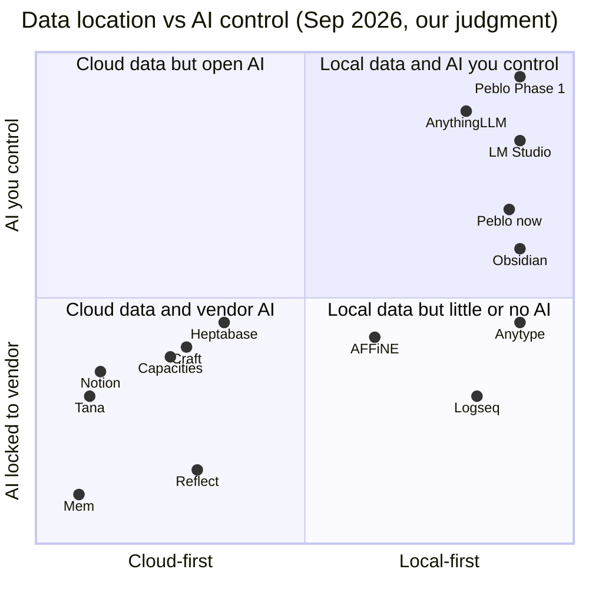
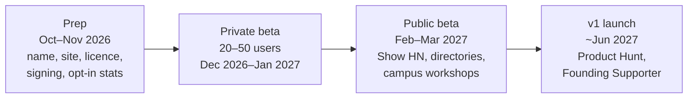
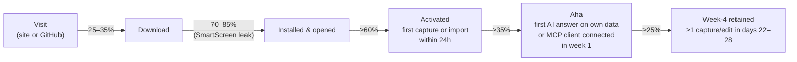

# 06 · Go-to-Market: positioning, pricing, channels and launch

> Owner: marketing & growth (today that is the founder). Last updated: 26 Sep 2026.
> Related: [00 Vision & strategy](./00-vision-and-strategy.md) · [01 PRD](./01-prd.md) · [02 TRD](./02-trd.md) · [03 MCP](./03-mcp.md) · [04 AI Hub](./04-ai-hub.md) · [05 Design](./05-design.md) · [docs index](./README.md)
>
> Unless a source is linked, every number in this doc (targets, prices, conversion rates) is a **hypothesis** to test, not a fact.

---

## TL;DR

- **The market gap is real but narrowing.** Big note apps are adding MCP quickly: Notion, Capacities, Heptabase and AFFiNE all run *hosted* MCP servers, and Anytype ships an official *local* one. Very few ship a workspace where **the data, the model and the MCP plumbing all stay on your laptop**. Notion AI needs the internet and a Business plan. Obsidian has no first-party AI or MCP. Anytype has local MCP but no built-in AI. Local-AI apps (LM Studio, AnythingLLM, Jan, Msty) are chat tools, not notes/tasks/calendar workspaces. Reor, the closest "local AI notes" app, was **archived in March 2026**. So there is room for this, and staying alive is the hard part.
- **Beachhead: developers and AI power users** who already run Ollama/LM Studio or work in Claude Desktop/Cursor. We seed first from Indian engineering campuses (the founder's own network, starting with Warangal and Hyderabad) and from global local-AI communities (r/LocalLLaMA, HN, MCP directories). Mass-market Indian students come second, once onboarding needs zero setup and there is a phone app.
- **Positioning:** *Peblo is the local-first workspace for notes, tasks and calendar that works with any AI you choose: a local model on your laptop, your own API key, or Claude/Cursor through MCP. Nothing leaves your computer unless you say so.*
- **Pricing (recommendation):** during Phase 1 everything is free. The local AI, the MCP server and import/export are never paywalled. We sell an optional one-time **Founding Supporter** license (hypothesis: ₹499 in India / $19 elsewhere). A subscription arrives only in Phase 2, with **Peblo Sync**, because sync has a real recurring cost. Students get 50% off.
- **Channels:** build in public (X + LinkedIn), genuine help in 3–4 communities, one 60-second demo video a week, listings in MCP and Ollama directories, a Show HN at public beta, Product Hunt at v1, and a small campus ambassador program in Telangana. There are no paid ads. The time budget is about 6 hours/week.
- **Blockers to fix before any public launch:** (1) **the name**. "Peblo" is already used by a seed-funded Indian ed-tech startup (the company whose take-home challenge this project began as), and `peblo.app` is taken by a *team docs tool*. Rename before public beta. (2) **Trust.** 76% of Indian desktops run Windows, and unsigned builds trigger SmartScreen. (3) **Open-source licence decision.** The repo has no LICENSE file.

---

## 1. Market research (September 2026)

### 1.1 Competitive landscape

Prices are USD list prices from the vendor page unless marked. "Local-first" means the app works fully from data on your device without an account. It does not just mean "has an offline cache".

| Product | Pricing (Sep 2026) | Local-first? | AI approach | MCP | Platforms | Sources |
|---|---|---|---|---|---|---|
| **Notion** | Free; Plus $10/member/mo; Business $20 (full Notion AI + Agents only here); Enterprise custom. ~20% off yearly. **Plus is free for students** with a school email. India ≈ ₹670 (Plus), billed in USD with no GST invoice (third-party estimate) | No. Cloud-first. Offline mode since Aug 2025 (download pages; auto-offline for Recents/Favorites on paid plans; some blocks and database edits need the internet) | Cloud, vendor-controlled. Notion AI needs the internet | **Yes, hosted** remote MCP (OAuth) for Claude Code, Cursor, Codex | Web, Win, Mac, iOS, Android. Plus Notion Mail (Apr 2025) and Notion Calendar | [pricing](https://www.notion.com/pricing), [offline release](https://www.notion.com/releases/2025-08-19), [offline limits](https://affine.pro/blog/notion-offline) (competitor-written), [MCP](https://developers.notion.com/guides/mcp/overview), [Wikipedia](https://en.wikipedia.org/wiki/Notion_(productivity_software)), [INR](https://www.itforsme.in/pricing/notion-india) |
| **Obsidian** | App free, including commercial use (licence optional, $50/user/yr). Sync $4/mo yearly or $5 monthly; Publish $8/$10; Catalyst $25 one-time; **40% edu discount** on Sync/Publish | **Yes.** Plain Markdown files in a folder | None built in. Community plugins (BYO key or local) | **No first-party server.** Official CLI; the community "Local REST API" plugin has an MCP endpoint (~745k downloads) | Win, Mac, Linux, iOS, Android | [pricing](https://obsidian.md/pricing), [MCP status](https://getaffineapp.com/blog/obsidian-mcp-guide), [plugin stats](https://www.obsidianstats.com/plugins/obsidian-local-rest-api) |
| **Anytype** | Free (≈1 GB sync); Builder ≈ $99/yr; Co-Creator higher (third-party figures). **50% student discount** | **Yes.** Local-first, end-to-end encrypted, P2P, self-hostable | No built-in AI listed | **Yes, official, local** (`anyproto/anytype-mcp`, talks to the desktop app on 127.0.0.1). Works with Claude Desktop, Cursor, LM Studio, and others | Win, Mac, Linux, iOS, Android | [MCP repo](https://github.com/anyproto/anytype-mcp), [pricing (3rd-party)](https://toolradar.com/tools/anytype/pricing), [memberships](https://doc.anytype.io/anytype-docs/resources/monetization.md) |
| **Logseq** | Free, open source. Sync is in testing for Open Collective sponsors | Yes (file graphs; new DB version shipping through 2026) | No core AI; "agent skills" appearing | Community only | Win, Mac, Linux, iOS, Android | [DB update May 2026](https://discuss.logseq.com/t/whats-new-with-logseq-db-may-16th-2026/35020), [Open Collective](https://opencollective.com/logseq) |
| **AFFiNE** | Free (local + 10 GB cloud); Pro $6.75/mo; Team $10/seat; Believer $499.99 lifetime | **Yes.** MIT open source, CRDT, self-hostable | Cloud "AFFiNE AI" copilot; self-hosters can configure providers | **Yes, built in, remote** (cloud or self-hosted endpoint, not localhost) | Web, desktop, mobile | [pricing](https://affine.pro/pricing), [MCP](https://affine.pro/mcp) |
| **Capacities** | Basic free; Pro $9.99/mo; Believer from $12.49; +$8.33 for the bigger AI budget. **40% off for students** | Partly (offline support; cloud sync) | Cloud AI with a monthly budget | **Yes, hosted**, Pro only | Web, desktop, mobile | [pricing](https://capacities.io/pricing), [MCP docs](https://docs.capacities.io/developer/model-context-protocol) |
| **Reflect** | $10/mo billed yearly, 14-day trial | No (cloud, but end-to-end encrypted, works offline) | OpenAI (GPT-4, Whisper) | Not advertised | Desktop, web, iOS | [site](https://reflect.app) |
| **Mem** | Free; Plus $9; Pro $29; up to $199/mo | No | Cloud "AI chief of staff" agent | Not advertised | Web, Mac, Win, mobile | [pricing](https://get.mem.ai/pricing), [site](https://get.mem.ai/) |
| **Tana** | Free (5 meetings, 50 AI queries); Pro $20; Max $80 (early-bird) | No | Cloud AI. **Pivoted in Mar 2026** to a meetings/"company brain" product; Tana Outliner kept | Yes (listed) | Web, desktop, mobile | [pricing](https://tana.inc/pricing), [pivot post](https://outliner.tana.inc/blog/the-next-chapter-for-tana) |
| **Heptabase** | Pro $8.99; Premium $17.99; Premium+ $53.99 (25% off yearly) | No (desktop apps + cloud sync) | Cloud AI credits. Pro is Gemini-only; Premium adds GPT/Claude | **Yes, official, hosted** (`api.heptabase.com/mcp`) | Mac, Win, Linux, iOS, Android | [pricing](https://heptabase.com/pricing), [MCP](https://support.heptabase.com/en/articles/12679581-how-to-use-heptabase-mcp) |
| **Craft** | Free; Plus $8/mo ($6.40 yearly); Family $15; Team $50 | No | Cloud AI credits | **Yes** ("API & MCP access" on all tiers) | Apple platforms, Windows, Android, web | [pricing](https://www.craft.do/pricing) |
| **Apple Notes / OneNote** | Free with the OS / Microsoft 365. Copilot features need a paid Microsoft tier | No (vendor cloud) | Apple: on-device + Private Cloud Compute. Microsoft: cloud Copilot | No first-party MCP | Own ecosystems | [Apple Intelligence](https://www.apple.com/apple-intelligence/), [OneNote Copilot](https://support.microsoft.com/en-us/onenote/welcome-to-copilot-in-onenote) |
| **LM Studio** | Free, including for work since Jul 2025; paid Enterprise | Yes | Local models (GUI) | **MCP host** since v0.3.17 | Win, Mac, Linux | [MCP docs](https://lmstudio.ai/docs/app/mcp), [free for work](https://alternativeto.net/news/2025/7/lm-studio-lifts-commercial-license-barrier-expands-free-team-collaboration/) |
| **AnythingLLM** | Desktop free (MIT, ~66k stars); cloud/enterprise paid | Yes | Local or cloud models; document RAG; agents | **MCP client** (desktop + Docker) | Win, Mac, Linux, Android, Docker | [site](https://anythingllm.com/), [MCP docs](https://docs.anythingllm.com/mcp-compatibility/overview) |
| **Msty** | Free; Aurum $149/yr or $349 lifetime | Yes | Local (Ollama, llama.cpp, MLX) + online; "knowledge stacks" RAG | MCP tools | Desktop | [pricing](https://msty.ai/pricing) |
| **Jan** | Free, Apache-2.0 (~45k stars) | Yes | Local open models + cloud keys | MCP integration | Desktop | [GitHub](https://github.com/janhq/jan) |
| **Khoj** | Self-host free (AGPL); free cloud tier; enterprise | Self-hostable | Local or cloud LLMs over your docs (Obsidian, Emacs, Notion, PDF) | Not clearly documented | Web, desktop, Obsidian, Emacs, WhatsApp | [GitHub](https://github.com/khoj-ai/khoj) |
| **Reor** | Was free, AGPL | Yes | Local-first (Ollama + LanceDB) AI notes | — | Desktop | **Archived 7 Mar 2026** ([GitHub](https://github.com/reorproject/reor)) |
| **Peblo (today)** | Free, unsigned builds | **Yes.** SQLite file in app-data, no account | Ollama local + user's OpenAI/Gemini key, with fallback cascade | Planned in Phase 1 (server *and* client). See [03-mcp.md](./03-mcp.md) | Win, Mac, Linux | this repo |

What the table tells us:

1. **MCP is becoming table stakes, and it is mostly cloud-hosted.** Notion, Capacities (Pro only), Heptabase and AFFiNE run remote MCP endpoints. Anytype's official server is local, but Anytype has no in-app AI. A *local* MCP server plus a *local* model plus an *in-app* AI Hub in one download is still uncommon. That is Peblo's wedge. It has a shelf life of maybe 12–18 months (estimate).
2. **"Local AI notes" alone doesn't sustain a product.** Reor had 8.6k GitHub stars and still got archived. Khoj and AnythingLLM widened into general AI assistants. Peblo needs a reason to open it daily (tasks + calendar + quick capture) *and* a business model early.
3. **Students are already given Notion Plus free**, and Obsidian, Anytype and Capacities all offer 40–50% student discounts. Competing on price for students is not a differentiator.
4. **Demand evidence for our exact combination:** on a Show HN for an "AI-first alternative to Obsidian/Notion" (OpenKnowledge, 381 points, 173 comments), the top complaints were *no easy local-model support* ("a deal breaker"), *Mac-only*, and *Electron polish* ([HN thread](https://news.ycombinator.com/item?id=48675435)). Peblo already has local models and Windows/Linux. The Electron criticism will hit us too.

### 1.2 Positioning map

The axes: **where your data lives** (cloud-first → local-first) and **who controls the AI** (locked to the vendor's cloud AI → you choose: local model, your own key, and MCP in and out). Placements are our judgment from the table above, as of Sep 2026.

How to read it: the top-right is where **Peblo's Phase 1 target** sits. It is crowded only by **chat tools** (AnythingLLM, LM Studio), which are not notes/tasks/calendar workspaces. Obsidian gets there only with plugins, and Anytype only if it adds built-in AI. The risk is that AFFiNE, Anytype or Obsidian move up this chart faster than Peblo moves right on features.

### 1.3 Market signals

| Signal | Evidence | What it means for Peblo |
|---|---|---|
| MCP is the standard way AI tools connect to data | ~97M SDK downloads/month; 10,000+ public servers; first-party support in Claude, ChatGPT, Gemini, Copilot Studio, VS Code, Cursor ([Digital Applied](https://www.digitalapplied.com/blog/mcp-adoption-statistics-2026-model-context-protocol)). Governed by the Linux Foundation's Agentic AI Foundation since Dec 2025; big spec revision on 2026-07-28 ([bex.co](https://bex.co/blog/2026/09/23/mcp-linux-foundation-deploy-infrastructure)). Official registry is in preview with GitHub/DNS namespace verification ([registry](https://modelcontextprotocol.io/registry/about)) | Listing the Peblo MCP Server is free distribution. There are 10k+ servers, so discovery is the bottleneck, and a clear niche ("your tasks + notes, local") matters |
| Local AI is going mainstream among technical users | Ollama ≈ 9M users and a $65M raise (Jul 2026) ([Wikipedia](https://en.wikipedia.org/wiki/Ollama)). r/LocalLLaMA ≈ 830k members, +55% in a year (per [GummySearch](https://gummysearch.com/r/LocalLLaMA/) snapshot). LM Studio made itself free for work | The beachhead already exists and already installs things like Ollama. Also: 175k Ollama servers were found exposed to the internet (Jan 2026). Security-by-default is a selling point |
| Privacy worry is broad, but people still use cloud AI | 81% of US adults worry about AI accessing personal data; privacy is the #1 concern (48%); yet 32% use AI daily ([Shift survey, Mar 2026](https://ppc.land/81-of-consumers-fear-ai-data-access-but-daily-use-keeps-climbing/)) | "Private" alone doesn't sell to the mass market. Pair it with *control* and *usefulness* ("works with the AI you already use") |
| Obsidian-style users are growing | r/ObsidianMD ≈ 365k, +46% yearly ([GummySearch](https://gummysearch.com/r/ObsidianMD/)) | A big pool of people who already chose local-first. They care about plain files, so our SQLite storage is a talking point we must answer (see §2) |
| India is the biggest developer growth market | 21.9M Indian developers on GitHub, the most new devs in 2025, projected 57.5M by 2030 ([GitHub Octoverse 2025](https://github.blog/news-insights/octoverse/octoverse-a-new-developer-joins-github-every-second-as-ai-leads-typescript-to-1/)) | The founder's home market is also the fastest-growing dev market. Indian CS students are the cheapest-to-reach slice of our beachhead |
| Indian desktops are Windows (and Linux) | Windows 76%, Linux 12.6%, macOS ≈ 11% (Aug 2026, [StatCounter](https://gs.statcounter.com/os-market-share/desktop/india)) | SmartScreen is the #1 funnel leak in India. Linux is unusually big, and we support it |
| Indian students are price-anchored very low | Spotify Premium Student: ₹69/mo ([Spotify IN](https://www.spotify.com/in-en/student/)). Notion Plus free for students | Anything above ~₹99/mo or ~₹499 one-time is a hard sell to students (hypothesis) |
| Where Indian students spend attention | YouTube ≈ 500M, Instagram ≈ 481M, WhatsApp ≈ 535M, LinkedIn ≈ 170M, Telegram ≈ 104M, Reddit ≈ 31M Indian users ([GrabOn, citing DataReportal](https://www.grabon.in/indulge/tech/social-media-statistics/)). India is Telegram's #1 market ([WPR](https://worldpopulationreview.com/country-rankings/telegram-users-by-country)) | For students: short video (Reels/Shorts) and WhatsApp/Telegram groups through ambassadors, plus LinkedIn build-in-public. For devs: X, Reddit, HN, GitHub |
| Payments for Indian users got easier | Paddle added **UPI Autopay** for recurring subscriptions (17 Jun 2026) ([Paddle](https://developer.paddle.com/changelog/2026/upi-autopay/)) | A merchant-of-record can sell to India (UPI) and the world from one checkout, without the founder handling global tax himself |
| Product Hunt is smaller than it used to be | Realistic B2C outcome is 500–1,500 signups; ranking rewards comment depth, not raw upvotes ([Causo 2026 playbook](https://hub.causo.ai/guides/product-hunt-launch-2026-realistic-playbook)) | Use PH for the v1 "badge + backlink", not as the main growth engine |

---

## 2. Where Peblo is differentiated, and where it is behind

The honest version. The "ahead" items are all *copyable*. Our real edge is speed, focus and community, not technology.

### Genuinely differentiated (today or in Phase 1)

| # | Differentiator | vs whom | Durable? |
|---|---|---|---|
| 1 | **Local model built in** (Ollama) with a fallback cascade to the user's own OpenAI/Gemini key. No plugin hunting | Notion, Capacities, Reflect, Mem, Tana, Heptabase, Craft (all cloud AI); Obsidian (plugins only); Anytype (no AI) | Medium. AFFiNE/Anytype could add it within a year |
| 2 | **Notes + tasks + calendar + dashboard + quick capture in one local app, no account** | Obsidian and Logseq need plugins for tasks/calendar; local-AI chat apps have no workspace | Medium |
| 3 | **MCP in both directions, locally** (Phase 1): Peblo MCP Server lets Claude/Cursor read and write your tasks; Peblo Connect lets Peblo's AI use other MCP servers. See [03-mcp.md](./03-mcp.md), [04-ai-hub.md](./04-ai-hub.md) | Notion, Capacities, Heptabase, AFFiNE MCP are *hosted*; Anytype's is local but it has no in-app AI | Low–medium. This is the 12–18 month window |
| 4 | **Windows and Linux are first-class** | OpenKnowledge (Mac-only), Apple Notes, parts of Craft | Low, but it matters a lot in India |
| 5 | **Smart Intake** (paste text/PDF → notes + tasks) and voice commands | Most note apps summarize; few turn a braindump into dated tasks | Low |
| 6 | **Founder-market fit for India**: a student building for students/devs, with rupee pricing and a local community | Global tools price in USD with no GST invoice | Medium (it's a story and a network, not a feature) |

### Where Peblo is behind (say it before users do)

| Gap | Who does it better | Impact on GTM | Fix / where tracked |
|---|---|---|---|
| **No mobile, no sync.** Students live on phones | Notion, Obsidian, Anytype, Capacities | Blocks the mass student segment; fine for desk-bound devs | Phase 2 ([01-prd.md](./01-prd.md), [02-trd.md](./02-trd.md)) |
| **No collaboration or sharing** | Notion, AFFiNE, Craft | Blocks group projects and teams | Phase 3 |
| **Data in SQLite, not plain Markdown files** | Obsidian, Logseq | Obsidian users will ask "can I open my notes without Peblo?" Answer: one-click Markdown export today; a "Markdown vault" storage adapter later ([02-trd.md](./02-trd.md)) | Messaging + Phase 2 storage adapter |
| **Unsigned builds** (SmartScreen / Gatekeeper warnings) | Everyone above | Biggest install drop-off, especially on Windows. Destroys trust for a no-name app | Phase 1 must-fix (§8) |
| **No end-to-end encryption, no encryption at rest** | Anytype, Reflect, Obsidian Sync | Can't sell to privacy-sensitive professionals yet. Don't claim "encrypted" | Phase 2 |
| **No semantic search / "ask your notes" yet** | Heptabase, Capacities, AnythingLLM, Khoj | Our headline demo ("chat with your notes locally") doesn't exist yet | Phase 1 AI Hub ([04-ai-hub.md](./04-ai-hub.md)) |
| **No plugin ecosystem, integrations or templates gallery** | Obsidian (thousands of plugins), Notion | Power users hit walls fast | MCP is our "plugin system" for now; plugin API in Phase 2 |
| **Single developer, part-time (student + internship)** | Funded teams | Slow fixes, exam-season gaps, bus factor. Users worry an indie app will die (Reor did) | Be transparent; export-anytime promise; consider open source (§5.5) |
| **Electron** | Native apps | HN/Reddit will criticise memory use and polish | Show real RAM numbers; keep startup fast ([05-design.md](./05-design.md)) |
| **No telemetry or crash reporting** | — | We are blind to funnel and crashes | Opt-in, documented usage stats (§8.3) |

---

## 3. ICP and beachhead

### 3.1 Three candidate segments

| Criterion | A. Indian college students (general) | B. Developers & AI power users (Claude/Cursor/Ollama users) | C. Privacy-sensitive professionals (lawyers, doctors, therapists, journalists, researchers) |
|---|---|---|---|
| Pain today | Medium: scattered notes, deadlines, exam prep | **High**: their notes/tasks are invisible to their AI tools, or they won't paste private context into the cloud | **High**: can't put client or patient data into cloud AI |
| Fit with today's product | Low–medium: needs mobile, sync, sharing; many 8 GB laptops struggle with local models | **High**: Ollama, Win/Linux, quick capture, MCP (Phase 1) | Low: needs signing, encryption, backups, support, a company behind it |
| Reachability for this founder | **Very high**: own campus, WhatsApp groups, clubs | High: Reddit, HN, X, MCP directories, Indian CS students | Low: no network, needs trust and sales |
| Ability / willingness to pay | Low (₹69/mo Spotify anchor; Notion Plus free) | Medium–high globally; medium in India | **High** |
| Tolerance for rough edges (unsigned builds, Ollama setup) | Low | **High** | Very low |
| Feedback quality | Medium | **High** (specific, technical, will file issues) | High but slow |
| Word of mouth | High inside a campus | High online (posts, repos, videos) | Low (private by nature) |
| Competitive pressure | Notion (free Plus), Google Keep, OneNote | Obsidian + plugins, Anytype MCP, AnythingLLM | Enterprise tools, Apple's on-device AI |

### 3.2 Recommendation

**Beachhead = Segment B, seeded through its Indian-student slice.**

> *Developers and AI-heavy users on Windows/Linux/macOS who already run a local model (Ollama/LM Studio) or live in Claude Desktop/Cursor, and want their notes, tasks and calendar to be usable by those AIs without uploading them anywhere.*

Why:
- It is the only segment where **today's product plus the Phase 1 roadmap is already a strong fit**, and where unsigned builds and Ollama setup are acceptable for a while.
- They are **reachable for ₹0**: r/LocalLLaMA (~830k), HN, MCP registries, Ollama's integrations list, GitHub.
- The founder's campus network gives a **dense first cohort** of Indian CS/engineering students who code with AI. They sit in both A and B, and they are the easiest 20–50 beta users to recruit and interview in person.
- Winning B produces the assets (tutorials, MCP listings, GitHub stars, testimonials) that later make A (mass students, after mobile + zero-setup AI) and C (professionals, after signing + encryption + company) cheaper to win.

**Sequence (hypothesis):** B in Phase 1 → A in Phase 2 (mobile companion + sync + a "no-GPU" AI option) → C in Phase 2–3 (encryption, signed builds, a registered company, a privacy page reviewed by a lawyer).

### 3.3 Beachhead persona (for copy and interviews)

**"Arjun", 21, final-year CSE student in Hyderabad (India sub-slice)**: Windows laptop with 16 GB RAM, uses Cursor with the free tier, has Ollama with `llama3.2`, keeps notes in Notion (free student Plus) and tasks in Google Keep, preps for placements. Wants "one place where my AI knows my deadlines and notes."

**"Maya", 29, backend engineer in Berlin (global slice)**: Linux desktop, Claude Desktop + Claude Code daily, Obsidian vault she half-maintains, a to-do app she doesn't trust with work context. Wants "Claude to see my tasks and meeting notes without syncing them to another SaaS."

---

## 4. Positioning and messaging

### 4.1 Positioning statement

> **For** developers and AI power users **who** want their notes, tasks and calendar to work with the AI tools they already use, **Peblo is** a local-first AI workspace **that** runs entirely on your computer, chats with a local model or your own API key, and plugs into Claude, Cursor and other tools through MCP. **Unlike** Notion, your data and your AI never have to leave your machine. **Unlike** Obsidian, AI, tasks and a calendar are built in, not a plugin hunt.

### 4.2 Messaging pillars

| Pillar | Message | Proof points (only claim what ships) | Don't say |
|---|---|---|---|
| **1. Yours, on your machine** | No account. Your workspace is one file on your computer. Export everything to Markdown anytime. | No login; `peblo.db` in the app-data folder (Help → Open Data Folder); Markdown zip export; Notion/Obsidian import | "Encrypted", "secure vault" (no encryption at rest yet). "Zero data leaves" is only true when using local AI |
| **2. Any AI, your choice** | Use a local model, your own OpenAI/Gemini key, or both. Switch any time. | Ollama integration with fallback cascade; AI Hub model switcher (Phase 1) | "Works offline with AI" unless a local model is set up |
| **3. Plugs into your AI tools** | Claude, Cursor and VS Code can read and update your Peblo tasks and notes, with your permission. Peblo's AI can use your other MCP servers. | Peblo MCP Server + Peblo Connect ([03-mcp.md](./03-mcp.md)) | Anything about MCP before it ships in a build users can download |
| **4. One calm place for notes, tasks and time** | Capture from anywhere, turn a braindump into tasks, see your day. | Ctrl/Cmd+Shift+Space quick capture; Smart Intake; calendar; daily briefing | "Replaces Notion" (it doesn't yet: no collab, no mobile) |

**Standard privacy line** (use everywhere, exactly): *"Everything stays on your computer. If you choose a cloud AI provider, only the text you send to the AI goes to that provider, using your own key."*

### 4.3 Tagline options

1. **Your notes. Your model. Your machine.** (recommended for devs; short, true today)
2. **The workspace your AI can read, and nobody else can.** (strong MCP angle; use once MCP ships)
3. **Local-first notes, tasks and calendar that work with any AI.** (plain-English, good for India/LinkedIn)
4. **Bring your own model.** (tight, dev-native; good as a section header or a sticker)
5. **Think locally. Ask anything.** (softer, student-friendly)

### 4.4 Homepage hero copy (draft)

> **Your notes. Your model. Your machine.**
>
> Peblo is a local-first workspace for notes, tasks and your calendar, with AI that *you* control. Chat with a local model through Ollama or use your own OpenAI/Gemini key. Let Claude, Cursor and VS Code work with your tasks through MCP. No account. No cloud. Just a file on your computer.
>
> **[Download for Windows]** [macOS] [Linux] · Free · v0.x beta
>
> *Moving from Notion or Obsidian? Import your export in about a minute.*
>
> ---
> **Three things, under the hero, each with a 10-second looping GIF:**
> 1. **Capture from anywhere.** Press Ctrl+Shift+Space in any app. "Submit DBMS assignment friday !high #college" becomes a dated task.
> 2. **Ask your notes, locally.** "What did I decide about the internship offer?", answered by Llama on your laptop, with links to the notes it used. *(Phase 1)*
> 3. **Your AI tools, connected.** In Claude Desktop: "What's due this week in Peblo?" *(Phase 1)*
>
> **Trust strip:** Open data folder · Export to Markdown anytime · Built in public by a student developer in Warangal, India · [Source on GitHub] *(if open-sourced)* · SHA-256 checksums for every release

Copy owner: this doc. Visual design: [05-design.md](./05-design.md).

### 4.5 Naming and brand: is "Peblo" OK?

**Recommendation: no. Pick a new name before public beta**, and ideally before building any audience under the current name.

Findings:
- **The name comes from a company.** The repo root contains `Peblo_Full_Stack_Developer_Challenge.docx.pdf`, a take-home brief from **Peblo**, a seed-funded Indian ed-tech startup (kids' AI learning, [mypeblo.com](https://www.mypeblo.com/)). The PDF is marked *"Confidential — for candidate evaluation."* Launching a product with their brand name, in the same country and the same broad "AI app" space, invites a trademark complaint and confusion, and could damage a professional relationship. **Action now:** if the repo is public, remove the PDF from the repo *and its git history* (it's confidential material). Rename the product and the repo.
- **`peblo.app` is taken** by a waitlist site for a *team documentation tool* (it redirects to `peblo.framer.website`): the same category as us. There are also CB Insights / Crunchbase / Tracxn profiles under "Peblo".
- Good news: nothing about the current brand has public equity yet, so renaming is cheap *now* and expensive later.

**Naming criteria:** 2 syllables, easy to say in English, Telugu and Hindi. No clash in software/AI classes. A `.com` or `.app` available (or `get<name>.com`). A free GitHub org and X/Instagram handle. It should hint at *ownership / local / calm*, not "AI" (AI names date fast).

**Directions to explore** (none are checked; illustrative only):
- *Stone / keepsake* (keeps the pebble spirit): Cairn, Flint, Shale-like coinages.
- *Home / ownership*: Hearth, Burrow, Nook-like coinages.
- *Indian roots*: **Pothi** (पोथी, a traditional handwritten book/manuscript: "your personal book of knowledge"), Bahi (as in *bahi-khata*, a ledger).

**Checks to run for each shortlisted name** (≈2 hours each, free):
1. Indian trademark search, IP India public search, Classes 9 (software) and 42 (SaaS): https://tmrsearch.ipindia.gov.in/
2. US (USPTO) and EU (EUIPO / WIPO Global Brand Database) searches, Classes 9 and 42.
3. Domain availability (.com, .app, .in, .ai) via any registrar. The GitHub Student Developer Pack has historically included a free first-year domain; check it.
4. GitHub org, npm package name (needed for the MCP registry), X, Instagram, YouTube handles.
5. Google + Product Hunt + Play Store + App Store search for "<name> notes/app/AI".
6. Say it out loud to 5 classmates in Telugu/Hindi/English: any unfortunate meaning?

If a clear name can't be found in 2 weeks, fall back to a descriptive compound (e.g. "<Name> Notes") and file an Indian trademark application once there's revenue. Filing fees are lower for individuals/startups; verify the current fee on IP India.

---

## 5. Pricing and business model

### 5.1 Constraints

- Local-first users strongly prefer **not** to pay subscriptions for software that runs on their own machine. They pay for **services with real ongoing cost** (sync, hosting) or **one-time licences / support** (Obsidian Catalyst $25; Msty lifetime $349; AFFiNE Believer $499.99).
- Indian students are anchored at ~₹69/mo (Spotify) and ₹0 (Notion Plus free for students).
- Peblo currently has **no recurring cost per user**: no servers, and AI runs on the user's key or machine. A subscription would feel unjustified until Sync exists.
- The founder is an individual in India. A **merchant of record** (Paddle, Lemon Squeezy, or similar) handles global VAT/GST and invoicing, and Paddle now supports UPI Autopay.
- Fixed yearly costs to cover (estimates): Apple Developer Program $99/yr; a Windows code-signing certificate from ~$116/yr for a cloud OV cert ([SSLmentor, Certum](https://www.sslmentor.com/certum/certumcodecloud)), or free via SignPath if the app is fully open source (§5.5); domain ₹1–3k/yr. **Total ≈ ₹25–35k/yr (hypothesis).**

### 5.2 Options

| Option | How it works | Pros | Cons |
|---|---|---|---|
| **A. Free + donations** | GitHub Sponsors / Open Collective | Maximum trust; zero friction | Rarely covers costs; Reor-style fade-out risk |
| **B. Freemium subscription** (e.g. Pro $5/mo) | Paywall AI Hub / MCP features | Predictable revenue; standard SaaS | Clashes with local-first ethos; paywalling MCP kills our growth loop; low Indian WTP; nothing recurring to justify it yet |
| **C. Free core + one-time Pro licence** (e.g. $29 / ₹999 with 1 year of updates) | Pay once, keep the version forever | Fits local-first; students can afford a one-off; cash up-front | Lumpy revenue; must keep shipping to sell renewals; feature gating is hard if open source |
| **D. Free core + Peblo Sync subscription** (Phase 2) | Pay for end-to-end encrypted multi-device sync/backup | Obsidian-proven; pays a real cost; clear value | Sync isn't built (Phase 2); encryption and ops are hard for one dev |
| **E. Cloud AI credits** | Peblo resells a cheap cloud model for users without a GPU or API key | Zero-setup for students on 8 GB laptops | Margin and abuse risk; money up front; weakens the "local" story |
| **F. Student / regional (PPP) pricing** | Layered on C or D: ~50–60% lower in India, 50% off for verified students | Matches reality; goodwill | Verification effort (SheerID-style is costly; start with `.ac.in`/`.edu` email check) |

### 5.3 Recommendation (all prices are hypotheses)

| Phase | Model | Price hypothesis |
|---|---|---|
| **Phase 1** (now → v1) | **Everything free.** Optional **Founding Supporter** one-time licence: supporter badge in the app, name in credits, early/beta builds, a vote on the roadmap, and **lifetime 40% off Peblo Sync** later | ₹499 India / $19 global. Free for the 50 private-beta users and campus ambassadors |
| **Phase 2** | **Peblo Sync** subscription (E2E-encrypted sync + backup + mobile companion). Optionally a **Pro one-time** licence for power features (agents/automations, advanced RAG) if the app stays closed source | Sync: ₹99–149/mo or ₹999/yr India; $4/mo or $40/yr global; students 50% off |
| **Phase 2+ (optional)** | **AI credits add-on** for users without a GPU or key, at cost + margin, using a cheap model | Only after measuring demand. Until then, onboarding links to the free tiers of cloud providers (e.g. a Gemini API key; verify current free-tier terms) |

**Never paywall:** local AI via Ollama, BYO keys, the Peblo MCP Server, import/export. These are the growth loop and the trust promise.

**Success test for pricing (Phase 1):** ≥5% of weekly-active users buy Founding Supporter within 60 days of v1. That's ~5 of 100 WAU (hypothesis). If it's under 2%, the value isn't clear yet. Revisit messaging before changing price.

### 5.4 Payment rails (to confirm)

- Start with one **merchant of record** that supports INR + UPI and global cards (Paddle's UPI Autopay; also compare Lemon Squeezy, Dodo Payments). This avoids registering for GST in every country.
- Open question: does an individual Indian student need a sole proprietorship or company to be paid out? That depends on MoR KYC requirements. Check before the v1 launch date.

### 5.5 The open-source decision (affects pricing, trust and signing)

The repo currently has **no LICENSE** ("all rights reserved" by default).

| Option | Pros | Cons |
|---|---|---|
| **Closed source** | Can paywall features (Option C) | "Unknown desktop app from a student" is a hard trust sell; no free code signing; less HN/Reddit goodwill |
| **Open-core**: MIT-licence the Peblo MCP Server package + Core API spec, keep the app closed | MCP listing and GitHub discovery; low risk | Partial trust gain only |
| **Fully open source** (AGPL-3.0 like Logseq/Khoj, or MIT like AFFiNE) | Biggest trust win for a privacy product; eligible for **free SignPath code signing** (requires an OSI licence and no proprietary components/dual-licensing, [terms](https://signpath.org/terms.html)); contributors; strong HN/r/selfhosted appeal | Monetization must come from services (Sync, AI credits) and supporter licences, not feature gates; a fork risk |

**Recommendation:** open-source the MCP server package now. **Decide on full open source before public beta.** Marketing leans toward **fully open source (AGPL-3.0) + paid Sync/supporter licences**, because trust is our #1 adoption barrier. This is a founder/strategy call; see [00-vision-and-strategy.md](./00-vision-and-strategy.md).

---

## 6. Channel plan (solo founder, ~₹0 budget, ~6 hours/week)

### 6.1 Channels ranked by expected return for the beachhead

| # | Channel | Why it fits | What exactly | Success signal |
|---|---|---|---|---|
| 1 | **MCP & local-AI directories** | Free, evergreen, intent-rich traffic | Publish the MCP server (npm package that talks to the running app) to the **official MCP Registry** (namespace `io.github.<user>/<name>`). Then submit to PulseMCP, Glama, mcp.so, Smithery, LobeHub, and the awesome-mcp-servers list. Open a PR to Ollama's README "Community Integrations". List on **AlternativeTo** as an alternative to Notion, Obsidian and Reor | ≥10% of downloads attributed (ask "where did you hear about us?" on first run) |
| 2 | **Communities (help first)** | Beachhead lives there | r/LocalLLaMA, r/ObsidianMD, r/selfhosted, r/productivity; MCP and Ollama Discords; Indian dev communities (e.g. GDG on Campus, college coding clubs). Follow each sub's self-promo rules (roughly 9 helpful comments per 1 self-post) | Karma and recognisable username; 1 invited post per month that gets >50 upvotes |
| 3 | **Build in public** | Founder story ("student in Warangal building a local-first Notion alternative") is authentic and plays on LinkedIn India + dev X | 2 posts/week: what shipped (GIF), one number, one lesson. Monthly honest metrics post | 1,000 followers across X+LinkedIn by v1 (hypothesis); waitlist signups per post |
| 4 | **Short demo videos** | YouTube/Instagram are the biggest Indian platforms; devs share good 60s demos | One 45–60s vertical video/week, cross-posted to YouTube Shorts, Instagram Reels, X, LinkedIn. Script ideas in §6.3 | ≥1 video/month over 10k views; click-through to download |
| 5 | **Long-form technical posts** | HN and r/LocalLLaMA reward real engineering | Monthly: dev.to/Hashnode + cross-post. E.g. "Building a local MCP server inside an Electron app", "Local RAG on an 8 GB laptop: benchmarks of 5 small models" | 1 HN front-page post in 6 months (hypothesis) |
| 6 | **Show HN** (public beta) and **Product Hunt** (v1) | One-time spikes + permanent backlinks | See §7 | HN: 100+ points; PH: top 5 of the day |
| 7 | **Campus ambassadors** (Telangana first) | Founder's home turf; dense word of mouth | See §6.4 | 5 active colleges; 300 student downloads |
| 8 | **Open source** (if chosen) | Trust + contributors + GitHub trending | Good README, `good first issue` labels, CONTRIBUTING guide, signed releases | 500 stars by v1 (hypothesis) |

**Not now:** paid ads, influencer deals, cold DMs, Notion-template-style aesthetic content (we can't out-Notion Notion creators), App Store/Microsoft Store listings (until builds are signed), multiple community platforms at once.

### 6.2 Weekly operating rhythm (~6 hours)

| Day | Time | Action |
|---|---|---|
| Mon | 45 min | **Build-in-public post** on X + LinkedIn: what shipped last week + GIF + one learning. Schedule the Thursday post |
| Tue | 60 min | **Community hour**: answer 3 real questions (Ollama setup, MCP config, Obsidian/Notion migration) in r/LocalLLaMA, r/ObsidianMD, or the MCP Discord. Link Peblo only when it directly answers the question |
| Wed | 90 min | **Record + edit one 60-second video** (script from the backlog in §6.3). Post to Shorts, Reels, X, LinkedIn |
| Thu | 60 min | **Two 20-minute user calls** (§9), then 10 minutes writing insights into Peblo itself (dogfooding). Post #2 on X/LinkedIn |
| Fri | 30 min | **Metrics + changelog**: update the funnel sheet (§8.2), publish release notes, send the beta email/Discord update |
| Sat/Sun | 60 min | Alternate weeks: (a) one directory submission or PR (MCP registries, Ollama integrations, AlternativeTo); (b) a long-form post draft (monthly) |

During exam weeks, drop to "Mon post + Fri changelog" only, and say so publicly. Honesty builds trust with this audience.

### 6.3 Content backlog (specific to Peblo)

| Title | Format | Segment | Needs |
|---|---|---|---|
| **"Notion → Peblo in 60 seconds"**: export zip → import → notes + database tables appear | 60s video | Students, devs | Works today |
| **"Ctrl+Shift+Space: capture a task from any app"**: "DBMS assignment friday !high #college" | 20s loop | Students | Works today |
| **"Turn a lecture PDF into notes + tasks"** (Smart Intake) | 60s video | Students | Works today |
| **"What's inside peblo.db?"**: open the file in DB Browser for SQLite; "no lock-in" | 60s video + blog | Devs, Obsidian users | Works today |
| **"Claude Desktop, what's due this week?"**: Peblo MCP Server demo | 60s video | Devs | Phase 1 MCP |
| **"Chat with your notes offline on an 8 GB laptop"**: local RAG with citations | 60–90s video | Devs, r/LocalLLaMA | Phase 1 AI Hub |
| **"Cursor reads my project notes from Peblo"** | 60s video | Devs | Phase 1 MCP |
| **"Reor was archived. Here's a local-first alternative"** (respectful; import from Markdown) | Blog + Reddit comment when relevant | Local AI users | Works today (MD import) |
| **Telugu/Hindi versions** of the top 2 student videos | Shorts/Reels | Indian students | Experiment: does regional language beat English? |
| **"I'm a student building a local-first Notion alternative: month N numbers"** | LinkedIn/X thread | Founders, Indian tech | Monthly |

### 6.4 Campus ambassador program (start at public beta, not before)

- **Where first:** colleges within reach of Hanamkonda/Warangal and Hyderabad. For example NIT Warangal, Kakatiya University colleges, KITS Warangal, then JNTU Hyderabad, IIIT Hyderabad, IIT Hyderabad, BITS Hyderabad. Start with 3 colleges, then expand to 5.
- **Who:** 1–2 students per college who already code with AI tools (they match the beachhead) and run or belong to a coding club, GDG on Campus, or E-Cell.
- **What they do (per month):** 1 hands-on workshop ("Your own AI second brain: local models + MCP on your laptop", 60–90 min, lab session), share in their own class WhatsApp/Telegram groups (never mass-spam), collect 5 feedback forms, and bring 1 interviewee.
- **What they get:** free Founding Supporter licence, a certificate plus a LinkedIn recommendation from the founder, name on the website, stickers (~₹15 each, a few hundred rupees per college), first access to paid internship roles if the company raises money. Model: Notion's Campus Leaders program ([Notion campus templates](https://www.notion.com/templates/collections/campus-leader-templates)), at student scale.
- **Tracking:** a unique `?ref=<college>` download link per ambassador; a "Where did you hear about Peblo?" first-run question.
- **Risk:** ambassador programs decay fast. Keep it to ≤10 people, with a monthly 30-minute group call.

---

## 7. Launch plan by phase

This maps onto the brief's **Phase 1 ("Local-first AI")**. Dates are suggestions. Adjust to the semester exam calendar (commonly Nov–Dec and Apr–May) and to what [01-prd.md](./01-prd.md) and [02-trd.md](./02-trd.md) commit to.

| Phase | Goal | Key actions | Exit criteria (hypotheses) |
|---|---|---|---|
| **Prep** (4–6 weeks) | Be launchable and trustworthy | Rename + domain + handles (§4.5); remove the confidential PDF; licence decision (§5.5); landing page with waitlist + download links + checksums; privacy page; sign macOS builds (Apple Developer) and Windows (OV cert or SignPath); first-run "Where did you hear about us?" + opt-in usage stats (§8.3); 3 demo videos; Ollama one-click setup guide | Signed builds on ≥2 OSes; 150 waitlist signups |
| **Private beta** (20–50 users, ~6 weeks) | Learn what makes people stay | Hand-pick users: ~15 local-AI/MCP devs (Reddit/Discord), ~20 Indian CS students (campus), ~10 Notion/Obsidian switchers. Private Discord. Weekly builds. **Interview everyone once, 10 of them twice** | Activation ≥60%; week-4 retention ≥40% (high-touch cohort); ≥25 interviews logged; "very disappointed if Peblo disappeared" ≥25% |
| **Public beta** (~8 weeks) | First 100 weekly-active users (the Phase 1 goal) | **Show HN** at public beta ("Show HN: <Name> – local-first notes/tasks that work with Ollama and expose an MCP server"). Post Tue–Thu around 7–9 pm IST (morning US Eastern). Founder answers every comment for 6 hours. An r/LocalLLaMA project post; MCP registry and directory listings; Ollama integrations PR; 3 campus workshops | 1,500 site visits → 500 downloads → 250 activated → **100 WAU**; week-4 retention ≥20% |
| **v1 launch** | Credibility + first revenue | **Product Hunt** (weekend launch for better odds of Product of the Day; line up 30–50 *real* users to leave detailed comments; no vote-begging). Founding Supporter checkout goes live. Launch post on LinkedIn/X/dev.to; email the waitlist; a pitch to Indian startup media (YourStory, Inc42) with the student-founder angle | PH top 5 of the day; 300 WAU; 15+ Founding Supporters; week-4 retention ≥25% |

### 7.1 Funnel and metric definitions

(All percentages are hypotheses to replace with real data after the private beta.)

| Metric | Definition | How we measure without breaking the privacy promise |
|---|---|---|
| Visits | Unique visitors to landing page + GitHub | Cookie-less, privacy-friendly web analytics on the website only; GitHub traffic tab |
| Downloads | Installer downloads per OS | GitHub Releases download counts (API) or website counter |
| Install success | First launch after download | Opt-in anonymous "first-launch" ping; in beta, ask directly |
| **Activation** | First note/task captured (app or quick capture) **or** a successful import, within 24h of first launch | Opt-in usage stats: counts only, never content |
| **Aha** | First AI response grounded in the user's own notes (AI Hub) **or** an external MCP client connected, in week 1 | Opt-in stats |
| **Week-4 retention** | ≥1 capture/edit during days 22–28 after first launch | Opt-in stats; weekly beta check-in form as backup |
| Referral source | "Where did you hear about us?" (first run, optional) | Stored locally; sent only if stats are opted in |
| Supporter conversion | Founding Supporter purchases ÷ WAU | MoR dashboard |

### 7.2 Success metrics by phase (summary)

| | Private beta | Public beta | v1 |
|---|---|---|---|
| Active users (WAU) | 20–50 | 100 | 300 |
| Activation | ≥60% | ≥50% | ≥50% |
| Week-4 retention | ≥40% | ≥20% | ≥25% |
| Interviews | 25+ | 10/month | 8/month |
| Revenue | — | — | 15+ Founding Supporters |
| Community | Private Discord | Public Discord + GitHub Discussions | + ambassadors in 5 colleges |

---

## 8. Trust: the make-or-break topic for an unknown desktop app

### 8.1 Code signing plan

| OS | Problem today | Fix | Cost (estimate) |
|---|---|---|---|
| Windows (76% of Indian desktops) | "Windows protected your PC" (SmartScreen) | Option 1: cloud OV code-signing certificate (e.g. Certum, from ~$116/yr). Option 2: **free SignPath Foundation** signing if fully open source. **Not available:** Microsoft's Azure Artifact Signing only onboards individuals in the US/Canada and organisations in a short list of countries that excludes India ([Microsoft Learn](https://learn.microsoft.com/en-us/azure/artifact-signing/quickstart)). Note: even signed builds build SmartScreen reputation gradually ([My-SSL](https://my-ssl.com/learn/open-source-code-signing-certificate)) | $0–230/yr |
| macOS | Gatekeeper "unidentified developer" | Apple Developer Program + notarization | $99/yr |
| Linux | Low friction | Publish checksums; later a Flatpak/Flathub listing | $0 |

Until signing lands, the **download page must show the warning screenshot and the "More info → Run anyway" steps**, with a one-line explanation ("we're a one-person project; code-signing is being set up"). A surprise warning feels like malware. An explained one feels like honesty.

### 8.2 Other trust signals (cheap)

- SHA-256 checksums and (if open source) reproducible build notes for every release.
- A plain-English **privacy page**: what's stored where, what goes to AI providers, what the opt-in stats contain (list every field).
- "Your data folder" and "Export everything" visible in onboarding (not buried in Settings).
- A public changelog and roadmap (GitHub Discussions or a roadmap page).
- Founder's real name, face and city on the About page. People trust people.
- Safe MCP defaults: read-only by default, per-client permission prompts, localhost-only binding. Say so on the site. (Security-conscious users know about exposed Ollama servers.) Details in [03-mcp.md](./03-mcp.md).

### 8.3 Telemetry stance

Today there's none, so we are blind. Recommendation: **opt-in, off by default, counts only, documented field list, viewable in Settings before sending.** Beta users get a clear ask ("help a student developer: share anonymous usage counts?"). Implementation belongs in [02-trd.md](./02-trd.md). Marketing needs the events in §7.1.

---

## 9. Feedback loops

### 9.1 Recruiting the first 20–50 users

- **Beta application form** (Tally or Google Forms, linked from landing page, posts and videos). Screener questions:
  1. OS, RAM, GPU (can they run a local model?)
  2. Current notes / tasks / calendar tools (pick all)
  3. Do you use Ollama/LM Studio? Claude Desktop/Cursor/VS Code with MCP?
  4. The last time you hesitated to paste something into a cloud AI: what was it? (free text; filters for real pain)
  5. Willing to do two 20-minute calls? (required for private beta)
- **Pick a balanced cohort**: ~40% global devs, ~40% Indian CS students, ~20% Notion/Obsidian switchers. At least 30% on Windows and 20% on Linux.
- **Incentive:** free Founding Supporter licence + name in credits. No cash.
- **Where to find them:** own campus (in person beats DMs), replies to your community answers, people who comment on your videos, people asking "Notion alternative with local AI?" on Reddit.

### 9.2 Interview guide (20 minutes; ask about past behaviour, not hypotheticals)

**Before they install (discovery):**
1. Walk me through the last time you had to remember a task or deadline. Where did it end up?
2. Which notes/task apps have you tried and abandoned? What made you leave?
3. When did you last *not* paste something into ChatGPT/Claude because it felt too private? What was it?
4. Do you run local models? On what hardware? What for? What annoys you?
5. Have you connected any MCP server to Claude/Cursor? Which? What happened?
6. What software have you paid for in the last 12 months (including student plans)? (a willingness-to-pay proxy; don't ask "would you pay?")

**Watch them install and start (screen share, no help unless stuck >2 min):**
7. Note every hesitation: the download page, the SmartScreen/Gatekeeper moment, first screen, import, first capture, AI provider setup.
8. "What do you think this button does?" on 2–3 core UI elements.

**After 2 weeks (retention):**
9. What did you use Peblo for this week? Show me.
10. What did you still do in another app? Why?
11. How would you feel if you could no longer use Peblo? (very / somewhat / not disappointed: the Sean Ellis test)
12. Who else do you know who'd want this? (Ask for an intro. This measures word of mouth.)

### 9.3 Synthesis loop

- Log each interview as a note **in Peblo** (tag `#interview`, `#segment-dev|student|switcher`). Dogfooding shows up bugs fast.
- Every Friday: top 3 insights → one change to the roadmap or messaging. Post a "You said, we did" line in the changelog.
- Monthly: re-score the §3.1 segment table with real evidence. Re-check the beachhead choice after the private beta.
- Always-on channels: in-app "Send feedback / talk to the founder" link, GitHub Issues/Discussions, and the beta Discord. Keep it to these three; more channels mean slower replies.

---

## 10. Gaps (marketing view): today vs what launch needs

| Needed for launch | Status today |
|---|---|
| A clearable product name + domain + handles | ❌ "Peblo" conflicts (§4.5) |
| Landing page with download, waitlist, privacy page, checksums | ❌ none |
| Signed builds (Win/mac) | ❌ unsigned |
| Licence (open source or not) | ❌ no LICENSE file |
| Headline features we want to market: ask-your-notes RAG, MCP server, AI Hub | ❌ Phase 1 (not built) |
| Measurement (opt-in stats, referral source) | ❌ no telemetry |
| Demo videos, screenshots, press kit | ❌ none |
| Community space (Discord/GitHub Discussions), email list | ❌ none |
| Payments (MoR account, pricing page) | ❌ none |
| Onboarding that works without a GPU (cloud key guide) and one-click Ollama setup | ⚠️ manual steps in README |
| README positioning | ⚠️ generic ("AI-powered productivity app"); tech-stack line still says "OpenAI with Gemini fallback" and omits Ollama |

---

## 11. Risks

| Risk | Likelihood | Impact | Mitigation |
|---|---|---|---|
| **Trust barrier for an unknown desktop app** (unsigned, solo student dev, Windows SmartScreen) | High | High | Signing (§8.1), open source (§5.5), explained warnings, founder visibility, checksums |
| **Big players close the gap**: Notion adds better offline/local AI; Obsidian ships first-party AI/MCP; Anytype or AFFiNE add a built-in local LLM | Medium–high (12–18 months) | High | Move fast on the MCP + local AI + tasks combination; own the community and the "India + Windows/Linux + student-built" niche; stay export-friendly so users try us at low risk |
| **Name/trademark conflict** with Peblo (ed-tech) and a same-category `peblo.app` | High if unchanged | High (forced rename after launch = lost SEO, links and followers) | Rename in Prep phase |
| Local-model hardware reality: many student laptops (8 GB RAM) run small models slowly | High | Medium | Recommend specific small models; publish honest benchmarks; offer the "your own free cloud key" path |
| Founder bandwidth (classes + internship + exams); bus factor of one | High | High | Fixed 6 h/week marketing budget; announce exam pauses; automate releases; recruit 1–2 contributors if open source |
| Sustainability doubt ("will this be archived like Reor?") | Medium | Medium | Export-anytime promise; a visible business model (supporter licence, Sync); public roadmap |
| Electron criticism (RAM, polish) on HN/Reddit | High | Low–medium | Publish memory numbers; keep the app fast; don't argue, fix |
| MCP security incident (a prompt-injected client edits or leaks notes) | Low–medium | High | Read-only default, per-tool permissions, audit log ([03-mcp.md](./03-mcp.md)) |
| Community self-promo backlash / bans | Medium | Medium | Help first; follow sub rules; one account, real name |
| Payments/KYC as an individual in India delay revenue | Medium | Low (revenue isn't Phase 1's goal) | Set up MoR early; confirm entity requirements |

---

## 12. Open questions

1. **Name**: which candidate passes all checks (§4.5)? Deadline: end of Prep.
2. **Open source or not**, and which licence? (Owner: founder; see [00-vision-and-strategy.md](./00-vision-and-strategy.md).)
3. Does the beachhead hold? After 25 interviews, is B clearly stronger than A? What share of students already use Cursor/Claude or local models?
4. What is the **minimum MCP scope** that makes the "Claude, what's due this week?" demo work reliably with Claude Desktop, Cursor and VS Code? ([03-mcp.md](./03-mcp.md))
5. Which local model do we recommend for an 8 GB Windows laptop, and is RAG quality acceptable there? ([04-ai-hub.md](./04-ai-hub.md))
6. Opt-in telemetry: what share of users opt in? If it's under 20%, can we still steer?
7. Merchant of record and entity: individual vs sole proprietorship; which MoR pays out to Indian individuals smoothly?
8. Will regional-language (Telugu/Hindi) videos outperform English for Indian students?
9. Is there a later B2B angle (e.g. privacy-sensitive small firms in India) worth a Phase 3 experiment?

---

## 13. Next steps (tied to phases)

**Now → Prep (next 4–6 weeks, before private beta)**
1. Remove the confidential challenge PDF from the repo and its history (if the repo is public). Shortlist 5 names and run the §4.5 checks; pick one. Buy the domain and claim the handles.
2. Decide the licence (§5.5). If open source, apply to SignPath; if not, budget an OV certificate. Enrol in the Apple Developer Program when a Mac build is ready to sign.
3. Ship a one-page landing site with hero copy (§4.4), waitlist, download links, checksums, a privacy page, and the "if Windows warns you" explainer.
4. Add a first-run "Where did you hear about us?" and opt-in usage counts (coordinate with [02-trd.md](./02-trd.md)).
5. Record the 3 videos that work today: Notion import, quick capture, Smart Intake.
6. Start the weekly rhythm (§6.2): community hour + build-in-public posts from week 1, so there's an audience by beta.

**Phase 1 · Private beta**
7. Recruit 20–50 users via the form (§9.1); open a private Discord; run 25+ interviews; ship weekly.
8. As soon as the Peblo MCP Server works: publish the npm bridge package and submit to the official MCP Registry + directories; record the "Claude, what's due this week?" video.

**Phase 1 · Public beta**
9. Show HN + r/LocalLLaMA post; Ollama integrations PR; AlternativeTo listing; launch the ambassador pilot in 3 Telangana colleges.
10. Hit 100 WAU, then re-run the segment scoring and pricing test.

**Phase 1 · v1**
11. Product Hunt (weekend), Founding Supporter checkout, launch posts, Indian startup media pitch.

**Phase 2 (preview)**
12. Peblo Sync pricing test (India and global, student 50% off); mobile companion launch aimed at segment A (mass students); signed builds and encryption at rest unlock segment C conversations.
