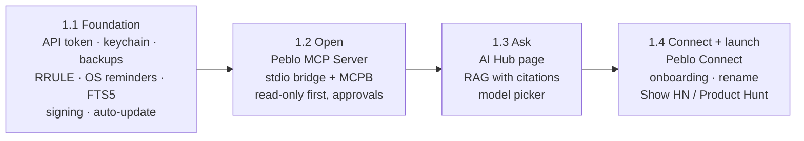
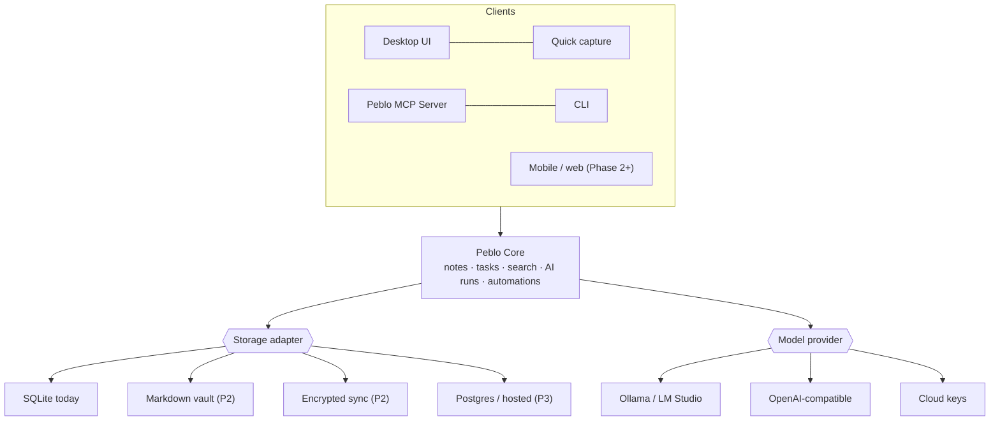

# Peblo documentation

> The plan for turning Peblo from a working offline desktop app into a company.
> Written 26 Sep 2026 by four specialist agents (founder/product, developer/architect, designer, marketing) and reviewed by the lead.
> Status: **draft v1 for the founder's review.** Nothing here is final until the decisions below are made.

## TL;DR

- **Vision:** your notes, tasks and calendar live on *your* computer, and *any* AI you choose (a local model, your own cloud key, or Claude/Cursor/VS Code via MCP) can work with them, with your permission. That's how Peblo goes beyond Notion. Notion keeps your work in its cloud and rents you its AI; Peblo keeps your work local and makes it useful to every AI.
- **Recommended path:** start as **"the private memory and task layer for your AI tools"** (Path B), sold on the local-first, you-own-it promise. Beachhead: developers and technical students who already use Ollama, Claude Desktop or Cursor. Students at large and teams come later.
- **Phase 1 build order:** **1.1 Foundation** (trust and safety fixes) → **1.2 Open** (Peblo MCP Server) → **1.3 Ask** (AI Hub with grounded, cited answers) → **1.4 Connect** (Peblo uses other MCP servers) + public launch.
- **Architecture:** a runtime-agnostic **Peblo Core** with pluggable **storage adapters** (SQLite today; encrypted sync, a Markdown vault or Postgres later) and **model providers** (Ollama, OpenAI-compatible, cloud). The desktop UI, the MCP server, a CLI and future mobile/web clients are all just clients of Core, so the database or UI shell can change later without rewriting features.
- **Before any public launch, three founder decisions block everything:** the **name**, a **confidential file in the public repo**, and the **licence**. See [Decisions needed](#decisions-needed-from-the-founder).

## The documents

| # | Document | Owner (agent) | Read it for |
|---|---|---|---|
| 00 | [Vision & strategy](./00-vision-and-strategy.md) | Founder / product | Vision, core bets, beachhead, **4 strategic paths with pros/cons**, business model, milestones, a weekly operating plan for a student founder |
| 01 | [PRD: product requirements](./01-prd.md) | Founder / product | Personas, jobs-to-be-done, every requirement with an ID, priority, phase and acceptance criteria, metrics, release plan |
| 02 | [TRD: technical requirements](./02-trd.md) | Developer / architect | Current vs target architecture, Peblo Core, storage and model interfaces, data model, **ADRs** (Electron vs Tauri, ORM, vector search, sync, where AI runs, monorepo), security, testing, effort estimates |
| 03 | [MCP: Peblo MCP Server + Peblo Connect](./03-mcp.md) | Developer / architect | The tools Peblo exposes (with JSON schemas), transports, permissions, config snippets for Claude Desktop/Cursor/VS Code, connecting out to other MCP servers, prompt-injection defences |
| 04 | [AI Hub spec](./04-ai-hub.md) | Developer / architect | The separate page for chatting with local/cloud LLMs: models, streaming, RAG with citations, tools, automations, data model, API, sequence diagrams |
| 05 | [Design: UX, AI Hub, design system](./05-design.md) | Designer | UI audit, navigation, screen specs, design system, accessibility, **wireframes** below |
| 06 | [Go-to-market](./06-go-to-market.md) | Marketing | Competitor table with sources, positioning map, beachhead, messaging, pricing, zero-budget channel plan, launch plan |

**Wireframes** (open them on GitHub to view):

| Screen | File |
|---|---|
| App shell with the new left sidebar | [design/navigation.svg](./design/navigation.svg) |
| AI Hub: chat with citations, model picker, sources drawer | [design/ai-hub.svg](./design/ai-hub.svg) |
| AI Hub: an MCP tool call waiting for approval | [design/ai-hub-tool-approval.svg](./design/ai-hub-tool-approval.svg) |
| Connections: models, Peblo MCP Server, Peblo Connect | [design/connections.svg](./design/connections.svg) |
| First-run onboarding (4 steps) | [design/onboarding.svg](./design/onboarding.svg) |

**Suggested reading order.** Founder: 00 → 06 → 01. Building: 02 → 03 → 04, with 05 open alongside. Everyone: this page first.

---

## Decisions needed from the founder

These block the plan. Each one is argued in the linked doc.

| # | Decision | Why it matters | Recommendation | Where |
|---|---|---|---|---|
| 1 | **Product name** | "Peblo" is the name of the seed-funded ed-tech company (mypeblo.com) whose hiring challenge started this project. `peblo.app` is also taken by a team-docs tool. Launching under this name risks a trademark dispute and confuses search. | Pick a new name before any public beta. Check the domain, the trademark (India + US) and GitHub/npm/X handles first. | [00 §11](./00-vision-and-strategy.md#11-risks), [06](./06-go-to-market.md) |
| 2 | **Confidential file in the repo** | `Peblo_Full_Stack_Developer_Challenge.docx.pdf` is marked "Confidential — for candidate evaluation" and is committed and pushed to GitHub (on `main` and `app`). | Remove it from the repo *and its history*. That rewrites history and needs a force-push, so it's your call. The docs don't remove it. | [00](./00-vision-and-strategy.md) |
| 3 | **Licence: open source or closed** | The repo has no LICENSE file. That decides trust with developers, free code signing (SignPath needs open source), contributors, and how you make money. | Marketing leans towards open core (AGPL for the app, with paid sync/Pro). Decide before public beta. | [00 §5](./00-vision-and-strategy.md#5-business-model-options), [06](./06-go-to-market.md) |
| 4 | **Primary path** | Decides what gets built first and who you talk to. | Path B (AI tools' memory) with Path A's privacy promise, keeping Path C (students) as a channel. There's an explicit pivot signal if it doesn't land. | [00 §4](./00-vision-and-strategy.md#4-strategic-paths) |
| 5 | **Code-signing budget** | Unsigned Windows builds trigger SmartScreen warnings, and about 76% of Indian desktops run Windows. | Either a paid OV certificate (about $116+/yr) or free SignPath if you go open source. Apple needs $99/yr for macOS. | [02 §9](./02-trd.md#9-testing-strategy-and-cicd), [06](./06-go-to-market.md) |

---

## Cross-team gap analysis

What the vision needs versus what exists today, merged from all seven docs. **Sev** = severity: 🔴 blocks launch or trust · 🟠 needed for Phase 1 · 🟢 later.

| Area | Gap today | Sev | Fix | Doc |
|---|---|---|---|---|
| Trust / security | The local API has **no authentication**: any process on the computer, or a web page that finds the port, can read and write every note | 🔴 | Per-launch token, plus Host/Origin checks | [02 §7.1](./02-trd.md#71-local-api-authentication) |
| Trust / security | API keys are stored in plain text in 3 places (database, settings JSON, browser localStorage) | 🔴 | OS keychain (Electron `safeStorage`) | [02 §7.2](./02-trd.md#72-secrets) |
| Trust / AI | ~~Choosing Local AI could silently fall back to the cloud~~ **fixed in this commit**. "Auto" still goes to the cloud first. | 🟠 | Make "Ask me first" the default and label every answer Local/Cloud | [05](./05-design.md), [02 ADR-5](./02-trd.md#adr-5-where-ai-runs) |
| Reliability | ~~Saving an OpenAI key broke all AI~~ **fixed in this commit** (found by the architect agent). There's no typecheck in CI to catch this class of bug. | 🟠 | Add `tsc --noEmit` to CI, step by step | [02 §2](./02-trd.md) |
| Reliability | No automatic backups; migrations run with no backup first | 🔴 | Daily rolling backups + a backup before every migration | [01 DATA](./01-prd.md), [02](./02-trd.md) |
| Tasks | Repeating tasks are stored as 5–30 pre-made copies | 🟠 | Real repeat rules (RRULE) | [01 ACT](./01-prd.md), [02 §4](./02-trd.md) |
| Tasks | Reminders only appear inside the app window, not as system notifications | 🟠 | OS notifications from the main process | [01 ACT](./01-prd.md) |
| Knowledge | No "ask your notes": embeddings are saved for almost no notes and never read | 🟠 | Chunking, local embeddings, hybrid search, citations | [04](./04-ai-hub.md) |
| Knowledge | No full-text index, no `[[links]]`/backlinks | 🟠 | SQLite FTS5 + links table | [02 §4](./02-trd.md), [01 KN](./01-prd.md) |
| Openness | No MCP server; other AI tools can't use Peblo | 🟠 | Peblo MCP Server (stdio bridge + MCPB bundle) | [03](./03-mcp.md) |
| Openness | Peblo's AI can't use other tools | 🟢 (1.4) | Peblo Connect | [03 part 2](./03-mcp.md) |
| Capture | Smart Intake saves notes and tasks with no review step | 🟠 | A review screen before saving | [05](./05-design.md), [01 CAP-04](./01-prd.md) |
| Data ownership | Export covers notes only; import skips images | 🟠 | Full export (tasks, calendar, settings) + attachments | [01 DATA](./01-prd.md) |
| Architecture | The API runs inside Electron's main process, so big imports can freeze the window and the shortcut | 🟠 | Move Core into a `utilityProcess` | [02 ADR-1](./02-trd.md) |
| Architecture | Data access is spread across controllers (Prisma calls everywhere), so storage can't be swapped | 🟢 | Storage adapter interface; new code on Kysely | [02 §3](./02-trd.md) |
| Design | Three brand accents; ~30 borders that don't render (token misuse); 234 inline styles; no focus styles; mobile leftovers | 🟠 | Token cleanup + left-sidebar shell | [05 audit](./05-design.md) |
| Design | Five separate AI surfaces (floating chat, block AI, voice, intake, settings) | 🟠 | One AI Hub page + a `Ctrl/Cmd+J` side panel sharing one chat component | [05](./05-design.md) |
| Distribution | Unsigned builds, no auto-update, no opt-in telemetry, so no way to measure the funnel | 🔴 | Signing + electron-updater + opt-in usage counts | [02 §9](./02-trd.md), [06](./06-go-to-market.md) |
| Platform | No sync, no mobile | 🟢 (Phase 2) | E2E-encrypted sync (Yjs + HLC), mobile companion | [02 ADR-4](./02-trd.md) |
| Company | Name, licence, confidential PDF | 🔴 | See decisions above | — |

## Where the docs disagreed, and how it's resolved

| Topic | Disagreement | Resolution (proposed) |
|---|---|---|
| `Ctrl/Cmd+J` | The PRD (HUB-01) uses it to open the AI Hub page; Design uses it for an AI side panel | Design wins: `Ctrl/Cmd+J` toggles the side panel from anywhere, and the panel has an "Open in AI Hub" button. Update HUB-01 when the PRD is next revised. |
| Phase plan | The brief put the plugin API in Phase 2 | Product and engineering both argue for **Phase 3**, with a Markdown-vault storage adapter before Postgres in Phase 2. Adopted. |
| Order within Phase 1 | The brief listed the AI Hub first | Everyone agrees to ship **Foundation → MCP Server → AI Hub RAG → Connect**. The MCP server is smaller, and it gets Peblo listed in MCP directories early. |
| AI default | Today's "Auto" goes to the cloud first | Design and engineering want local-first, with cloud only after explicit consent. Local-only is enforced now; changing the default to "Ask me first" is still open. |

---

## Paths forward

### Company paths (full detail in [00 §4](./00-vision-and-strategy.md#4-strategic-paths))

| Path | One line | Pros | Cons | Solo-founder fit | First revenue *(est.)* |
|---|---|---|---|---|---|
| **A. Private workspace** | "The private Notion" | Broadest story; mostly built already | Head-on with Notion/Obsidian on polish; privacy is said more than paid for | Medium | 9–15 mo |
| **B. Memory for your AI tools** ⭐ | One private memory for Claude, Cursor and your local LLM | Sharp new pain; MCP tailwind; free distribution; you are the user | Smaller market; developers expect open source | **High** | 4–8 mo |
| **C. Student OS (India)** | Semester planner + notes + AI | Huge audience; your campus access | Needs mobile; low willingness to pay; weak laptops for local AI | Medium | 12–18 mo |
| **D. Open-core teams** | Self-hosted team workspace | Highest revenue ceiling | Needs sync, auth and hosting first; fights Notion on its home ground | Low (for now) | 18–30 mo |

⭐ Recommended: **B, wrapped in A's promise, with C as a campus channel and D kept as a Phase 3 option.**
**Pivot signal:** 8 weeks after public launch, if fewer than 15% of weekly users have an MCP client connected *and* fewer than 30% use the AI Hub weekly, shift emphasis to A.

### Build path (Phase 1, from [01](./01-prd.md) and [02 §10](./02-trd.md#10-phased-engineering-roadmap-solo-dev-estimates))

Engineering estimates about **27 focused dev-weeks (±30%)** for all of Phase 1. For a part-time solo developer in college that's about **7–9 months**. To go faster, cut scope rather than quality: ship 1.2 (MCP Server) as early as possible, since it's small (about 3 dev-weeks) and gets the product into MCP directories.

### Architecture path: how "swap anything later" works (from [02 §3](./02-trd.md))

### Go-to-market path (from [06](./06-go-to-market.md))

Private beta with 20–50 users from your campus and r/LocalLLaMA → rename + signed builds → public beta with a Show HN and MCP directory listings → v1 on Product Hunt. Everything is free in Phase 1, with an optional one-time **Founding Supporter** licence (hypothesis: ₹499 / $19). The subscription (**Sync + Pro**) comes in Phase 2. Budget is about 6 hours a week and no paid ads.

---

## Suggested next 30 days

1. **Decide** the name, the licence and the confidential PDF (decisions 1–3). They're cheap now and expensive later.
2. **Recruit 10 beta users** (5 classmates who use Ollama or Cursor, and 5 from r/LocalLLaMA), using the interview script in [06](./06-go-to-market.md). Watch them import from Notion and use quick capture.
3. **Ship 1.1 Foundation, part 1:** local API token, keychain secrets, automatic backups, `tsc --noEmit` in CI.
4. **Prototype the Peblo MCP Server read-only** (`search_notes`, `get_note`, `list_tasks`, `get_agenda`) and connect it to Claude Desktop. This is the demo video for launch.

## How to keep these docs alive

- Treat requirement IDs (e.g. `MCP-05`, `HUB-01`) as the link between docs, GitHub issues and commits.
- When a decision is made, record it in the doc's decision/ADR table (status: *accepted*) instead of deleting the options, so the reasoning isn't lost.
- Revisit 00 and 06 after every 10 user interviews; revisit 02 when a phase starts.
