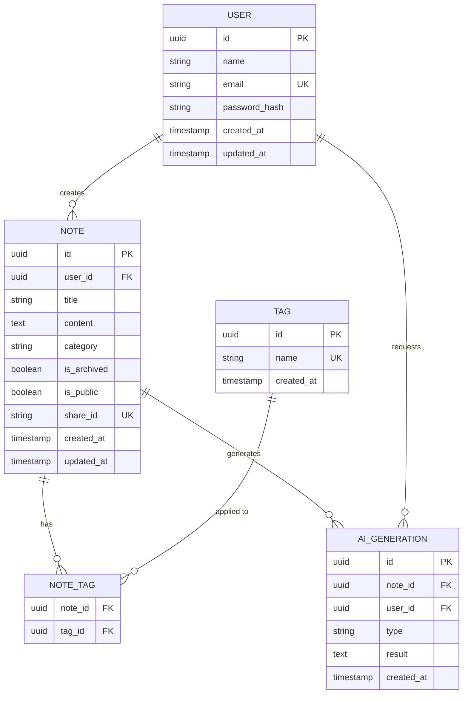
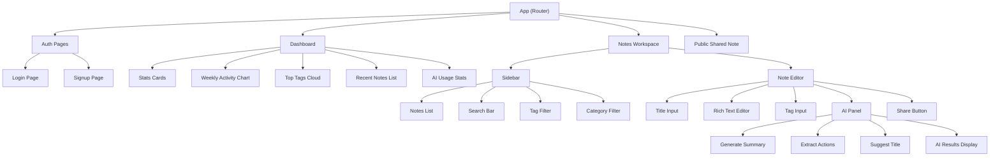

# PEBLO Full Stack Developer Challenge — Implementation Plan

## 📋 Challenge Analysis & Debug Notes

### Requirements Breakdown

| # | Feature | Core Requirements | Complexity |
|---|---------|-------------------|------------|
| 1 | **Authentication** | Signup, Login, Protected routes, Persistent sessions, Secure passwords | Medium |
| 2 | **Notes Workspace** | CRUD, Auto-save, Tags & Categories, Archive | Medium-High |
| 3 | **AI Integration** | Summaries, Action items, Suggested titles (via LLM) | Medium |
| 4 | **Search & Filtering** | Keyword search, Tag filter, Sort by updated_at | Medium |
| 5 | **Public Share Page** | Generate share link, Public access (no auth), Clean page | Low-Medium |
| 6 | **Productivity Insights** | Total notes, Recent edits, Top tags, AI stats, Weekly activity | Medium |

### Edge Cases & Gotchas Identified

1. **Auto-save** — Needs debouncing (e.g., 1.5s after last keystroke). Must handle conflicts if user navigates away mid-save. Optimistic UI updates are important here.
2. **AI Integration** — Must be async. LLM calls can take 3-15 seconds; the UI must remain responsive. Need loading states and error handling for rate limits / API failures.
3. **Public Share** — Security concern: must ensure shared notes don't leak private user data. Share links should use UUIDs, not sequential IDs.
4. **Authentication Sessions** — JWT with refresh tokens or HTTP-only cookies. Never store tokens in localStorage for production (XSS risk), but for this challenge, JWT in localStorage with short expiry + refresh is acceptable.
5. **Productivity Insights** — Weekly activity requires tracking note edit timestamps. A simple approach: aggregate from `updated_at` timestamps on notes rather than maintaining a separate activity log.
6. **Tags** — Need to decide: free-form strings vs. normalized tag table. A normalized tag table is more scalable and enables "most-used tags" queries efficiently.

---

## 🏗️ Architecture Decision

### Monorepo Structure

```
peblo-notes/
├── client/          # React (Vite) frontend
├── server/          # Node.js (Express) backend
├── shared/          # Shared types (optional)
├── .env.example
├── README.md
└── package.json     # Root scripts
```

> [!IMPORTANT]
> Monorepo keeps everything in one GitHub repo as required. Separate `client/` and `server/` directories for clean separation of concerns.

---

## 🔧 Tech Stack Selection

| Layer | Choice | Rationale |
|-------|--------|-----------|
| **Frontend** | React 18 + Vite | Fast dev server, modern tooling, React is industry standard |
| **Styling** | Vanilla CSS with CSS custom properties | Full control, premium dark-mode design, no dependency bloat |
| **State Management** | React Context + useReducer | Sufficient for this scope, no Redux overhead |
| **Rich Text Editor** | React-Quill or TipTap | Markdown-like editing with rich preview |
| **Backend** | Node.js + Express | Lightweight, fast to build, excellent ecosystem |
| **Database** | PostgreSQL (via Supabase or local) | Relational model fits tags/notes well, scalable |
| **ORM** | Prisma | Type-safe queries, easy migrations, clean schema |
| **Auth** | JWT (access + refresh tokens) | Stateless, scalable, bcrypt for password hashing |
| **AI Provider** | Google Gemini API | Free tier available, strong capabilities |
| **Deployment** | Vercel (frontend) + Render (backend) | Free tier, easy setup |

---

## 🗄️ Database Schema Design



### Prisma Schema (Key Models)

```prisma
model User {
  id           String   @id @default(uuid())
  name         String
  email        String   @unique
  passwordHash String   @map("password_hash")
  createdAt    DateTime @default(now()) @map("created_at")
  updatedAt    DateTime @updatedAt @map("updated_at")
  notes        Note[]
  aiGenerations AiGeneration[]

  @@map("users")
}

model Note {
  id         String    @id @default(uuid())
  userId     String    @map("user_id")
  title      String    @default("Untitled")
  content    String    @default("")
  category   String?
  isArchived Boolean   @default(false) @map("is_archived")
  isPublic   Boolean   @default(false) @map("is_public")
  shareId    String?   @unique @map("share_id")
  createdAt  DateTime  @default(now()) @map("created_at")
  updatedAt  DateTime  @updatedAt @map("updated_at")

  user       User      @relation(fields: [userId], references: [id])
  tags       NoteTag[]
  aiGenerations AiGeneration[]

  @@map("notes")
}

model Tag {
  id        String    @id @default(uuid())
  name      String    @unique
  createdAt DateTime  @default(now()) @map("created_at")
  notes     NoteTag[]

  @@map("tags")
}

model NoteTag {
  noteId String @map("note_id")
  tagId  String @map("tag_id")
  note   Note   @relation(fields: [noteId], references: [id], onDelete: Cascade)
  tag    Tag    @relation(fields: [tagId], references: [id], onDelete: Cascade)

  @@id([noteId, tagId])
  @@map("note_tags")
}

model AiGeneration {
  id        String   @id @default(uuid())
  noteId    String   @map("note_id")
  userId    String   @map("user_id")
  type      String   // "summary" | "action_items" | "title"
  result    String   // JSON string
  createdAt DateTime @default(now()) @map("created_at")

  note Note @relation(fields: [noteId], references: [id], onDelete: Cascade)
  user User @relation(fields: [userId], references: [id])

  @@map("ai_generations")
}
```

---

## 🔌 API Design

### Auth Endpoints

| Method | Endpoint | Description | Auth |
|--------|----------|-------------|------|
| POST | `/api/auth/signup` | Register new user | No |
| POST | `/api/auth/login` | Login, returns JWT | No |
| GET | `/api/auth/me` | Get current user | Yes |
| POST | `/api/auth/refresh` | Refresh access token | Yes |

### Notes Endpoints

| Method | Endpoint | Description | Auth |
|--------|----------|-------------|------|
| GET | `/api/notes` | List user's notes (supports `?search=`, `?tag=`, `?sort=`, `?archived=`) | Yes |
| POST | `/api/notes` | Create new note | Yes |
| GET | `/api/notes/:id` | Get single note | Yes |
| PATCH | `/api/notes/:id` | Update note (auto-save) | Yes |
| DELETE | `/api/notes/:id` | Delete note | Yes |
| POST | `/api/notes/:id/archive` | Toggle archive status | Yes |
| POST | `/api/notes/:id/share` | Generate/toggle public share link | Yes |

### AI Endpoints

| Method | Endpoint | Description | Auth |
|--------|----------|-------------|------|
| POST | `/api/notes/:id/ai/summary` | Generate AI summary | Yes |
| POST | `/api/notes/:id/ai/actions` | Extract action items | Yes |
| POST | `/api/notes/:id/ai/title` | Suggest title | Yes |

### Public Endpoints

| Method | Endpoint | Description | Auth |
|--------|----------|-------------|------|
| GET | `/api/shared/:shareId` | Get publicly shared note | No |

### Dashboard Endpoints

| Method | Endpoint | Description | Auth |
|--------|----------|-------------|------|
| GET | `/api/dashboard/insights` | Get productivity insights | Yes |

---

## 🎨 Frontend Component Architecture



### Page Routing

| Route | Component | Auth Required |
|-------|-----------|---------------|
| `/login` | LoginPage | No |
| `/signup` | SignupPage | No |
| `/` | Dashboard | Yes |
| `/notes` | Notes Workspace | Yes |
| `/notes/:id` | Notes Workspace (with note selected) | Yes |
| `/shared/:shareId` | Public Shared Note | No |

---

## 🤖 AI Integration Strategy

### Approach: Google Gemini API (Free Tier)

```
User clicks "Generate Summary"
  → Frontend shows loading spinner
  → POST /api/notes/:id/ai/summary
  → Backend fetches note content
  → Backend calls Gemini API with structured prompt
  → Backend saves result to ai_generations table
  → Backend returns result
  → Frontend displays summary with animation
```

### Prompt Templates

**Summary Prompt:**
```
Analyze the following note and provide a concise summary in 2-3 sentences.
Focus on the key points and main ideas.

Note Title: {title}
Note Content: {content}

Respond with ONLY a JSON object: {"summary": "..."}
```

**Action Items Prompt:**
```
Extract actionable items from the following note. Return specific, 
concrete tasks that need to be done.

Note Title: {title}
Note Content: {content}

Respond with ONLY a JSON object: {"action_items": ["...", "..."]}
```

**Title Suggestion Prompt:**
```
Based on the following note content, suggest a clear and concise title
that captures the main topic.

Note Content: {content}

Respond with ONLY a JSON object: {"suggested_title": "..."}
```

> [!TIP]
> Store AI results in the database so they persist and can be shown in the dashboard's "AI usage statistics" without re-generating.

---

## 🎨 Design System

### Color Palette (Dark Mode First)

```css
:root {
  /* Background layers */
  --bg-primary: #0a0a0f;
  --bg-secondary: #12121a;
  --bg-tertiary: #1a1a2e;
  --bg-elevated: #222236;

  /* Accent - Purple/Violet (Peblo brand feel) */
  --accent-primary: #7c3aed;
  --accent-secondary: #a855f7;
  --accent-glow: rgba(124, 58, 237, 0.3);

  /* Text */
  --text-primary: #f1f5f9;
  --text-secondary: #94a3b8;
  --text-muted: #64748b;

  /* Semantic */
  --success: #22c55e;
  --warning: #f59e0b;
  --error: #ef4444;
  --info: #3b82f6;

  /* Borders */
  --border-subtle: rgba(255, 255, 255, 0.06);
  --border-default: rgba(255, 255, 255, 0.1);

  /* Glassmorphism */
  --glass-bg: rgba(255, 255, 255, 0.03);
  --glass-border: rgba(255, 255, 255, 0.08);
}
```

### Typography
- **Primary Font**: Inter (Google Fonts)
- **Monospace**: JetBrains Mono (for code blocks in notes)

### Design Features
- ✅ Dark mode (default)
- ✅ Glassmorphism cards
- ✅ Subtle gradient accents
- ✅ Micro-animations (hover, transitions)
- ✅ Responsive layout (sidebar collapses on mobile)

---

## 📦 Build Order (Phased Approach)

### Phase 1: Project Setup & Backend Foundation
- [x] Task 1.1: Initialize monorepo structure
- [x] Task 1.2: Set up Express server with TypeScript
- [x] Task 1.3: Configure Prisma with PostgreSQL
- [x] Task 1.4: Create database schema & run migrations
- [x] Task 1.5: Set up Vite + React frontend

### Phase 2: Authentication
- [x] Task 2.1: Implement signup endpoint (bcrypt, validation)
- [x] Task 2.2: Implement login endpoint (JWT generation)
- [x] Task 2.3: Create auth middleware (JWT verification)
- [x] Task 2.4: Build Login & Signup UI pages
- [x] Task 2.5: Implement auth context & protected routes

### Phase 3: Notes CRUD & Workspace
- [x] Task 3.1: Implement notes CRUD API endpoints
- [x] Task 3.2: Build sidebar with notes list
- [x] Task 3.3: Build note editor with rich text (TipTap/Quill)
- [x] Task 3.4: Implement auto-save with debouncing
- [x] Task 3.5: Add tag management (create, assign, remove)
- [x] Task 3.6: Add category support
- [x] Task 3.7: Implement archive functionality

### Phase 4: Search & Filtering
- [x] Task 4.1: Implement search API (keyword search on title + content)
- [x] Task 4.2: Implement tag filtering API
- [x] Task 4.3: Implement sorting (updated_at, created_at)
- [x] Task 4.4: Build search bar UI component
- [x] Task 4.5: Build tag filter chips UI

### Phase 5: AI Integration
- [x] Task 5.1: Set up Gemini API client on backend
- [x] Task 5.2: Implement summary generation endpoint
- [x] Task 5.3: Implement action items extraction endpoint
- [x] Task 5.4: Implement title suggestion endpoint
- [x] Task 5.5: Build AI panel UI with loading states
- [x] Task 5.6: Store & display AI generation history

### Phase 6: Public Sharing
- [x] Task 6.1: Implement share link generation API
- [x] Task 6.2: Implement public note fetch API
- [x] Task 6.3: Build clean public share page
- [x] Task 6.4: Add share toggle in note editor

### Phase 7: Productivity Dashboard
- [x] Task 7.1: Implement insights aggregation API
- [x] Task 7.2: Build dashboard layout
- [x] Task 7.3: Create stats cards (total notes, AI usage)
- [x] Task 7.4: Build weekly activity chart
- [x] Task 7.5: Build top tags visualization
- [x] Task 7.6: Build recent notes list

### Phase 8: Polish & Nice-to-Haves
- [x] Task 8.1: Dark mode toggle (light/dark)
- [x] Task 8.2: Markdown preview in editor
- [x] Task 8.3: Keyboard shortcuts (Ctrl+S save, Ctrl+K search)
- [x] Task 8.4: Optimistic UI updates
- [x] Task 8.5: Loading skeletons & error boundaries
- [x] Task 8.6: Mobile responsive design
- [x] Task 8.7: Write README with architecture docs
- [x] Task 8.8: Create .env.example
- [x] Task 8.9: Sample outputs & screenshots

---

## 🗂️ Detailed File Structure

```
peblo-notes/
├── client/
│   ├── public/
│   │   └── favicon.svg
│   ├── src/
│   │   ├── api/
│   │   │   ├── auth.js
│   │   │   ├── notes.js
│   │   │   ├── ai.js
│   │   │   ├── dashboard.js
│   │   │   └── client.js          # Axios instance with interceptors
│   │   ├── components/
│   │   │   ├── auth/
│   │   │   │   ├── LoginForm.jsx
│   │   │   │   ├── SignupForm.jsx
│   │   │   │   └── ProtectedRoute.jsx
│   │   │   ├── dashboard/
│   │   │   │   ├── StatsCard.jsx
│   │   │   │   ├── WeeklyChart.jsx
│   │   │   │   ├── TopTags.jsx
│   │   │   │   └── RecentNotes.jsx
│   │   │   ├── notes/
│   │   │   │   ├── NoteEditor.jsx
│   │   │   │   ├── NotesList.jsx
│   │   │   │   ├── NoteCard.jsx
│   │   │   │   ├── TagInput.jsx
│   │   │   │   ├── SearchBar.jsx
│   │   │   │   └── AIPanel.jsx
│   │   │   ├── shared/
│   │   │   │   └── PublicNote.jsx
│   │   │   └── ui/
│   │   │       ├── Button.jsx
│   │   │       ├── Input.jsx
│   │   │       ├── Modal.jsx
│   │   │       ├── Toast.jsx
│   │   │       └── Loader.jsx
│   │   ├── context/
│   │   │   ├── AuthContext.jsx
│   │   │   └── NotesContext.jsx
│   │   ├── hooks/
│   │   │   ├── useDebounce.js
│   │   │   ├── useAutoSave.js
│   │   │   └── useKeyboardShortcut.js
│   │   ├── pages/
│   │   │   ├── LoginPage.jsx
│   │   │   ├── SignupPage.jsx
│   │   │   ├── DashboardPage.jsx
│   │   │   ├── WorkspacePage.jsx
│   │   │   └── SharedNotePage.jsx
│   │   ├── styles/
│   │   │   ├── index.css          # Design system & globals
│   │   │   ├── auth.css
│   │   │   ├── dashboard.css
│   │   │   ├── workspace.css
│   │   │   ├── editor.css
│   │   │   └── shared.css
│   │   ├── utils/
│   │   │   ├── formatDate.js
│   │   │   └── constants.js
│   │   ├── App.jsx
│   │   └── main.jsx
│   ├── index.html
│   ├── vite.config.js
│   └── package.json
│
├── server/
│   ├── prisma/
│   │   ├── schema.prisma
│   │   └── seed.js
│   ├── src/
│   │   ├── controllers/
│   │   │   ├── authController.js
│   │   │   ├── notesController.js
│   │   │   ├── aiController.js
│   │   │   ├── shareController.js
│   │   │   └── dashboardController.js
│   │   ├── middleware/
│   │   │   ├── auth.js
│   │   │   ├── errorHandler.js
│   │   │   └── validate.js
│   │   ├── routes/
│   │   │   ├── auth.js
│   │   │   ├── notes.js
│   │   │   ├── ai.js
│   │   │   ├── share.js
│   │   │   └── dashboard.js
│   │   ├── services/
│   │   │   ├── aiService.js
│   │   │   └── insightsService.js
│   │   ├── utils/
│   │   │   ├── jwt.js
│   │   │   └── helpers.js
│   │   └── index.js
│   ├── package.json
│   └── .env.example
│
├── .env.example
├── .gitignore
├── README.md
└── package.json
```

---

## ⚠️ Risk Mitigation

| Risk | Mitigation |
|------|------------|
| PostgreSQL setup complexity | Use SQLite for dev, PostgreSQL for prod. Prisma abstracts the difference. |
| AI API rate limits | Cache AI results in DB, show cached results first, add retry with backoff |
| Auto-save data loss | Debounce saves, show save indicator, queue failed saves for retry |
| JWT token expiry UX | Silent refresh via interceptor, redirect to login only on refresh failure |
| Large note content | Paginate notes list, lazy-load content, limit AI input to first 4000 chars |

---

## ✅ Evaluation Checklist (Self-Assessment)

- [ ] **Frontend Engineering**: Clean components, proper state management, polished UX
- [ ] **Backend Engineering**: RESTful APIs, proper error handling, middleware chain
- [ ] **AI Integration**: Meaningful (not gimmicky), async, cached, with loading states
- [ ] **Database Design**: Normalized schema, proper relations, efficient queries
- [ ] **Code Quality**: Consistent style, no dead code, clear naming
- [ ] **Product Thinking**: Cohesive flow, intuitive navigation, delightful micro-interactions
- [ ] **Documentation**: Clear README, .env.example, architecture explanation

---

## 🚀 Ready to Build

With this plan, we will build the application phase by phase. The estimated implementation covers all 6 required features plus several nice-to-haves (dark mode, markdown preview, keyboard shortcuts, optimistic UI).

**Shall I proceed with Phase 1 (Project Setup)?**
