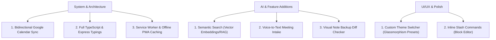

# 🚀 Peblo Productivity Hub — Improvement Proposal

Peblo is a modern, high-quality productivity ecosystem with a robust tech stack (React, Vite, Express, Prisma, PostgreSQL) and a multi-provider AI cascade (OpenAI ↔ Gemini ↔ Mock). 

Based on a thorough audit of the active codebase (including the [Prisma Schema](file:///home/tejas/internship/peblo%20full%20stack%20developerf/server/prisma/schema.prisma), [Server Entrypoint](file:///home/tejas/internship/peblo%20full%20stack%20developerf/server/src/index.ts), and [AI Service](file:///home/tejas/internship/peblo%20full%20stack%20developerf/server/src/services/aiService.ts)), here is a multi-dimensional roadmap to transition Peblo from a great project into a **production-grade SaaS platform**.

---

## 🗺️ Peblo Improvement Roadmap at a Glance



---

## 1. 🏗️ System & Architecture Enhancements

### A. Bidirectional Google Calendar Sync [COMPLETED]
* **State:** Implemented the `handleCalendarWebhook` handler and watch channel lifecycle in [calendarController.ts](file:///home/tejas/internship/peblo%20full%20stack%20developerf/server/src/controllers/calendarController.ts). Updates, deletions, and additions made inside Google Calendar automatically synchronize back to Peblo's local `Todo` database.

### B. End-to-End Strict TypeScript typing [COMPLETED]
* **State:** Fully typed all controllers, request handlers, Express routing parameters, schema validations, and middleware. Running `npx tsc --noEmit` compiles cleanly with zero warnings or errors.

### C. Offline Support & PWA Capabilities
* **Current State:** Standard single-page application requiring active backend connections for notes, calendars, and todo operations.
* **The Upgrade:** Implement client-side offline storage using **Dexie.js** (IndexedDB wrapper) alongside a React Query offline sync queue.
  1. Add a Service Worker (`sw.js`) utilizing Workbox to cache assets.
  2. Intercept API failures and queue pending mutations in IndexedDB.
  3. Re-sync automatically when the browser's `online` event fires.

---

## 2. 🧠 Advanced AI & Feature Upgrades

### A. Semantic Search & Note RAG (Retrieval-Augmented Generation)
* **Current State:** Note searching is done using simple database keywords.
* **The Upgrade:** Enable semantic queries (e.g., *"What did we decide about marketing?"* instead of keyword searches).
  1. Integrate `pgvector` in the PostgreSQL database.
  2. When a note is created/edited, generate vector embeddings on the backend using Gemini or OpenAI embeddings models:
```typescript
// Example embed call in server/src/services/aiService.ts
export async function generateEmbedding(text: string): Promise<number[]> {
  const gemini = getGenAI();
  const model = gemini.getGenerativeModel({ model: "text-embedding-004" });
  const result = await model.embedContent(text);
  return result.embedding.values;
}
```
  3. Allow users to query their AI Assistant to surface related notes instantly.

### B. Voice Recording & Audio Transcription (Smart Intake)
* **Current State:** The [AiChatPanel.jsx](file:///home/tejas/internship/peblo%20full%20stack%20developerf/client/src/components/AiChatPanel.jsx) Smart Intake expects typed text or files.
* **The Upgrade:** Integrate Web Audio recording in the floating panel so users can dictate meeting notes on the fly. Send the audio file to OpenAI's Whisper API or Gemini's Audio processing model to get a transcription before feeding it to `analyzeAndOrganize`.

### C. Visual Note Backup Diff Viewer
* **Current State:** The backups panel in [WorkspacePage.jsx](file:///home/tejas/internship/peblo%20full%20stack%20developerf/client/src/pages/WorkspacePage.jsx) allows users to view and restore older note snapshots.
* **The Upgrade:** Integrate `diff-match-patch` or `jsdiff` to display a beautiful color-coded diff (green for additions, red for deletions) showing exactly what the AI or a user changed between note edits before they commit to restoring an older backup.

---

## 3. ✨ UI/UX & Interactive Polish

### A. Glassmorphic Theme Customizer
* **Current State:** A beautiful dark-theme first stylesheet with custom variables defined in `index.css`.
* **The Upgrade:** Add a personalization menu letting users swap between highly premium HSL palettes:
  - **Aura Purple:** (Default Peblo brand theme)
  - **Cyberpunk Neon:** Dark background with cyan, hot pink, and high neon glows.
  - **Forest Jade:** Soothing dark slate with emerald green accents.
  - **Nordic Frost:** Cool blue-grey background with ice-blue indicators.

### B. Block Editor Slash Commands for AI
* **Current State:** Keyboard commands `/summarize`, `/fix` are restricted to the AI Chat Panel input.
* **The Upgrade:** Extend the slash menu in the BlockNote editor (via custom block extensions) so users can highlight text or type `/ai` directly inside the note to rewrite, lengthen, format, or clean up prose inside the active block.


---

> [!TIP]
> **Priority Path:** The highest impact improvements with the highest "Wow Factor" would be **Semantic Search (RAG)** or **Bidirectional Calendar Webhooks**. 
> Which of these improvements would you like to explore or implement next? I can help you draft schemas, design routes, or build out components right now!
